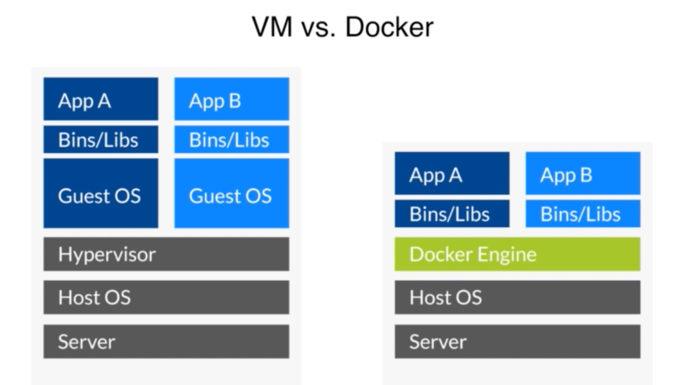
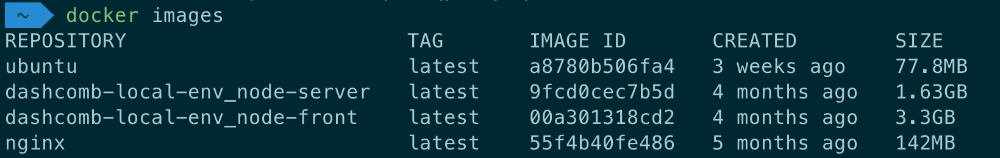
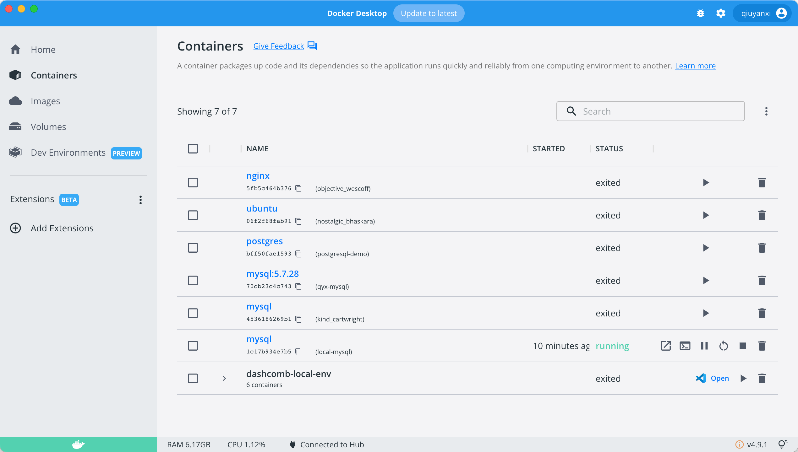
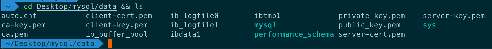
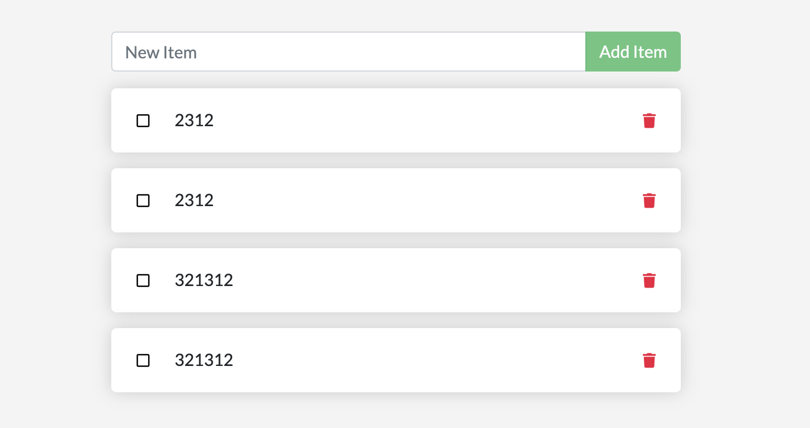
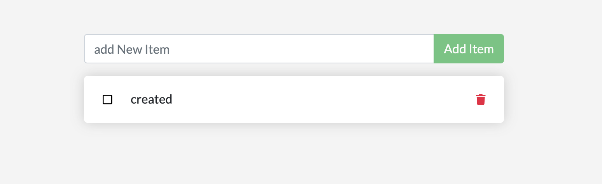
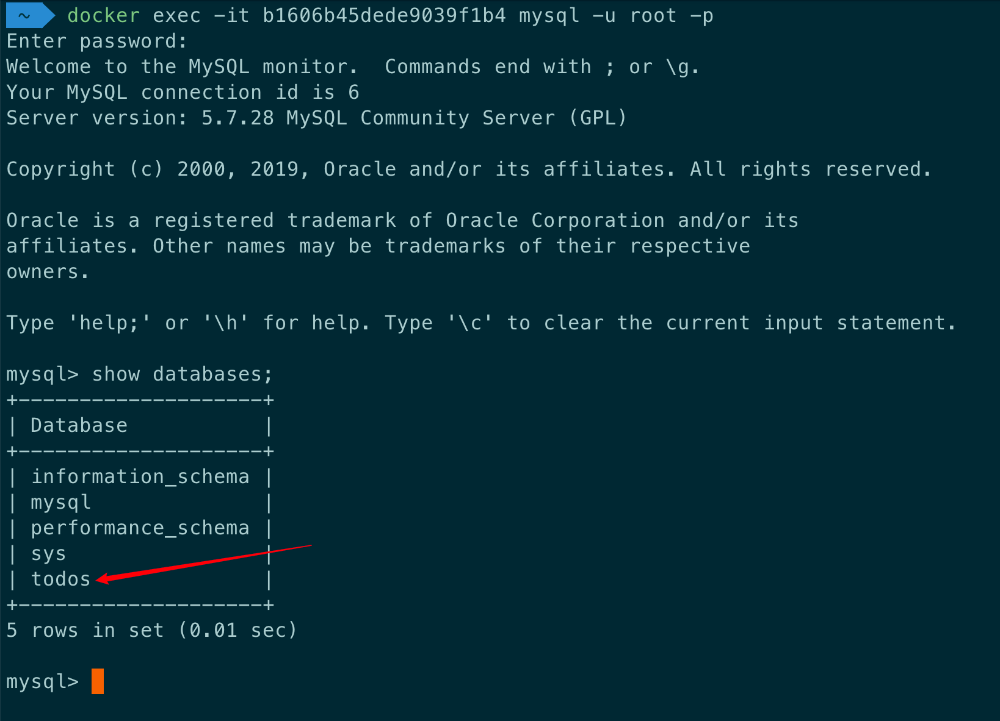
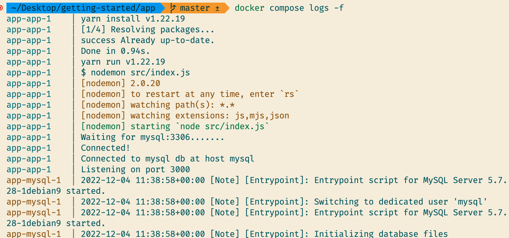

# Docker

## Docker 是什么

Docker 是这样介绍自己的：

> an open source project to pack,ship and run any application as a lightweight container.
>
> 是一个将任何应用作为轻量级的容器进行打包、发布和运行的开源项目

Nodejs 是这样介绍 docker 的：

> allows to package an application with all of its dependencies into a standardized unit.
>
> 允许将应用及其所有依赖打包到一个标准的单元里

Docker 可以被粗糙地被理解为一个轻量的虚拟机。但是它跟虚拟机有一些不同：



不同点为以下内容：

- VM 在宿主上虚拟出一层 Hypervisor ，它虚拟出了硬件。在硬件环境上，安装完全独立的 Guest OS（虚拟机里的系统），我们的应用程序会在里面运行。Docker 是利用了 Host OS（物理机里的系统）里的 nameSpace、control group 等将应用程序分离，让它们跑在 Docker Engine 中。
- 由于 Docker 没有虚拟层，所以会比虚拟机轻量很多，包括内存、运行速度等都会快很多。

## 配置 Docker

通过 [官方网站](https://docs.docker.com/docker-for-mac/install/)安装 Docker

国内从 Docker Hub 拉取镜像有时会遇到困难，需要额外配置镜像加速器。

国内很多云服务商都提供了国内加速器服务，这里就以网易云和百度云为例，设置国内镜像源:

打开 Docker 后点开 Preferences => Docker Engine =>编辑 daemon.json

添加国内镜像

```json
{
  ...省略部分内容,
  "registry-mirrors": [
    "https://hub-mirror.c.163.com",
    "https://mirror.baidubce.com"
  ]
}
```

## Docker 架构图


Docker_Host 为 Docker 运行的宿主机，这个宿主机上会安装有 Docker daemon。

Docker daemon 负责做各种 docker 操作，比如下载镜像、运行容器等。

我们通过命令行指令的方式与 Docker daemon 交互。如：docker build、docker pull、docker run 等。

daemon 也可以跟 Registry 交互。Registry 是 docker 使用者分享镜像用的。

## container 是什么

简单来说，容器（container）是我们的计算机上的一个进程，已与主机上的所有其他进程隔离。

容器的特点：

1. 是一个镜像（image）的可运行实例。我们可以创建、启动、停止、移动或者删除容器
2. 可以运行在本地机、虚拟机或者部署到云上。
3. 可移植的，能够被任何操作系统运行
4. 容器之间互相隔离，运行他们自己的软件、二进制文件和配置

## images 是什么

当运行一个容器时，它会使用一个隔离的文件系统。这个自定义的文件系统是容器镜像（image）提供的。因为镜像包含了容器的文件系统，所以它必须包含运行应用程序所需的所有东西——所有依赖项、配置、脚本、二进制文件等等。该映像还包含容器的其他配置，例如环境变量、要运行的默认命令和其他元数据。

使用以下命令行可以查看镜像列表

```bash
docker image ls
```

当然，也可以通过 `docker` 桌面端查看。

## Docker 常用命令

### 概览

| 命令          | 用途                              |
| ------------- | --------------------------------- |
| docker pull   | 获取 image                        |
| docker build  | 创建 image                        |
| docker images | 列出 image                        |
| docker run    | 创建并运行 container              |
| docker ps     | 列出 container                    |
| docker rm     | 删除 container                    |
| docker rmi    | 删除 image                        |
| docker cp     | 在 host 和 container 之间拷贝文件 |
| docker commit | 保存改动为新的 image              |

### 获取 image

可以通过https://hub.docker.com/访问线上的镜像，比如版本号、镜像名、功能等，再通过 docker pull 命令在本地终端拉取镜像库里的镜像。

以获取 mysql 的 image 为例

```bash
-- 获取最后一个版本的镜像
docker pull mysql
-- 获取最后一个版本的镜像 以 :TAG 结尾
docker pull mysql:latest
-- 拉取指定版本的镜像 以 :TAG 结尾
docker pull mysql:5.7.28
```

image 就相当于一个模板，运行 image 可以产生一个容器。

**建议在使用镜像时指定版本**，因为默认的 latest 是滚动更新的，现在下载的 latest 版本过一段时间就不一定是最新的版本了，所以会造成混淆，弄不清到底是哪个版本。

### 查看本地所有 images（镜像）

```bash
docker images
```



### 查看本地所有容器

```bash
docker ps -a
```

### run container

docker 上创建并运行一个容器的命令示例

```bash
docker run mysql
```

**如果本地没有容器需要的 image，则会从 registry 中拉取 image 并生成容器。**

拉取 image 成功后会有提示

```bash
Digest: sha256:96439dd0d8d085cd90c8001be2c9dde07b8a68b472bd20efcbe3df78cff66492
Status: Downloaded newer image for mysql:latest
```

> **每次运行 docker run xxx 都会产生一个新的容器，如果没有指定容器的名称则默认生成**

### 查看容器详细信息

```bash
docker inspect <Container ID>
```

通过这个命令可以看到容器的详细信息，比如端口号，ip 地址等。

### 运行 mysql 容器

以下为运行 mysql:5.7.28 的 docker 命令示例 (来自 [dockerhub-mysql](https://hub.docker.com/_/mysql)官方文档)

**运行 mysql:5.7.28 容器**

```bash
docker run --name local-mysql -e MYSQL_ROOT_PASSWORD=123456 -p 3306:3306 -d mysql:5.7.28
```

- `-- name local-mysql` —— 指定容器名称为 `local-mysql`

- `-d` - 在后台运行，可以指定版本如：`mysql:5.7.28`。没写版本则同`mysql:latest`，指定最新的版本。

  没有 `-d` 这个参数就表示前台运行，当退出终端后，就访问不到了。因此大多数情况下都会用到 `-d`

- `-p 3306:3306` -将主机 3306 端口映射到容器 3306 端口

  `-p`不单单可以绑定单个端口，也可以绑定端口范围，前后必须对应

  ```bash
  -p 8080-8090:8080-8090 公开端口范围
  -p 192.168.56.106:8080:80 如果宿主机有多个 ip，可以指定绑定到哪个 ip
  ```

- `-e MYSQL_ROOT_PASSWORD=123456` 设置 env

当启动完成会返回容器的 ID

```bash
1c17b934e7b5bec7b7481f9ac8a03ca93aabfb621b840de8f12ce94cf957943f
```

当容器在本地跑之后，docker 允许使用`-it`参数以命令行的方式跟容器进行交互。

比如下面就是用命令重新创建一个新的 mysql 客户端容器，并与刚才实例出来的 mysql 容器连接。

```bash
docker run -it --rm mysql:5.7.28 mysql -hsome.mysql.host -usome-mysql-user -p
```

- `-it` docker 使用命令行交互方式与容器交互,可以在控制台中输入、输出
- `--rm` 当容器退出时自动删除容器。一般是在使用客户端程序时使用此参数,如果每次使用客户端都创建一个新的容器，会占用大量的系统空间，所以会用完后删除容器。
- `mysql:5.7.28` 表示容器的镜像
- `mysql -hsome.mysql.host -usome-mysql-user -p` —— 启动该容器时执行的命令
- `-hsome.mysql.host`——完整为`-h 容器的ip`
- `-usome-mysql-user` —— 完整为`-u 容器的用户名`

通过`docker inspect`查看到具体 ip 地址后完整填入命令行

```bash
docker run -it --rm mysql:5.7.28 mysql -h172.17.0.2 -uroot -p
```

最后输入密码，即可访问之前创建的 local-mysql 的容器。

### 查看正在运行的容器

```bash
docker ps
```

或者打开 Docker Desktop 可视化地看到机器上已经运行的容器。



### 停止容器

```bash
docker stop <Container ID>
```

### 启动已经存在的容器

```bash
docker start <Container ID>
```

### 用交互模式在容器中输入命令

```bash
-- 交互模式下，在 container 中使用 bash
docker exec -it <Container name> /bin/bash
-- 退出
exit
```

### 将主机上的文件拷到容器中

```bash
docker cp <host-file-path> <Container ID>:<Container path>
```

示例：

```bash
cd Desktop && mkdir mysql-config
cd mysql-config && touch mysql-config.cnf
echo -e "# this is mysql configuration file" >> mysql-config.cnf
docker cp ~/Desktop/mysql-config/mysql-config.cnf 47dbc3b110cf:/etc/mysql/conf.d/mysql-config.cnf
```

### 删除容器

```bash
docker rm <Container ID>
```

### 删除 image

```bash
docker rmi <Image ID>
```

## Docker network

### 网络简介

Docker 会创建三个网络：

- bridge 桥接网络

  如果不指定，新创建的容器默认将链接到 bridge 网络。

  默认情况下，使用 bridge 网络，宿主机可以 ping 通容器 ip，容器中也能 ping 通宿主机。

  容器之间只能通过 ip 地址互相访问，由于容器的 ip 会随着启动顺序发生变化，因此不推荐使用 ip 访问。

- host 与宿主机共享网络

  容器与宿主机共享网络，不需要映射端口即可通过宿主机 ip 访问。（-p 选项会被忽略）

  主机模式网络可用于优化性能，在容器需要处理大量端口的情况下，它不需要网络地址转化（NAT），并且不会为每个端口创建“用户空间代理”。

- none 禁用容器中所用网络，在启动容器中使用

### 自定义网络

桥接网络下，不推荐使用 ip 访问，那么能通过什么访问呢？可以使用用户自定义网络。

在用户自定义网络下，用户可以通过容器的名称来做到互相访问。

- 容器之间可以使用容器名互相访问
- 使用 Docker 的嵌入式 DNS 服务器将容器名解析成 IP

**创建网络**

```bash
docker network create <NetWork Name>
```

**容器连接到自定义网络**

```bash
docker network connect <NetWork Name> <Container Name>
```

以之前创建的 local-mysql 为例，将该容器连接到自定义网络

```bash
docker network connect my-net local-mysql
```

此时用 `docker inspect`可以看到容器有两个网络了

```json
"Networks": {
                "bridge": {
                ...
                },
                "my-net": {
                ...
                }
            }
```

现在可以创建新的 mysql 客户端，通过自定义网络而不是 host 访问 local-mysql 容器

```bash
-- 之前的命令
docker run -it --rm mysql:5.7.28 mysql -h172.17.0.2 -uroot -p
-- 之后的命令
docker run -it --rm --network my-net mysql:5.7.28 mysql -hlocal-mysql  -uroot -p
```

> 当在创建容器时使用了自定义网络，那么该容器将不再连接默认的 bridge 网络。

## Docker 存储

将数据存储在容器中，一旦容器被删除，数据也会被删除。同时也会使容器变得越来越大，不方便恢复和迁移。

将数据存储在容器之外，这样删除容器也不会丢失数据。一旦容器故障，我们还可以重新创建一个容器，将数据挂载到容器中，就可以快速恢复数据。

Docker 的数据存储有三种形式：

1. volumn 卷

   volumn 是 Docker 中持久保存数据的最佳方式。它存储在主机文件系统分配的一块专有存储区域，由 Docker 管理，并且与主机的核心功能隔离。非 Docker 进程不能修改文件系统的这一部分。

2. bind mount 绑定挂载

   绑定挂载 可以将主机文件系统目录或者文件装载到容器中，但是主机上的非 Docker 进程可以修改它们，同时在容器中也可以更改主机文件系统，包括创建、修改或者删除目录，使用不当可能会带来安全隐患。

3. tmpfs 临时挂载

   tmpfs 挂载仅存储在主机系统的内存中，从不写入主机系统的文件系统。当容器停止时，数据将被删除。

### bind mount 绑定挂载

绑定挂载适用以下场景：

- 将配置文件从主机共享到容器
- 在 Docker 主机上的开发环境和容器之间共享源代码或者编译目录

以 mysql 为例，参考 https://hub.docker.com/_/mysql 提供的命令示例。

下面是使用在容器中使用一个新的 `mysql configuration file`

```bash
docker run --name some-mysql -v ~/desktop/mysql-config/mysql-config.cnf:/etc/mysql/conf.d/mysql.cnf \
-v ~/desktop/mysql/data:/var/lib/mysql \
-e MYSQL_ROOT_PASSWORD=123456 -d mysql:5.7.28
```

- `-v` —— 绑定挂载使用`-v`参数将主机上的目录或者文件装载到容器中。绑定挂载会覆盖容器中的目录和文件。
- `~/desktop/mysql-config/mysql-config.cnf:/etc/mysql/conf.d/mysql.cnf` 将冒号前面的主机的自定义配置文件的路径映射到冒号后面容器中的 mysql.cnf 的路径，以此来修改 docker-mysql 的配置文件。同时，修改了主机的配置文件会同步反映到容器中
- `~/desktop/mysql/data:/var/lib/mysql` 把冒号后面 mysql 容器存储数据的地方映射到冒号前面宿主机的存储文件中。如果宿主机的目录是不存在的，那么 docker 会自动创建这个目录。但是 docker 只自动创建文件夹，不会创建文件。

> 以上有关容器的路径地址均来自 https://hub.docker.com/_/mysql 官方文档

上面的命令敲完就能在主机上看到 mysql 容器的数据存储到主机上了。



通过交互方式看一下容器中的配置文件是否已经放进去了

```bash
 docker exec -it 0727fc097470 /bin/bash
 cat /etc/mysql/conf.d/mysql.cnf
```

**这时候在主机上修改内容，然后去容器里面看，配置文件会同步变更。**

以下是我本地修改后查询出来的结果

```bash
$ root@0727fc097470:/# cat /etc/mysql/conf.d/mysql.cnf
# this is mysql configuration file
## I have write something in this file
```

### volume

卷是 docker 容器存储数据的最好的方式，卷有以下优势：

- 可以在多个运行的容器之间互相共享数据。仅当显式删除卷时，才会删除卷
- 当想要将容器数据存储在外部网络存储上或者云提供商上，而不是本地时。
- 卷更容易备份或者迁移，当需要备份、还原数据或者将数据从一个 docker 主机迁移到另一个主机时，卷是更好的选择

**创建卷：**

```bash
docker volume create <VOLUME NAME>
```

**使用卷：**

还是以 mysql 数据为例，只需要把挂载的路径换成 volume 的名字即可

```bash
docker run --name some-mysql -v ~/desktop/mysql-config/mysql-config.cnf:/etc/mysql/conf.d/mysql.cnf \
-v <VOLUME NAME>:/var/lib/mysql \
-e MYSQL_ROOT_PASSWORD=123456 -d mysql:5.7.28
```

**查看卷的信息：**

```bash
docker inspect <VOLUME NAME>
```

## Build an Application

### docker build

官方网站给了一个示例，容器化了一个 Web 项目。

原地址是这个：

[Containerize an application](https://docs.docker.com/get-started/02_our_app/)

步骤：

1. clone repository

   ```bash
   git clone https://github.com/docker/getting-started.git
   ```

2. 在 app 目录创建 Dockerfile

   ```dockerfile
   FROM node:18-alpine
   WORKDIR /app
   COPY . .
   RUN yarn install --production
   CMD ["node", "src/index.js"]
   EXPOSE 3000
   ```

3. 在 app 目录下执行 `docker build`

   ```bash
   docker build -t getting-started .
   ```

`docker build`命令会用 Dockerfile 生成一个新的 image。

`-t`指令用来 tag 镜像的名字，这里就是给新生成的 image 取名。

`.`是用来告诉 Docker 它应该从当前的文件目录去寻找 Dockerfile。

Dockerfile 内的内容解释：

1. `FROM node:18-alpine` 基于`node:18-alpine`镜像，如果没有的话，会自动去下载
2. `WORKDIR` 告诉 Docker 去哪个目录，相当于 `cd dir`
3. `COPY`拷贝 WORKDIR 里的内容
4. `RUN`执行一个脚本命令，这里是的脚本命令是安装依赖
5. `CMD`指令用来指定命令。当从此生成的 image 生成并启动一个 container 时，会执行该命令
6. `EXPOSE`暴露一个端口

当 build image 成功后，就可以用它来生成新的 container

```bash
docker run -dp 3000:3000 getting-started
```

`-d`标记后台运行。`-p`用来指定宿主机和容器内的端口映射，通过这个映射可以访问到内部容器的端口。

最后在浏览器上打开`localhost:3000`就能够看到我们的 `app` 了。


此时打开 Docker，会看到 `getting-started` 的镜像启动了。

### update code

现在我们需要更新一下代码，在 `src/static/js/app.js`上更新以下代码：

```diff
- <p className="text-center">No items yet! Add one above!</p>
+ <p className="text-center">You have no todo items yet! Add one above!</p>
```

然后运行以下命令：

```bash
docker build -t getting-started .
docker run -dp 3000:3000 getting-started
```

会报一个错：

```bash
docker: Error response from daemon: driver failed programming external connectivity on endpoint epic_gould (3799c6f242a473e0057eaeb958ea129d03142acd9da927049e5eb041ce198218): Bind for 0.0.0.0:3000 failed: port is already allocated.
```

我们无法启动新容器，因为旧容器仍在运行。

旧容器正在使用主机的端口 3000，并且机器上只有一个进程(包括容器)可以侦听特定的端口。要解决这个问题，我们需要移除旧容器。

查看容器 ID

```
docker ps -a
```

拷贝需要删除的容器的 ID，并执行删除容器命令

```bash
docker rm <Container ID>
```

现在可以重新执行 `docker run` 了

```bash
docker run -dp 3000:3000 getting-started
```

### 上传 image 到 docker Hub

做好的 image 可以上传到 docker Hub。

上传的步骤：

1. 注册并登陆[docker Hub](https://hub.docker.com/)

2. 点击 Create Repository

3. 输入 Repository name

4. 在本地登陆 docker`docker login -u YOUR-USER-NAME`

5. 在本地给 image 重新命名，需要用到 `tag`取一个新的 `image name`

   `docker tag <local image name> <YOUR-USER-NAME>/<Repository Name>:<tag name>`

   例如 ：

   ```bash
   docker tag getting-started qiuyanxi/getting-started:0.0.2
   ```

6. 最后使用 `docker push`上传

   示例：

   ```bash
   docker push qiuyanxi/getting-started:0.0.2
   ```

### volume 存储数据

官方给的示例通过 SQlite 把数据存储到`/etc/todos/todo.db`中，如果我们重新 run 一个新的容器，原来保存的数据都会消失，所以最好的方式是我们通过 volume 将`/etc/todos`与 volume 绑定在一起，这样即使容器删除了数据还在。

**创建 volume**

```bash
docker volume create todo-db
```

再创建并运行一个新的容器命名为 `gs`并将数据与 volume 绑定

```bash
docker run --name gs -dp 3000:3000 -v todo-db:/etc/todos getting-started
```

打开`http://localhost:3000/`，为了测试效果，先在页面中增加一些数据



停止和删除容器

```bash
docker stop e971cd1d5837
docker rm e971cd1d5837
```

再新建并运行一个容器，记得挂载 volume

```bash
docker run --name gs2 -dp 3000:3000 -v todo-db:/etc/todos getting-started
```

再打开`localhost:3000`，依然是原来的数据，并没有随着容器的删除而被删除。


打开`docker inspect todo-db`能够查看到 volume 的信息

```bash
 docker inspect todo-db
[
    {
        "CreatedAt": "2022-12-01T12:07:00Z",
        "Driver": "local",
        "Labels": {},
        "Mountpoint": "/var/lib/docker/volumes/todo-db/_data",
        "Name": "todo-db",
        "Options": {},
        "Scope": "local"
    }
]
```

`mountpoint`是 docker 将 volume 里的数据存储到 disk 的挂载点。

### 用 bind mount 配置开发环境

通过 volume 做数据持久化，我们不需要关心数据存在哪里，这是 docker 帮我们做的。

如果想要指定挂载点并且持久化数据呢？答案是 bind mount。

通过 bind mount，我们可以在宿主机和容器之间绑定一个由我们指定的确切的挂载点，它经常被用来把额外的数据添加到容器中。

比如我们经常把我们的代码挂载到容器中，一旦它看到代码更改了，就会做出响应，我们也能够马上看到变化。

在上面的示例中，每次更新代码都需要重新 build image 并 run 一个新的容器，非常不方便。

这里就用到 bind mount 来构建一个开发环境。每次代码变更都能马上看到结果。

步骤：

1. 确保 3000 端口没有被占用

2. 基于 `node:18-alpine`镜像构建一个容器，并将代码 bind mount 到容器中

   ```bash
   // 先进入项目目录
   cd ~/desktop/getting-started/app
   docker run -dp 3000:3000 \
        -w /app -v "$(pwd):/app" \
        node:18-alpine \
        sh -c "yarn install && yarn run dev"
   ```

   - `-dp 3000:3000`——后台运行 node18 并将宿主机的 3000 端口映射到容器的 3000 端口

   - `-w /app`——设置一个工作目录或者说设置命令行从哪个目录运行

   - `-v "$(pwd):/app"`——将当前目录与容器中的`/app`目录绑定

   - `node:18-alpine` —— 基础镜像，运行 JavaScript 的环境镜像。

   - `sh -c "yarn install && yarn run dev"` ——使用`sh`执行`yarn install && yarn run dev`，因为 `node18` 没有 `bash`，所以将`sh`作为 shell 跑代码。

3. 执行`docker logs -f <Container ID>`查看 `shell` 执行情况

   ```bash
   docker logs -f <container-id>
    nodemon src/index.js
    [nodemon] 2.0.20
    [nodemon] to restart at any time, enter `rs`
    [nodemon] watching dir(s): *.*
    [nodemon] starting `node src/index.js`
    Using sqlite database at /etc/todos/todo.db
    Listening on port 3000
   ```

4. 在主机上修改代码

   ```diff
   // app.js
   - placeholder="New Item"
   + placeholder="add New Item"
   ```

5. 当完成代码的修改，要发布了，再重新 build 一下

   ```bash
   docker build -t getting-started .
   ```

### 与 MySQL 容器通信

上面的案例使用 `SQLite`做数据管理的，如果想要把数据存在`MySQL`中，应该把数据放在同一个容器里还是另起一个容器？官方给了这样的答案

> each container should do one thing and do it well

原因如下：

1. 很有可能我们必须以不同于 databases 的方式扩展 API 或者前端
2. 分离容器能够独立得进行版本变更

所以我们需要在同一台机器上再构建一个 MySql 容器，然后让应用容器和 Mysql 容器互通通话。


要让两个容器互相通话，需要记住这句话

> If two containers are on the same network, they can talk to each other. If they aren’t, they can’t.

也就是说，我们需要用到 network 来让两个容器互相通信。

**创建自定义网络**

```bash
docker network create todo-app
```

**创建 MySQL 容器并绑定到 network**

```bash
docker run -d \
     --network todo-app --network-alias mysql \
     -v todo-mysql-data:/var/lib/mysql \
     -e MYSQL_ROOT_PASSWORD=secret \
     -e MYSQL_DATABASE=todos \
     mysql:5.7.28
```

- `--network todo-app` 绑定到 todo-app 网络
- `--network-alias` 网络别名
- `-v todo-mysql-data:/var/lib/mysql` 绑定一个 volume 到数据库在容器内的存储空间`/var/lib/mysql`(如果没有这个 volume 则会自动创建)

**连接 MySQL**

现在 MySQL 容器已经启动了，每一个容器都有自己的 IP 地址，但是问题是，如何和另一个同网络下的容器互相连接。

为了弄清楚这一点，官方让我们使用 [nicolaka/netshoot](https://github.com/nicolaka/netshoot)的容器，这个容器附带了很多对解决或调试网络问题很有用的工具。

1. 下载并运行 `netshoot`镜像，并且将它和 MySQL 放在同一个网络下

   ```bash
   docker run -it --network todo-app nicolaka/netshoot
   ```

2. 查看 mysql 的容器 ip

   ```bash
   dig mysql
   ```

   会看到类似这样的内容

   ```bash
   ; <<>> DiG 9.18.8 <<>> mysql
   ;; global options: +cmd
   ;; Got answer:
   ;; ->>HEADER<<- opcode: QUERY, status: NOERROR, id: 44500
   ;; flags: qr rd ra; QUERY: 1, ANSWER: 1, AUTHORITY: 0, ADDITIONAL: 0

   ;; QUESTION SECTION:
   ;mysql.				IN	A

   ;; ANSWER SECTION:
   mysql.			600	IN	A	172.19.0.2

   ;; Query time: 5 msec
   ;; SERVER: 127.0.0.11#53(127.0.0.11) (UDP)
   ;; WHEN: Sun Dec 04 05:28:49 UTC 2022
   ;; MSG SIZE  rcvd: 44
   ```

   查看 `ANSWER SECTION`，可以看到 mysql 容器的 ip 地址是`172.19.0.2`。

   虽然这不是一个有效的 IP 地址，但是 docker 能够把它解析成具有网络别名的容器的 IP 地址。

   这就意味着我们能通过网络别名去访问到`database`。

3. 与项目连接

   ```bash
   cd getting-started/app
   docker run -dp 3000:3000 \
      -w /app -v "$(pwd):/app" \
      --network todo-app \
      -e MYSQL_HOST=mysql \
      -e MYSQL_USER=root \
      -e MYSQL_PASSWORD=secret \
      -e MYSQL_DB=todos \
      node:18-alpine \
      sh -c "yarn install && yarn run dev"
   ```

   上面的命令重新基于 image 构建了一个容器，不同之处在于：

   - `--network todo-app` 与 MySQL 放到同一个网络下

   - 添加 MySQL 的配置

     ```bash
        -e MYSQL_HOST=mysql \
        -e MYSQL_USER=root \
        -e MYSQL_PASSWORD=secret \
        -e MYSQL_DB=todos \
     ```

     - `-e MYSQL_HOST=mysql`设置 host 地址，这里填写的是设置过的`alias`
     - `-e MYSQL_USER=root` 设置 MySQL 账号
     - `-e MYSQL_PASSWORD=secret` 设置 MySQL 密码
     - `-e MYSQL_DB=todos` 设置用哪个 database

命令运行结束后，通过 logs 查看进度

```bash
docker logs -f <container ID>
```

当看到这样的信息时，就意味着成功了

```bash
success Already up-to-date.
Done in 0.82s.
yarn run v1.22.19
$ nodemon src/index.js
[nodemon] 2.0.20
[nodemon] to restart at any time, enter `rs`
[nodemon] watching path(s): *.*
[nodemon] watching extensions: js,mjs,json
[nodemon] starting `node src/index.js`
Waiting for mysql:3306.
Connected!
Connected to mysql db at host mysql
Listening on port 3000
```

打开 localhost 添加几条信息



再去数据库看一下是否有`todos`的`database`



这样就完成了数据库与项目的连接。

小结一下，我们为了加入 mysql 做的操作：

1. 自定义 network
2. network 绑定到 mysql 容器
3. 创建一个新的 app 容器，将 network、mysql 环境变量等一起绑定到 app 容器中

这些加在一起，感觉配置还是比较繁琐的。

还好 Docker 给出了一个简便的方式——Docker Compose。

### Docker compose

Docker compose 是一个用来帮助定义多个容器的工具。使用 Docker compose，我们能够创建一个 YAML 文件去定义一些服务。

最大的好处是在项目中用一个文件去定义各种脚本任务，当其他人开启我们的项目时，不需要执行那么多复杂的命令，而是跑 Dockerfile 里定义好的脚本任务，自动把容器组合起来，简化操作。

首先创建 docker-compose.yml，并定义服务列表，服务列表开头这么写：

```yaml
// docker-compose.yml
services:
```

服务列表的内容则是根据之前的命令书写。

**我们生成容器时书写的命令是这样的**

```bash
docker run -dp 3000:3000 \
  -w /app -v "$(pwd):/app" \
  --network todo-app \
  -e MYSQL_HOST=mysql \
  -e MYSQL_USER=root \
  -e MYSQL_PASSWORD=secret \
  -e MYSQL_DB=todos \
  node:18-alpine \
  sh -c "yarn install && yarn run dev"
```

下面是针对以上命令书写 Dockerfile 脚本列表的步骤

1. 为容器定义一个 image。

   ```yaml
   services:
     app:
       image: node:18-alpine
   ```

   `app`——服务的名称，名称会自动变成网络别名。同一个 Dockerfile 内的容器都自动在同一个 network，只需要指定别名就行，相当于不需要`--network`仅需要`--network-alias`

   `image: node:18-alpine`—— 镜像名

2. 让容器执行命令,安装和开启项目

   ```yaml
   services:
     app:
       image: node:18-alpine
       command: sh -c "yarn install && yarn run dev"
   ```

3. 指定端口映射

   ```yaml
   services:
     app:
       image: node:18-alpine
       command: sh -c "yarn install && yarn run dev"
       ports:
         - 3000:3000
   ```

4. 指定工作目录并绑定到 volume 上

   ```yaml
   services:
     app:
       image: node:18-alpine
       command: sh -c "yarn install && yarn run dev"
       ports:
         - 3000:3000
       working_dir: /app
       volumes:
         - ./:/app
   ```

   `./:/app`是将 Dockerfile 所在的文件夹中的所有内容与容器中的`/app`目录做 volume 绑定。

   > 用 Dockerfile 的好处是可以使用相对路径。

5. 指定 MySQL 的环境变量

6. ```yaml
   services:
     app:
       image: node:18-alpine
       command: sh -c "yarn install && yarn run dev"
       ports:
         - 3000:3000
       working_dir: /app
       volumes:
         - ./:/app
       environment:
         MYSQL_HOST: mysql
         MYSQL_USER: root
         MYSQL_PASSWORD: secret
         MYSQL_DB: todos
   ```

容器脚本命令已经书写完毕了，我们还得继续写关于 MySQL 的 Dockerfile。

对 MySQL 创建容器并设置账户密码的命令是这样的：

```bash
docker run -d \
     --network todo-app --network-alias mysql \
     -v todo-mysql-data:/var/lib/mysql \
     -e MYSQL_ROOT_PASSWORD=secret \
     -e MYSQL_DATABASE=todos \
     mysql:5.7.28
```

整体思路基本差不多。

1. 指定服务名（同时也是网络别名），并明确 image

   ```yaml
   services:
     app:
     # The app service definition
     mysql:
       image: mysql:5.7.28
   ```

2. 定义 volume 映射

   ```yaml
   services:
     app:
     # The app service definition
     mysql:
       image: mysql:5.7.28
       volumes:
         - todo-mysql-data:/var/lib/mysql

   volumes:
     todo-mysql-data:
   ```

   当我们执行 `docker run`时，被命名的 volume 会自动创建。然而，Dockercompose 里如果单写`todo-mysql-data:/var/lib/mysql`是不会自动创建 volume 的。我们还需要在顶级的`volumes`字段中写 volume 名才会生效。

   如果只提供 volume 名，则使用默认选项。还有[many more options available](https://docs.docker.com/compose/compose-file/compose-file-v3/#volume-configuration-reference) 可以查阅。

3. 最后就是定义 mysql 的环境变量

   ```yaml
   services:
     app:
     # The app service definition
     mysql:
       image: mysql:5.7.28
       volumes:
         - todo-mysql-data:/var/lib/mysql
       environment:
         MYSQL_ROOT_PASSWORD: secret
         MYSQL_DATABASE: todos

   volumes:
     todo-mysql-data:
   ```

全部的 `docker-compose.yml`内容是这样的：

```yaml
services:
  app:
    image: node:18-alpine
    command: sh -c "yarn install && yarn run dev"
    ports:
      - 3000:3000
    working_dir: /app
    volumes:
      - ./:/app
    environment:
      MYSQL_HOST: mysql
      MYSQL_USER: root
      MYSQL_PASSWORD: secret
      MYSQL_DB: todos

  mysql:
    image: mysql:5.7.28
    volumes:
      - todo-mysql-data:/var/lib/mysql
    environment:
      MYSQL_ROOT_PASSWORD: secret
      MYSQL_DATABASE: todos

volumes:
  todo-mysql-data:
```

### 创建 compose 容器

使用`docker compose up`命令来启动 `docker-compose.yml`里写好的任务栈。

```bash
docker compose up -d
```

`-d`参数是让所有东西都在后台运行。

> 如果不加`-d`,则会在当前 shell 运行并打印出日志。当我们退出 shell 时，会把 compose 容器都停掉。

接着控制台会输出以下内容：

```bash
[+] Running 4/4
Network app_default           Created
Volume "app_todo-mysql-data"  Created
Container app-mysql-1         Started
Container app-app-1           Started
```

可以注意到，我们并没有在 yaml 文件中定义 network，`docker-compose`会自动创建一个 `network` —— `app_default`。

执行`docker compose logs -f`命令，能够将内部执行的 service 日志打印出来。



查看不同的 service 可以在后面加上服务名，比如`docker compose logs -f mysql`。

当所有日志都正常时，打开 docker-dashboard 能看到 compose 已经启动好了


### 删除 compose 容器

执行以下命令则会删除 compose 容器

```bash
docker compose down
```

所有容器（包括网络）会停止并被删除。

## Docker 基础组件

安装使用 Docker，得运行 Docker Daemon 进程，用于管理 docker，如：

- 镜像 images —— 我们将应用程序所需的环境，打包为镜像文件
- 容器 container ——应用程序跑在 container 中。容器是基于镜像运行的
- 镜像仓库 docker hub —— 提供保存、下载、上传镜像文件的仓库，类似于 github
- Dockerfile ——将部署项目的操作写成一个部署脚本，这个脚本就是 Dockerfile，且该脚本还能够构建出镜像文件。
- 网络 network ——
- 数据卷 Data volumes ——
