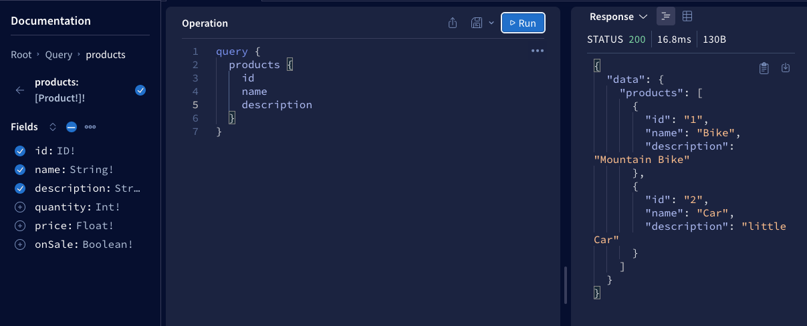
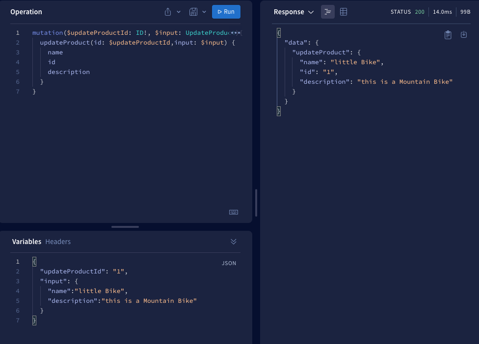

# GraphQL

## Apollo-server

### hello world 示例

使用 Apollo-server 并安装依赖：

```bash
npm install apollo-server
```

接着在 `index.js`中写入一个`hello world`的示例：

```js
const { ApolloServer, gql } = require('apollo-server');
// 定义 schema
const typeDefs = gql`
  type Query {
    hello: String
  }
`;
// 处理数据
const resolvers = {
  Query: {
    hello: () => {
      return 'world';
    },
  },
};
const server = new ApolloServer({
  typeDefs,
  resolvers,
});

server.listen().then(({ url }) => {
  console.log(`server is ready`);
});
```

在写 graphql 时，我们分成两步：

- 使用`typeDefs`是用来定义`graphql` 的 `schema` 查询语句,目前我们仅用`Query`来查询
- 使用`resolvers`来实现`schema`，将数据返回出去

接着我们可以访问`http://localhost:4000/graphql`，这时候会跳转到`Apollo Server`的`graphql playground`页面，我们可以通过这个页面来测试刚才写的 `hello`有没有效果。

`query`语句在前端对应的查询语句是：

```scheme
query {
  hello
}
```


### 基本类型

在`hello world`示例中，我们定义的 `hello`的返回值是 `String`。

下面是所有的`schema`的基本类型：

- `String` - 字符串
- `Int` - 数字
- `Float` - 浮点数
- `Boolean` - 布尔值
- `ID` - 约定唯一的字符串

其中 ID 表示一个不会重复的值，项目中我们可以使用`uuid`来生成。

下面是返回所有基本类型的示例：

```js
var { v4: uuidv4 } = require('uuid');

const typeDefs = gql`
  type Query {
    userID: ID
    hello: String
    numberOfAnimals: Int
    price: Float
    isCool: Boolean
  }
`;
// 获取数据
const resolvers = {
  Query: {
    userID: () => uuidv4(),
    hello: () => {
      return 'world';
    },
    numberOfAnimals: () => {
      return 100;
    },
    price: () => {
      return 3.1415926;
    },
    isCool: () => false,
  },
};
```

### 非空声明

默认情况下，每个类型都是可以为空的——这表示所有标量类型都可以返回 null。

如果不想为空则可以用一个感叹号表示一个类型不可为空，例如：`String!`表示非空字符串。

### 列表类型

如果是列表类型，使用方括号将对应类型包起来，如 `[String]` 就表示一个字符串列表。

```js
const typeDefs = gql`
  type Query {
    friends: [String!]
  }
`;
```

上面的例子表示`friends`可以是 `null`或者是数组项不为`null`的数组。

### 对象类型

如果我们想要回传的数据是对象类型，那么我们需要在`gql`中声明对象类型

```scheme
const typeDefs = gql`
  type Query {
    products: [Product!]!
  }

  type Product {
  	id:ID!
    name: String!
    description: String!
    quantity: Int!
    price: Float!
    onSale: Boolean!
  }
`
```

上面示例中`Product`就是对象类型。当`query`查询`products`时，会返回一个不为`null`的数组，数组项是`Product`类型且不能为`null`。

下面是我们定义的`Product`类型的 `resolvers`实现：

```js
const database = {
  products: [
    {
      id: '1',
      name: 'Bike',
      description: 'Mountain Bike',
      quantity: 20,
      price: 999.99,
      onSale: false,
    },
    {
      id: '2',
      name: 'Car',
      description: 'little Car',
      quantity: 10,
      price: 99999.99,
      onSale: true,
    },
  ],
};

const resolvers = {
  Query: {
    products: () => {
      return database.products;
    },
  },
};
```

使用`graphql playground`的查询也非常简单：



需要什么就在 `query` 语句中输入什么即可返回想要的数据。

### 传递参数

上面的例子中，我们已经能够将所有`products`查询出来了，但是如果我想要某一款`product`数据怎么办呢？

我们需要传递参数给服务端，让服务端根据这个参数来查询出对应的数据，开发中经常使用的参数就是 `id`。

我们首先定义`typeDefs`:

```js
const typeDefs = gql`
  type Query {
    products: [Product!]!
    product(id: ID!): Product
  }

  type Product {
    id: ID!
    name: String!
    description: String!
    quantity: Int!
    price: Float!
    onSale: Boolean!
  }
```

上面的`product(id: ID!): Product`表示我们需要根据`id`来查询出某一款`Product`类型的数据，有可能会为`null`，所以我们不加`!`。

此时我们需要在`resolvers`中将实现`schema`，将数据返回出去。

这种情况下当`graphql`调用我们`resolver`函数时，会给我们传递三个值：

- **parent** - 查到的父级数据
- **args** - 表示查询时传递过来的参数
- **context** - 保存的上下文属性

那么我们就可以通过`args`获取到前端传递过来的查询参数，所以对应的`resolvers`实现是这样的：

```js
const resolvers = {
  Query: {
    products: () => {
      return database.products;
    },
    product: (parent, args, context) => {
      console.log(args); // args就是前端传递过来的参数
      const productId = args.id;
      return database.products.find(product => product.id === productId);
    },
  },
};
```

在`playground`中测试时，我们一般会通过`Variables`的方式进行传递


`$productId`是表示一个变量标识，在前端使用`productId`查询，`graphql`会将它传递给`schema`中定义的`id`。

### 一对多连接

现在我们已经可以查询所有`products`以及根据`id`查询具体哪个`product`了。

整个过程有点类似单表查询，但实际开发中还有多表查询。

比如，现在还有一个品类的数据，会对`product`进行分类，数据是这样的：

```js
const database = {
  products: [
    {
      id: '1',
      name: 'Bike',
      description: 'Mountain Bike',
      quantity: 20,
      price: 999.99,
      onSale: false,
      categoryId: '1',
    },
    {
      id: '2',
      name: 'Car',
      description: 'little Car',
      quantity: 10,
      price: 999.99,
      onSale: true,
      categoryId: '2',
    },
  ],
  categories: [
    { id: '1', name: 'Bike' },
    { id: '2', name: 'Car' },
  ],
};
```

现在，我们的`product`多了一个属性`categoryId`是对应`categories`中`id`,表示这个产品是属于这个品类下的，他们之间用`categoryId`表示关系。

接下来更新一下的`type`

```diff
const typeDefs = gql`
  type Query {
    products: [Product!]!
    product(id: ID!): Product
+   categories: [Category!]!
+ 	category(id: ID!): Category
  }
+ type Category {
+   name: String!
+   id: ID!
+ }
  type Product {
    id: ID!
    name: String!
    description: String!
    quantity: Int!
    price: Float!
    onSale: Boolean!
+   categoryId: ID!
  }
`
```

以及`resolvers`:

```diff
const resolvers = {
  Query: {
    products: () => {
      return database.products
    },
    product: (parent, args, context) => {
      console.log(parent)
      console.log(args)
      const productId = args.id
      console.log(context)
      return database.products.find(product => product.id === productId)
    },
+    categories: () => {
+     return database.categories
+    },
+    category: (parent, args, context) => {
+      const { id } = args
+      return database.categories.find(category => category.id === id)
+    },
  },
}
```

目前我们的功能是能够根据 `id` 查到是哪个`category`以及`categories`数据了。

但是还没有实现根据`category`来查询出对应的`product`

倒推一下前端传递的写法，应该是这样的：

```scheme
query($categoryId: ID!){
  category(id: $categoryId) {
    id
    name
    products {
      name
      id
      categoryId
      description
    }
  }
}
```

我们应该通过 `categoryId` 查具体哪一个`category`,然后再使用`categoryId`对`products`进行筛选。

为了实现这一目标，需要更新一下`Category`的 `type`:

```diff
  type Category {
    name: String!
    id: ID!
+   products: [Product!]!
  }
```

其次，必须在`resolvers`中再声明一个与`Query`同级的`Category`

```js
const resolvers = {
  Query: {...
  },
  Category: {
    products: (parent, args, context) => {
      const { id } = parent
      return database.products.filter(product => product.id === id)
    },
  },
}
```

这里的 `parent`中取出来的`id`就是通过前端传递的`categoryId`查询到的`category`的`id`。

- `parent`表示父级拿到的数据。

- `args`表示本级传递过来的参数

现在我们已经能够实现根据`category`查询对应的`product`了。


通过 `product` 查询对应的 `category`也是同样的思路，我们首选需要更新`Product`类型：

```diff
  type Product {
    id: ID!
    name: String!
    description: String!
    quantity: Int!
    price: Float!
    onSale: Boolean!
    categoryId: ID!
+   category: Category!
  }
```

接着更新`resolvers`:

```js
  // 与 Query是同级的
  Product: {
    category: (parent, args, context) => {
      const { categoryId } = parent
      return database.categories.find(category => category.id === categoryId)
    },
  },
```

通过 `parent` 属性我们能够取到查询到的的`product`的数据。然后从里面拿出`categoryId`,最后找到对应的`category`数据。

以下是前端查询：


### 多对多连接

我们已经完成了从`product`查询`categray`以及从`categray`查询到对应的`product`了。

接下去就可以实现查询`products`时让每个`product`都能显示`categray`,以及查询`categories`时让每个`category`都能查到对应的`products`。

即多对多的连接。

事实上，由于我们已经完成了`product`到`category`以及`category`到`product`的逻辑，此时`graphql`已经帮我们做好了多对多的连接了，以下是查询示例：

**查询`categories`时找出所有对应的`products`**


**查询`products`时找出所有对应的`category`**


### context

当我们用`resolvers`时，我们的每个`resolver`函数调用时都会被`graphql`传入三个参数：`parent`、`args`、`context`。

我们已经知道前两个意味着什么。

下面介绍 `context`。这个属性能够在`new ApolloServer()`时被传进去，然后被传递给每个`resolver`。

比如，我们将每个`database`传入`context`

```diff
const server = new ApolloServer({
  typeDefs,
  resolvers,
+ context: database,
})
```

这时候就能够通过 `context` 拿到`database`的数据了。

```diff
    products: (parent, args, context) => {
+   	return database.products
      return context.products
    },
```

### input 类型

input 能够帮助我们做更精细化的筛选功能，举个例子：

我希望能够通过`id`查询到`product`、我希望能通过`onSale`查到正在出售中的`product`、我希望能够通过`name`属性帮我们查询到对应名称的`product`，等等。

现在这种需求下，纯传递参数已经很难满足我们了，所以我们需要用到`input`。

1. 定义`input`类型

   ```scheme
     input ProductFilterInput {
       onSale: Boolean
     }
   ```

2. 在`Query`中使用`filter`

   ```diff
     type Query {
   -  	products: [Product!]!
   +   products(filter: ProductFilterInput): [Product!]!
   		...
     }
   ```

3. 在`resolvers`中写`filter`逻辑

   ```diff
     products: (parent, args, context) => {
   -    return context.products
   +    const { filter } = args
   +    let filteredProducts = context.products
   +    if (filter) {
   +      if (filter.onSale !== undefined) {
   +        filteredProducts = filteredProducts.filter(product => {
   +          return product.onSale === filter.onSale
   +        })
   +      }
   +    }
   +    return filteredProducts
     },
   ```

筛选产品是否在售的逻辑就写好了


### Mutation

下面我们进入到另一个环节，上面的例子中，所有的数据都是现成的，我们能够使用`Query`来查现有数据。

如果我希望能够添加`product`或者`category`，我们就应该使用`input` 或者`args`和`mutation`来帮助我们做增加、更新、删除等工作。

**增加**

由于增加可能会有很多个数据，所以我们还需要定义一个`input`类型。

以下是步骤：

1. 定义`Mutation` 和`input`

   ```scheme
     type Mutation {
       addCategory(input: AddCategoryInput): Category!
     }
     input AddCategoryInput {
       name: String!
     }
   ```

   `input`表示前端的输入，在这个例子中，前端只需要输入`name`即可。

2. 接着写`resolver`函数

   ```js
   import { v4 as uuidv4 } from 'uuid';
   const Mutation = {
     addCategory: (parent, { input }, context) => {
       const { name } = input;
       console.log(input);
       const newCategory = {
         id: uuidv4(),
         name,
       };
       context.categories.push(newCategory);
       return newCategory;
     },
   };
   export default Mutation;
   ```

3. 最后将`Mutation`传递给`resolvers`

   ```js
   const resolvers = {
     ...Mutation,
   };
   ```

在`playground`测试一下


增加`product`也是同样的逻辑，我们需要在 `Mutation` 中定义变更的`type`，然后传入一个 `input`

```scheme
  type Mutation {
  	...
    addProduct(input: AddProductInput): Product!
  }
  input AddProductInput {
    name: String!
    description: String!
    quantity: Int!
    price: Float!
    onSale: Boolean!
    categoryId: ID!
  }
```

接着在`Mutation`中实现`resolver`函数

```js
  addProduct: (parent, { input }, context) => {
    const newProduct = {
      id: uuidv4(),
      ...input,
    }
    context.products.push(newProduct)
    return newProduct
  },
```

`playground`查询结果：


**删除**

下面我们来完成删除逻辑，一般的删除逻辑都是通过`id`来完成的，我们通过前端传递 `id` 就可以判断用户想要删除哪条数据。

第一步，写`schema`:

```diff
  type Mutation {
    addCategory(input: AddCategoryInput): Category!
    addProduct(input: AddProductInput): Product!
+   deleteCategory(id: ID!): Boolean
  }
```

之所以返回`Boolean`是因为我们只需要服务器告诉我们执行结果。

第二步，在`Mutation`中实现 `resolver`:

```js
  deleteCategory: (parent, { id }, context) => {
    const targetIndex = context.categories.findIndex(category => category.id === id)
    if (targetIndex !== -1) {
      context.categories.splice(targetIndex, 1)
      return true
    }
    return false
  },
```

下面是测试结果


**更新**

更新往往需要使用`args`结合`input`来完成，因为我们可能使用`id`来查询具体数据，然后需要更新成什么样子则通过`input`传入。

第一步：定义`schema`

```scheme
  type Mutation {
    updateProduct(id: ID!, input: UpdateProduct): Product
  }
  input UpdateProduct {
    name: String
    description: String
    quantity: Int
    price: Float
    onSale: Boolean
    categoryId: ID
  }
```

第二步：在`Mutation`中实现`resolver`

```js
  updateProduct: (parent, { id, input }, context) => {
    const targetIndex = context.products.findIndex(product => product.id === id)

    if (targetIndex !== -1 && input !== null) {
      context.products[targetIndex] = {
        ...context.products[targetIndex],
        ...input,
      }
    }
    return context.products[targetIndex]
  },
```

测试结果：


