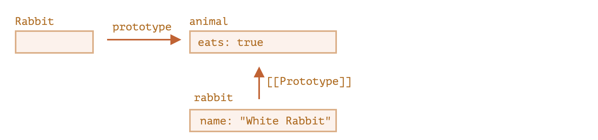
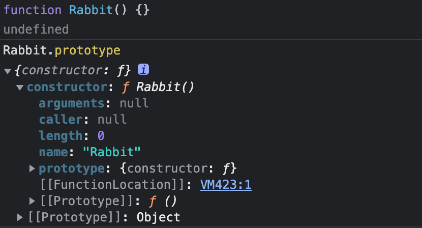
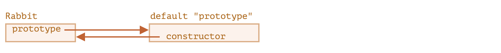

# JavaScript 中的原型

## 实例对象的原型继承

如果要实现某个实例对象扩展另一个实例对象的属性和方法，大部分语言会使用到继承，比如 Java 的 class 继承，这些方式会从被继承的 class 处复制它的方法。

但是 JavaScript 的继承并不是这样的。

JavaScript 采用的是原型继承的方式，并且实例对象也能够继承。

什么是原型继承？

在 JavaScript 中，对象有一个特殊的隐藏属性 `[[Prototype]]`（如规范中所命名的），它要么为 `null`，要么就是对另一个对象的引用。该对象被称为“原型”：

> object.[[Prototype]] ===> prototype object

如果我们想要访问这个对象，除了在浏览器的控制台输入`console.dir(object)`外，还可以通过`__proto__`来设置和访问它。

```js
let dog = {
  eats: true,
};
let animal = {
  jumps: true,
};

dog.__proto__ = animal; // 设置 dog.[[Prototype]] = animal
```

如果我们从 `dog` 中读取一个它没有的属性，JavaScript 会自动从 `animal` 中获取。

```js
let dog = {};
let animal = {
  jumps: true,
  eats: true,
};

dog.__proto__ = animal; // (*)

// 现在这两个属性我们都能在 rabbit 中找到：
alert(dog.eats); // true (**)
alert(dog.jumps); // true
```

第`*`行，我们将 `dog` 的原型对象设置为 `animal`，虽然 `dog` 是个空对象，但是却能访问到 `eats` 和 `jumps` 属性。

**如果对象身上没有某个属性，`JavaScript` 会顺着`[[prototype]]`往上查找，直到原型的终点——`null` 为止。**

> dog.eats ===> [[prototype]] ===> rabbit.eats

在上面的例子中，`dog`的原型是 `animal`。`dog`的`jumps`和`eats`方法继承自`animal`。

如果 `animal` 有其他属性和方法，那么它们将自动地变为在 `dog` 中可用。这种属性被称为“**继承**”。

一个对象可以继承多个其他对象的属性和方法，但是不可以有两个`[[Prototype]]`

如果要继承多个其他对象的属性和方法，则可以创建一组原型链表：

```js
let animal = {
  eats: true,
  walk() {
    alert('Animal walk');
  },
};

let rabbit = {
  jumps: true,
  __proto__: animal,
};

let longEar = {
  earLength: 10,
  __proto__: rabbit,
};
```

现在的原型链表是这样的：

> longEar ===> rabbit ===> animal

`longEar`可以调用 `animal`的 `walk`方法

```js
longEar.walk(); // Animal walk
```

整体的流程是：访问 `longEar` 的 `walk`属性时，如果`longEar`本身没有，就会顺着`[[Prototype]]`往上查找，最终查找到`animal`的`walk`方法。

这里有两个限制：

1. 原型链表不能有环形引用，否则 JavaScript 会报错
2. 原型链表只能赋值给 null 或者对象类型，其他类型的数据都会被忽略

## 原型中的 this

有这么一个例子：

```js
let user = {
  name: 'John',
  surname: 'Smith',
  get fullName() {
    return `${this.name} ${this.surname}`;
  },
};

let admin = {
  __proto__: user,
  isAdmin: true,
};
```

`admin.fullName` 此时返回什么？

答案很显而易见，由于调用的对象是 `admin`，所以 `this`指向`admin`。

又因为`admin`并没有 `name` 和 `surname`,所以就顺着`admin`的原型链，找到`user`对象，最终返回`John Smith`。

这说明`this` 在 JavaScript 的设计中不受原型的影响。

**无论在哪里找到方法：在一个对象还是在原型中。在一个方法调用中，`this` 始终是点符号 `.` 前面的对象。**

这个很重要，因为很有可能在继承的方法中会修改某一个属性，当继承的对象运行继承的方法时，它们将仅修改自己的状态，而不会修改大对象的状态。

例如，这里的 `animal` 代表“方法存储”，`rabbit` 在使用其中的方法。

调用 `rabbit.sleep()` 会在 `rabbit` 对象上设置 `this.isSleeping`：

```js
// animal 有一些方法
let animal = {
  walk() {
    if (!this.isSleeping) {
      alert(`I walk`);
    }
  },
  sleep() {
    this.isSleeping = true;
  },
};

let rabbit = {
  name: 'White Rabbit',
  __proto__: animal,
};

// 修改 rabbit.isSleeping
rabbit.sleep();

alert(rabbit.isSleeping); // true
alert(animal.isSleeping); // undefined（原型中没有此属性）
```

如果我们还有从 `animal` 继承的其他对象，像 `bird` 和 `snake` 等，它们也将可以访问 `animal` 的方法。但是，每个方法调用中的 `this` 都是在调用时（点符号前）评估的对应的对象，而不是 `animal`。因此，当我们将数据写入 `this` 时，会将其存储到这些对象中。

所以，方法是共享的，但对象状态不是。

## for..in 循环

`for..in`循环会遍历到继承的属性

```js
let animal = {
  eats: true,
};

let rabbit = {
  jumps: true,
  __proto__: animal,
};

// Object.keys 只返回自己的 key
alert(Object.keys(rabbit)); // jumps

// for..in 会遍历自己以及继承的键
for (let prop in rabbit) alert(prop); // jumps，然后是 eats
```

如果我们不需要遍历到继承的属性，一个方法是改用`Object.keys`替代`for..in`遍历，还有一个方法是使用`hasOwnProperty`来判断该属性是继承的还是自身上的，如果是自身的属性，则返回`true`。

使用`hasOwnProperty`配合 `for..in`迭代的示例如下：

```js
let animal = {
  eats: true,
};

let rabbit = {
  jumps: true,
  __proto__: animal,
};

for (let prop in rabbit) {
  let isOwn = rabbit.hasOwnProperty(prop);

  if (isOwn) {
    alert(`Our: ${prop}`); // Our: jumps
  } else {
    alert(`Inherited: ${prop}`); // Inherited: eats
  }
}
```

虽然`for..in`能遍历到继承的属性，但是几乎所有内置的继承到的方法却不会被遍历出来。

这是因为 JavaScript 内置的继承方法都设置了一个属性描述符——`enumerable:false`，

`for..in`只能列出可枚举的属性，这就是为什么`hasOwnProperty`等继承过来的方法不会被遍历出来。

## Object.prototype

上面的例子中我们将`rabbit`的原型设置为`adnimal`

```js
let animal = {
  eats: true,
};

let rabbit = {
  jumps: true,
  __proto__: animal,
};
```

然后，我们调用了`rabbit.hasOwnProperty`方法。

```js
for(let prop in rabbit) {
  let isOwn = rabbit.hasOwnProperty(prop);
  ...
}
```

我们已经知道`hasOwnProperty`这种内置的方法是继承过来的，它的`enumerable`是`false`，所以不能被`for..in`遍历到。

那么这个方法存在哪里？JavaScript 是不是为所有对象都设计了一个最终的`prototype`？

答案是——是的，所有 JavaScript 对象都指向最终的原型：`Object.prototype`

`Object.prototype`的`__proto__`指向`null`，这是原型的终点了。

`rabbit`对象的原型链是这样的：

```js
rabbit ===> animal ===> Object.prototype ===> null
```

我们可以通过浏览器的控制台来得知这一点

```js
rabbit.__proto__.__proto__ === Object.prototype; // true
Object.prototype.__proto__ === null; // true
```

## 构造函数 F.prototype

> 实例出来的对象`.__prototype__` === 它的构造函数`.prototype`

当`new`操作符将一个对象创建出来后，它的内部会将构造函数`F.prototype`设置成新对象的`[[Prototype]]`。

下面是一个例子：

```js
let animal = {
  eats: true,
};

function Rabbit(name) {
  this.name = name;
}

Rabbit.prototype = animal;

let rabbit = new Rabbit('White Rabbit'); //  rabbit.__proto__ == animal

alert(rabbit.eats); // true
```

当使用 `new`操作符创建由 `Rabbit` 构造函数构建的对象 `rabbit`时，`rabbit.__proto__`就被`new`操作符指向了`Rabbit.prototype`。

设置 `Rabbit.prototype = animal` 的字面意思是：“当创建了一个 `new Rabbit` 时，把它的 `[[Prototype]]` 赋值为 `animal`”。



## 默认的 F.prototype

每个函数都有一个默认的`prototype`,里面仅有一个`constructor`属性，指向函数自身。

```js
function Rabbit() {}

/* 默认的 prototype
Rabbit.prototype = { constructor: Rabbit };
*/
Rabbit ===> { constructor: Rabbit }
```



上面的 Rabbit 函数与默认的`prototype`的关系是这样的



如果 `Rabbit` 的默认`prototype`没有被改变，那么由 Rabbit 构造的 rabbit 对象也可以通过`[[prototype]]`访问到 `Rabbit`.

```js
let rabbit = new Rabbit();
rabbit.__proto__.constructor === Rabbit; // true
let rabbit2 = new rabbit.constructor('Black Rabbit');
```

这种方式的好处是，当我有一个对象，但是不知道它使用了哪个构造器时，就可以通过该对象的`constructor`属性来获取到这个构造器。

不过有一个注意点：

**……JavaScript 自身并不能确保正确的 `"constructor"` 函数值。**

也就是说，JavaScript 没有严格规定`constructor`的值，它仅存在于默认的`prototype`中。

特别是，如果我们将整个默认 prototype 替换掉，那么其中就不会有 `"constructor"` 了。

```js
function Rabbit() {}
Rabbit.prototype = {
  jumps: true,
};

let rabbit = new Rabbit();
alert(rabbit.constructor === Rabbit); // false
```

因此，为了确保正确的`constructor`，我们有必要在写程序时加上它：

```js
function Rabbit() {}

// 不要将 Rabbit.prototype 整个覆盖
// 可以向其中添加内容
Rabbit.prototype.jumps = true;
// 默认的 Rabbit.prototype.constructor 被保留了下来
```

或者就是手动创建`constructor`属性

```js
Rabbit.prototype = {
  jumps: true,
  constructor: Rabbit,
};

// 这样的 constructor 也是正确的，因为我们手动添加了它
```
