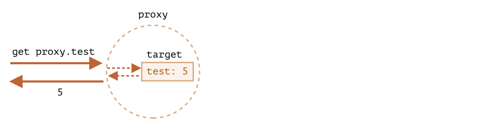

# Proxy 和 Reflect

## Proxy

`Proxy`对象可以包装另一个对象并拦截其读取/写入属性和其他操作。

```js
let proxy = new Proxy(target, handler);
```

- `target` —— 是要包装的对象，可以使任何东西，包括函数
- `handler` —— 代理配置：带有拦截操作（捕捉器）的方法的对象。比如`get`捕捉器用于读取`target`的属性，`set`捕捉器用于写入`target`的属性。

如果`handler`是空对象，即里面没有任何捕捉器，那么就直接对 target 进行处理。反之则通过捕捉器让 Proxy 对`target`进行处理。

例如，下面是一个没有捕捉器的代码：

```js
let target = {};
let proxy = new Proxy(target, {}); // 空的 handler 对象，没有捕捉器
proxy.name = 'qiuyanxi'; //对 proxy 写入内容，会直接影响到 target
console.log(target.name); // qiuyanxi
console.log(proxy.name); // qiuyanxi

for (let key in proxy) console.log(key); // name
```

由于没有捕捉器，所有对`proxy`的操作都会直接转发给`target`

- 写入操作`proxy.name=`会将值直接写入`target`
- 读取操作`proxy.name`会直接读取`target.name`
- 对`proxy`迭代会从`target`处返回对应的值

如果没有任何捕捉器，那么`proxy`就是一个`target`的透明包装器(wrapper)



如果要做更多操作，那么我们需要添加捕捉器。

捕捉器在里面的功能相当于拦截，我们可以用它们来拦截**底层方法**。

底层方法是位于`JavaScript` 的对象底层的方法，也就是内部方法，我们不能直接通过方法名调用它们。

内部方法描述了最底层的工作方式，例如`[[Get]]`用于读取属性，`[[Set]]`用于写入属性等。

这些最底层的内部方法都能够被 Proxy 捕捉器所拦截。

以下是每一种内部方法所对应的捕捉器：

| 内部方法                | Handler 方法               | 何时触发                                                                                                                                                                                                                                                                                                                    |
| :---------------------- | :------------------------- | :-------------------------------------------------------------------------------------------------------------------------------------------------------------------------------------------------------------------------------------------------------------------------------------------------------------------------- |
| `[[Get]]`               | `get`                      | 读取属性                                                                                                                                                                                                                                                                                                                    |
| `[[Set]]`               | `set`                      | 写入属性                                                                                                                                                                                                                                                                                                                    |
| `[[HasProperty]]`       | `has`                      | `in` 操作符                                                                                                                                                                                                                                                                                                                 |
| `[[Delete]]`            | `deleteProperty`           | `delete` 操作符                                                                                                                                                                                                                                                                                                             |
| `[[Call]]`              | `apply`                    | 函数调用                                                                                                                                                                                                                                                                                                                    |
| `[[Construct]]`         | `construct`                | `new` 操作符                                                                                                                                                                                                                                                                                                                |
| `[[GetPrototypeOf]]`    | `getPrototypeOf`           | [Object.getPrototypeOf](https://developer.mozilla.org/zh/docs/Web/JavaScript/Reference/Global_Objects/Object/getPrototypeOf)                                                                                                                                                                                                |
| `[[SetPrototypeOf]]`    | `setPrototypeOf`           | [Object.setPrototypeOf](https://developer.mozilla.org/zh/docs/Web/JavaScript/Reference/Global_Objects/Object/setPrototypeOf)                                                                                                                                                                                                |
| `[[IsExtensible]]`      | `isExtensible`             | [Object.isExtensible](https://developer.mozilla.org/zh/docs/Web/JavaScript/Reference/Global_Objects/Object/isExtensible)                                                                                                                                                                                                    |
| `[[PreventExtensions]]` | `preventExtensions`        | [Object.preventExtensions](https://developer.mozilla.org/zh/docs/Web/JavaScript/Reference/Global_Objects/Object/preventExtensions)                                                                                                                                                                                          |
| `[[DefineOwnProperty]]` | `defineProperty`           | [Object.defineProperty](https://developer.mozilla.org/zh/docs/Web/JavaScript/Reference/Global_Objects/Object/defineProperty), [Object.defineProperties](https://developer.mozilla.org/zh/docs/Web/JavaScript/Reference/Global_Objects/Object/defineProperties)                                                              |
| `[[GetOwnProperty]]`    | `getOwnPropertyDescriptor` | [Object.getOwnPropertyDescriptor](https://developer.mozilla.org/zh/docs/Web/JavaScript/Reference/Global_Objects/Object/getOwnPropertyDescriptor), `for..in`, `Object.keys/values/entries`                                                                                                                                   |
| `[[OwnPropertyKeys]]`   | `ownKeys`                  | [Object.getOwnPropertyNames](https://developer.mozilla.org/zh/docs/Web/JavaScript/Reference/Global_Objects/Object/getOwnPropertyNames), [Object.getOwnPropertySymbols](https://developer.mozilla.org/zh/docs/Web/JavaScript/Reference/Global_Objects/Object/getOwnPropertySymbols), `for..in`, `Object.keys/values/entries` |

## get 捕捉器

最常见的捕捉器用于读取/写入属性。

如果我们想要拦截读取操作，`handler`就应该具备`get(target,property,receiver)`方法。

读取属性时会触发这个方法，参数是这样的：

- target —— 目标对象，该对象被作为第一个参数传递给`new Proxy`
- Property —— 目标属性名
- receiver —— 如果目标属性是一个`getter`属性，则`receiver`就是本次读取属性所在的`this`对象。通常，这就是`proxy`对象本身。（如果我们从 proxy 继承，则是从 proxy 继承的对象）

现在我们可以用`get`来实现一个对象的默认值。

一般来说，数组不存在的项都是返回 undefined，如果我们想要默认返回 0，则可以这么做：

```js
let target = [1, 2, 3];
let proxy = new Proxy(target, {
  get(target, property, receiver) {
    if (property in target) {
      return target[property];
    }
    return 0;
  },
});
console.log(proxy[0]); //1
console.log(proxy[4]); //0 没有这个属性
```

这种方法很有用，假设我们现在有一本词典：

```js
let dictionary = {
  hello: 'English',
  你好: 'Chinese',
};
```

我们可以**将它变成它的代理**，然后再拦截对它的读取操作

```js
dictionary = new Proxy(dictionary, {
  // 拦截对它的操作
  get(target, property, receiver) {
    //如果有这个词，就返回对应的语言
    if (property in target) {
      return target[property];
    }
    return property; // 如果没有，就返回这个词
  },
});
console.log(dictionary['hello']); // English
console.log(dictionary['哈利路亚']); // 哈利路亚
```

变量名从原来的 target 指向了代理，这就意味着代理覆盖了变量。

```js
dictionary = new Proxy(dictionary, ...);
```

代理应该在所有地方都完全替代目标对象。目标对象被代理后，任何人都不应该再引用目标对象。否则很容易搞砸。

## set 捕捉器

JavaScript 的数组里面可以放任何的值，对象、数字、字符串等，假设我需要设置一个专门用于添加数字的数组，如果添加了其他类型的值就会抛出一个错误，就可以使用 set 捕捉器拦截。

`set`捕捉器参数如下：

```js
set(target, property, value, receiver);
```

- target —— 目标对象
- property —— 目标属性名称
- value —— 目标属性的值
- receiver —— 与 `get` 捕捉器类似，仅与 setter 访问器属性相关。

如果写入成功，则应该返回`true`，否则返回`false`（触发 `TypeError`）

```js
let numbers = [];
numbers = new Proxy(numbers, {
  set(target, prop, value, receiver) {
    if (typeof value === 'number') {
      target[prop] = value;
      return true;
    }
    return false;
  },
});
console.log((numbers[0] = 0)); // 添加成功
console.log(numbers.push(1)); // 添加成功
console.log((numbers[2] = 'test')); // TypeError
```

值得注意的是，使用数组的内置方法`push`也是有效的。代理对象 proxy 并不会破坏任何东西。我们不必重写`push`或者`unshift`等添加元素的数组方法（`Vue2` 是这么做的），就可以在其中添加检查，因为在内部它们使用代理所拦截的`[[Set]]`操作。

> 一定要返回`true`。对于 set 操作，它必须在成功时返回 true，如果我们忘记这样做，或者返回 falsy 值，则该操作触发 TypeError。
>
> 这是因为从底层设计来说，我们必须维持不变量。

> **不变量**
>
> JavaScript 强制执行某些不变量 — 内部方法和捕捉器必须满足的条件。
>
> 其中大多数用于返回值：
>
> - `[[Set]]` 如果值已成功写入，则必须返回 `true`，否则返回 `false`。
>
> - `[[Delete]]` 如果已成功删除该值，则必须返回 `true`，否则返回 `false`。
>
> - 应用于代理（proxy）对象的 `[[GetPrototypeOf]]`，必须返回与应用于被代理对象的 `[[GetPrototypeOf]]` 相同的值。换句话说，读取代理对象的原型必须始终返回被代理对象的原型。
>
>   ...
>
> 捕捉器可以拦截这些操作，但是必须遵循这些规则以确保语言功能的正确和一致的行为。

## 使用`ownKeys`和`getOwnPropertyDescriptor`迭代

`Object.keys`，`for..in` 循环和大多数其他遍历对象属性的方法都使用内部方法 `[[OwnPropertyKeys]]`（由 `ownKeys` 捕捉器拦截) 来获取属性列表。

这些方法在细节上有所不同：

- `Object.getOwnPropertyNames(obj)` 返回非 Symbol 键。
- `Object.getOwnPropertySymbols(obj)` 返回 Symbol 键。
- `Object.keys/values()` 返回带有 `enumerable` 标志的非 Symbol 键/值。
- `for..in` 循环遍历所有带有 `enumerable` 标志的非 Symbol 键，以及原型对象的键。

我们可以使用`ownKeys`捕捉器来拦截`for..in`对`user`的遍历，并使用`Object.keys`和`Object.values`来跳过下划线为`__`开头的属性。

```js
let user = { name: 'qiuyanxi', age: 20, _height: 180 };
user = new Proxy(user, {
  // 过滤掉开头带_的属性
  ownKeys(target) {
    return Object.keys(target).filter(item => !item.startsWith('_'));
  },
});
for (let key in user) {
  console.log(key); // name  age
}
```

如果我们返回对象中不存在的键，`Object.keys`并不会列出这些键：

```js
let user = {};

user = new Proxy(user, {
  ownKeys(target) {
    return ['a', 'b', 'c'];
  },
});

alert(Object.keys(user)); // <empty>
```

这是因为`Object.keys`仅返回带有`enumerable`标志的属性。为了检查它，该方法会首先对每个属性调用内部方法`[[getOwnProperty]]`来获取描述符（descriptor）。

但是上面的例子中并没有属性，那就意味着其属性描述符为空，没有`enumerable`标志，因此它被忽略了。

如果我们希望在这种情况下返回，那么我们可以使用`getOwnPropertyDescriptor`捕捉器拦截对`[[getOwnProperty]]`的调用，并返回`enumberable:true`的描述符。

```js
let user = {};

user = new Proxy(user, {
  ownKeys(target) {
    // 一旦要获取属性列表就会被调用
    return ['a', 'b', 'c'];
  },

  getOwnPropertyDescriptor(target, prop) {
    // 被每个属性调用
    return {
      enumerable: true,
      configurable: true,
      /* ...其他标志，可能是 "value:..." */
    };
  },
});

alert(Object.keys(user)); // a, b, c
```

## deleteProperty 捕捉器

当我们想要删除某个属性时，可以通过`deleteProperty`来拦截删除操作。

比如我们不希望删除 `name`,则可以这么拦截：

```js
let user = { name: 'qiuyanxi', age: '20' };
user = new Proxy(user, {
  deleteProperty(target, prop) {
    if (prop === 'name') {
      return false;
    }
    delete target[prop];
    return true;
  },
});
delete user.age; // success
console.log(user.age); // undefined
delete user.name; // TypeError
```

## 使用多个捕捉器来实现受保护属性

普遍约定下，以下划线`__`开头的属性和方法是内部的，我们不应该从对象外部访问它。

下面我们使用代理来禁止对`__`开头属性的任何访问：

- 不能读取该属性
- 不能修改该属性
- 不能删除该属性
- 不能遍历该属性

```js
let user = { name: 'qiuyanxi', age: '20', _password: '***' };
user = new Proxy(user, {
  // 拦截读取属性
  get(target, prop) {
    if (prop.startsWith('_')) {
      throw new Error(`you can not visit ${prop} `);
    }
    return target[prop];
  },
  // 拦截写入属性
  set(target, prop, value) {
    if (prop.startsWith('_')) {
      return false;
    }
    target[prop] = value;
    return true;
  },
  // 拦截删除属性
  deleteProperty(target, prop) {
    if (prop.startsWith('_')) {
      return false;
    }
    delete target[prop];
    return true;
  },
  // 拦截读取属性列表
  ownKeys(target) {
    return Object.keys(target).filter(key => !key.startsWith('_'));
  },
});

// "get" 不允许读取 _password
try {
  user._password;
} catch (error) {
  alert(error.message); // you can not visit _password
}

// "set" 不允许写入 _password
try {
  user._password = '123456';
} catch (error) {
  alert(error.message); // 'set' on proxy: trap returned falsish for property '_password'
}

// "deleteProperty" 不允许删除 _password
try {
  delete user._password;
} catch (error) {
  alert(error.message); // 'deleteProperty' on proxy: trap returned falsish for property '_password'
}

// "ownKeys" 将 _password 过滤出去
alert(Object.keys(user)); // name  age
```

## 拦截读取属性时的注意点

在读取属性时，有一个注意点：当属性是函数时，需要做特殊处理。比如，user 的`_password`属性虽然是受到保护的，但是我们依然想要通过某个方法来访问到它：

```js
let user = {
  name: 'qiuyanxi',
  age: '20',
  _password: '***',
  getPassword: function() {
    return this._password;
  },
};
```

如果此时代码依然是这样的：

```js
user = new Proxy(user, {
  get(target, prop) {
    if (prop.startsWith('_')) {
      throw new Error(`you can not visit ${prop} `);
    }
    return target[prop];
  },
});
```

那当访问 `user.getPassword()`时，此时 this 为代理对象 ,而不是原对象。`this._password`会触发 `get`拦截器，我们会得到`error`。

解决的方法是将原对象绑定上去：

```diff
user = new Proxy(user, {
  get(target, prop) {
    if (prop.startsWith("_")) {
      throw new Error(`you can not visit ${prop} `);
    }
+    if(typeof target[prop]==='function'){return target[prop].bind(target)}
    return target[prop];
  }
});
```

这样一来，`this`的指向就绑定在原对象上面，对`this.getPassword`的调用不会触发捕捉器。

> 这种方案通常可行，但是并不理想，因为一个方法可能将未被代理的对象传递到任何地方，这时候我们就会陷入困惑，原始对象和被代理对象会变得模糊不清。同时，一个对象可能被代理多次，并且如果我们将未包装的对象传递给方法，则可能会产生意想不到的后果。

## has 捕捉器

使用 `in`操作符可以检查属性是否存在于对象当中，如果想要拦截，则需要使用 has 捕捉器。

`has` 捕捉器会拦截 `in` 调用。

`has(target,property)`

- Target ——目标对象
- property —— 属性名

```js
let range = {
  start: 1,
  end: 10,
};

range = new Proxy(range, {
  has(target, prop) {
    return prop >= target.start && prop <= target.end;
  },
});

alert(5 in range); // true
alert(50 in range); // false
```

上面的代码是通过`in`操作符来检查一个数字是否在`range`范围内。

## apply 包装函数

`apply(target, thisArg, args)` 捕捉器可以捕捉到函数的调用情况。

假设现在有一个函数是这样的：

```js
function sayHi(args) {
  console.log(`${args} ${this.name} `);
}
sayHi.call({ name: 'qiuyanxi' }, 'hi'); // hi qiuyanxi
```

此时`sayHi`被调用后 this 为`{name:'qiuyanxi'}`,`args`为`hi`。如果我们希望能够使用同样的方式，但是缺修改掉 this，使其变成`{name:'Leo'}`应该怎么做？

使用`apply`可以拦截函数调用，并且对其做一些修改：

```js
function sayHi(args) {
  console.log(`${args} ${this.name} `);
}
sayHi = new Proxy(sayHi, {
  apply(target, thisArg, args) {
    console.log('thisArg', thisArg); // { name: "qiuyanxi" }
    console.log('args', args); // ['hi']
    target.call({ name: 'Leo' }, args);
  },
});
sayHi.call({ name: 'qiuyanxi' }, 'hi'); // hi Leo
```

使用`apply`捕捉器，我们就可以改变函数调用时的`this`指向。

下面还有一个例子，我们写一个 delay 函数，让传入的函数每次调用时，都延迟 3s

```js
function delay(f, ms) {
  return function() {
    return setTimeout(() => {
      f.apply(this, arguments);
    }, ms);
  };
}
function sayHi(user) {
  console.log(`Hi ${user}`);
}
console.log(sayHi.length); // 1
sayHi = delay(sayHi, 3000);
console.log(sayHi.length); // 0
```

通过这种包装后，虽然`sayHi('qiuyanxi')`能够正常调用，但是有了这么一层包装器后，`sayHi`的一些原始属性就消失了。

那么我们可以使用 `proxy`来做包装

```js
function delay(f, ms) {
  return new Proxy(f, {
    apply(target, thisArg, args) {
      setTimeout(() => {
        target.apply(thisArg, args);
      }, ms);
    },
  });
}

function sayHi(user) {
  console.log(`hi ${user}`);
}

sayHi = delay(sayHi, 3000);
sayHi.length; // 1
sayHi('qiuyanxi'); // hi qiuyanxi
```

现在代理上的所有操作都会转发到原始函数上。于是`sayHi.length`也是正确的结果。

## Reflect

`Reflect`是一个内建对象，它相当于内部方法的简单包装，允许我们显示调用`[[Get]]`和`[[Set]]`等内部方法。

比如，当使用`obj[prop]`读取属性时，其实是调用了`[[Get]]`这个内部方法。我们也可以使用`Reflect.get(obj,prop)`来直接调用这个内部方法而不使用`obj[prop]`读取。

```js
let user = { name: 'qiuyanxi' };
Reflect.get(user, 'name'); // qiuyanxi
```

同时也可以不使用`obj[prop]=xxx`这样的方式设置属性，而改用`Reflect.set(obj,prop,value)`写入属性

```js
let user = {};
Reflect.set(user, 'name', 'qiuyanxi'); // {name: "qiuyanxi"}
console.log(user);
```

以下是执行相同操作和 `Reflect` 调用的示例：

| 操作                | `Reflect` 调用                      | 内部方法        |
| :------------------ | :---------------------------------- | :-------------- |
| `obj[prop]`         | `Reflect.get(obj, prop)`            | `[[Get]]`       |
| `obj[prop] = value` | `Reflect.set(obj, prop, value)`     | `[[Set]]`       |
| `delete obj[prop]`  | `Reflect.deleteProperty(obj, prop)` | `[[Delete]]`    |
| `new F(value)`      | `Reflect.construct(F, value)`       | `[[Construct]]` |
| …                   | …                                   | …               |

`Reflect`允许我们将操作符(new、delete)作为函数（Reflect.construct、Reflect.deleteProperty）来调用。

对于每个可被 `Proxy`捕获的内部方法，在`Reflect`中都有一个对应的方法，其名称和参数跟`Proxy`捕捉器相同。

当使用`Proxy`时，我们可以结合`Reflect`来将操作转发给原始对象。

```js
let user = { name: 'qiuyanxi' };
user = new Proxy(user, {
  get(target, prop) {
    alert(`get ${prop}`);
    return Reflect.get(target, prop);
  },
  set(target, prop, value, receiver) {
    alert(`set ${prop}=${value}`);
    return Reflect.set(target, prop, value);
  },
});
console.log(user.name);
user.name = 'Leo';
```

- Reflect.get 可以读取一个对象属性
- Reflect.set 写入一个对象的属性，如果成功则返回`true`，否则则返回`false`

这样，一切都很简单：如果一个捕捉器想要将调用转发给对象，则只需使用相同的参数调用 `Reflect.<method>` 就足够了。

虽然不使用`Reflect`同样也可以，但是建议配合`Proxy`使用。

下面是一个体现使用`Reflect`的好处的简单例子：

```js
let user = {
  _name: 'qiuyanxi',
  get name() {
    return this._name;
  },
};
let proxyUser = new Proxy(user, {
  get(target, prop, receiver) {
    return target[prop]; // *
  },
});
let admin = Object.create(proxyUser);
admin._name = 'admin';
// 期望得到输出 admin
console.log(admin.name); // qiuyanxi
```

在第`*`行，我们直接用`target[prop]`的方式来返回目标对象的属性值。

读取 `admin.name` 应该返回 `"admin"`，而不是 `"qiuyanxi"`！

**如果我们移除代理，那么一切都会按预期进行。**

问题实际上出在代理中，在 `(*)` 行。

1. 当我们读取 `admin.name` 时，由于 `admin` 对象自身没有对应的的属性，搜索将转到其原型。

2. 原型是 `userProxy`。

3. 从代理读取 `name` 属性时，`get` 捕捉器会被触发，并从原始对象返回 `target[prop]` 属性，在 `(*)` 行。

   当调用 `target[prop]` 时，若 `prop` 是一个 getter，它将在 `this=target` 上下文中运行其代码。因此，结果是来自原始对象 `target` 的 `this._name`，即来自 `user`。

为了解决这种情况，我们需要 `get` 捕捉器的第三个参数 `receiver`。它保证将正确的 `this` 传递给 getter。在我们的例子中是 `admin`。

如何把上下文传递给 getter？对于一个常规函数，我们可以使用 `call/apply`，但这是一个 getter，它不能“被调用”，只能被访问。

所以这时候我们需要使用`Reflect`了。

```js
let user = {
  _name: 'qiuyanxi',
  get name() {
    return this._name;
  },
};
let userProxy = new Proxy(user, {
  get(...rest) {
    return Reflect.get(...rest);
  },
});
let admin = Object.create(userProxy);
admin._name = 'admin';
console.log(admin.name); // 得到正确的答案了：admin
```

现在 `receiver` 保留了对正确 `this` 的引用（即 `admin`），该引用是在 `(*)` 行中被通过 `Reflect.get` 传递给 getter 的。

`Reflect` 调用的命名与捕捉器的命名完全相同，并且接受相同的参数。它们是以这种方式专门设计的。

因此，`return Reflect...` 提供了一个安全的方式，可以轻松地转发操作，并确保我们不会忘记与此相关的任何内容。

## Proxy 的局限

`Proxy`可以在底层修改或者调整现有对象的某些行为，但并不是全部。

- 内建对象：内部插槽（Internal slot）
- 私有字段
-
