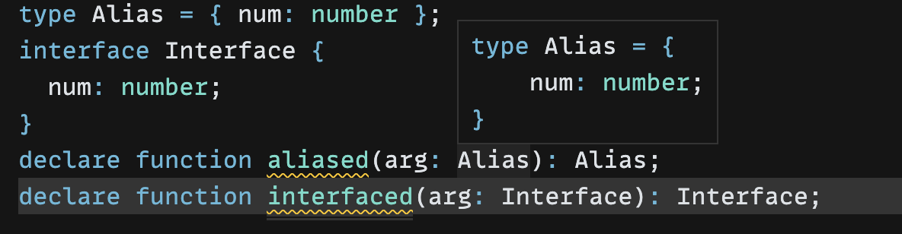
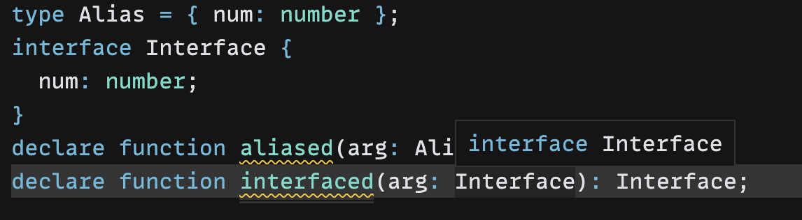
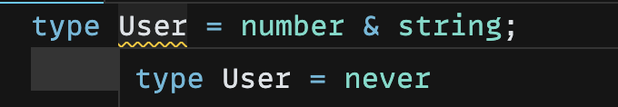
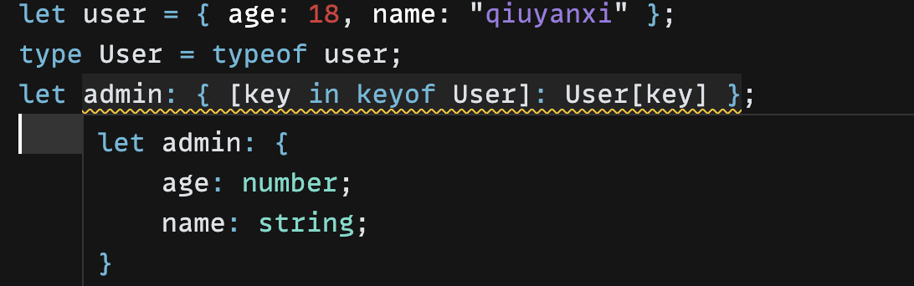
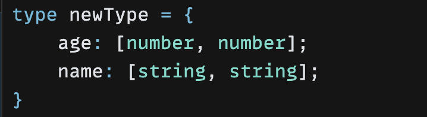

# TypeScript 高级类型

## 类型简介

TypeScript 包含了 JavaScript 的 8 种基本类型：

- number
- boolean
- object
- string
- bigint
- symbol
- undefined
- null

还有复合类型：

- Array
- class
- Promise
- ...

另外增加了三种复合类型：

- Tuple（元组）
- interface（接口）
- Enum（枚举）

以及四种特殊类型：

- void ：表示为空，一般用来表示返回值为 undefined
- never：表示永不可达的类型
- any：任意类型
- unknown：未知类型，任何类型都可以赋值给它，但是它不可以赋值给别的类型

同时，可以用 `type`来做类型别名。

> type 和 interface 的区别
>
> 1. 编译器对 type 更友好，通常能够在鼠标悬浮时直接显示 type 的字面量类型
>
>    
>
>    而 interface 则并没有那么友好
>
>    
>
> 2. type 是类型别名，interface 是接口。类型别名不能`extends`和`implements`,如果想要类似效果只能用`&`运算符交叉合并类型。
>
> 3. interface 没有办法写元组类型或者联合类型。
>
> 4. 同名的 interface 会合并，同名的 type 会报错。
>
>    ```js
>    interface User {
>      name: string;
>    }
>    interface User {
>      age: number;
>    }
>    let user: User = {
>      name: 'qiuyanxi',
>      age: 18,
>    };
>    ```
>
>    ```js
>    type Admin = {
>      name: string,
>    };
>    type Admin = {
>      age: number,
>    }; // ❎ 报错啦
>    ```

**Tuple**

元组（Tuple）就是元素的个数和类型固定的数组类型：

```js
type Tuple = [number, string];
let array: Tuple = [1, 2, '2']; // ❎  长度和类型不对
let array: Tuple = [1, '2']; // ✅
```

**interface**

接口（interface）可以用来描述函数、对象、构造器的结构，比如我需要描述对象：

```js
interface IPerson {
  name: string;
  age: number;
}

class Person implements IPerson {
  name: string;
  age: number;
}

const obj: IPerson = {
  name: 'guang',
  age: 18,
};
```

描述函数：

```js
interface SayHi {
  (name: string): string;
}
const sayHi: SayHi = (name: string) => {
  return `hi ${name}`;
};
```

描述构造器：

```js
interface PersonConstructor {
  new(name: string, age: number): IPerson;
}

function createPerson(ctor: PersonConstructor): IPerson {
  return new ctor('guang', 18);
}
```

对象类型、class 类型也叫做索引类型，也就是这几个类型索引了多个元素的类型的意思。

如果一个对象想要动态添加属性，但是又可以是任意属性，那么就使用索引签名：

```js
interface IPerson {
  [prop: string]: string | number; // 索引签名
}
const obj: IPerson = {};
obj.name = 'qiuyanxi';
obj.age = 18;
```

**Enum**

枚举是一系列值的复合，可以用枚举来敲定常量

```js
enum Transpiler {
    Babel = 'babel',
    Postcss = 'postcss',
    Terser = 'terser',
    Prettier = 'prettier',
    TypeScriptCompiler = 'tsc'
}

const transpiler = Transpiler.TypeScriptCompiler;
```

**字符串字面量**

`TypeSctipt`还支持字面量类型，也就是可以拿 123、’123‘等这些值来做类型。

其中字符串字面量支持普通字符串字面量还有模板字面量。

如果我们希望指定一个以`#`开头后面是任意`string`的字符串，那么可以使用模板字面量

```js
const hello: "hello" = "hello"; // 普通字面量
const temp:`#${string}`='#123' // 模板字面量
```

## 类型装饰

除了描述类型的结构外，TypeScript 还支持描述类型的属性，比如属性是否是可选的，是否是只读的：

```js
interface IPerson {
    readonly name: string;
    age?: number;
}

type tuple = [string, number?];
```

## 类型运算

### 条件类型

条件类型用来做一些动态的类型计算。比如以下例子：

```js
type isTwo<T> = T extends 2 ? true: false;

type res = isTwo<1>; // false类型
type res2 = isTwo<2>; // true 类型
```

这种类型也叫做`高级类型`。

**高级类型的特点是传入类型参数，经过一系列类型运算逻辑后，返回新的类型。**

### infer 推导

假设现在我需要两个类型，这两个类型分别是从两个对象的属性中提取出来的，而不是静态定义的类型：

```js
const user = { name: 'qiuyanxi', age: '12' };
const admin = { name: 'qiuyanxi', age: 12 };
```

我需要推导出 age 属性的两个类型，分别是 string 和 number，那么我应该这么做：

```js
type AgeTypeOf<T> = T extends { age: infer P } ? P : unknown;

type UserAgeType = AgeTypeOf<typeof user>; // string
type AdminAgeType = AgeTypeOf<typeof admin>; // number
```

如果想要收窄泛型 T ，那么还可以这么做：

```js
type AgeTypeOf<T extends { name: string }> = T extends { age: infer P }
  ? P
  : unknown;

type UserAgeType = AgeTypeOf<typeof user>;
type AdminAgeType = AgeTypeOf<typeof admin>;

const noName = { age: 12 };
type noName = AgeTypeOf<typeof noName>; // Type '{ age: number; }' does not satisfy the constraint '{ name: string; }'.
```

### 联合类型

联合类型使用`|`运算符，表示就这么几个类型之一：

```js
type Union = 1 | 2 | 3;
```

### 交叉类型

交叉类型使用`&`运算符，可以对类型进行合并

```js
type User = { age: string } & { name: string };
const user: User = {
  name: 'qiuyanxi',
  age: '18',
};
```

不同的类型则无法合并：



### 映射类型

对象、class 在 TypeScript 中对应的类型是索引类型（Index Type），如果我们想要查询索引类型中所有的索引，可以用索引查询：

```
let user = { age: 18, name: "qiuyanxi" };
type User = typeof user;
let admin: { [key in keyof User]: User[key] };
```

- `keyof User`是索引查询
- `User[key]`是索引访问
- `in`用来遍历联合类型



上面的方式中，我们通过关键字从**一个类型的集合映射出另一个集合，这就是映射类型**。

通过映射类型，我们可以做很多事，比如，根据`User`的类型映射出一个全新的类型

```js
let user = { age: 18, name: "qiuyanxi" };
type User = typeof user;
type MapType<T> = {
  [key in keyof T]: [T[key], T[key]];
};

type newType = MapType<User>;
```



### 小结

TypeScript 支持条件、推导、联合、交叉、映射等多种类型运算。

经过一系列类型运算后，返回出的新的类型，我们称之为高级类型。

这些语法经过组合通常可以实现很多复杂的逻辑。
