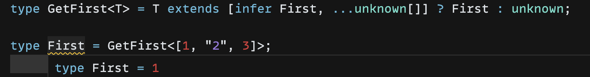
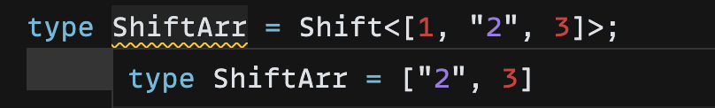
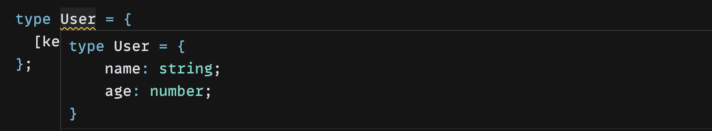
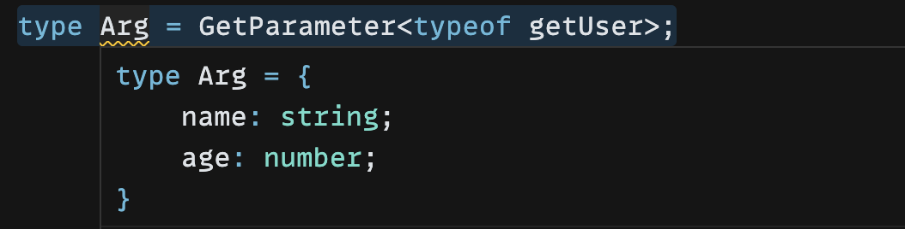
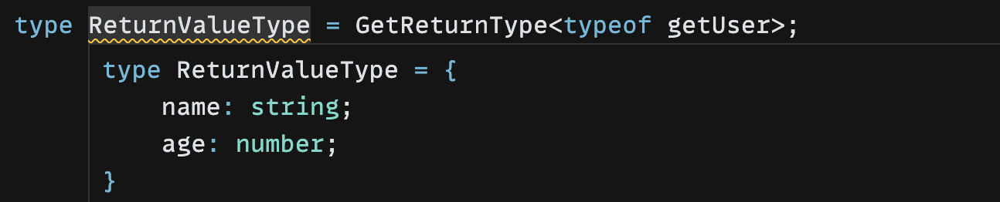
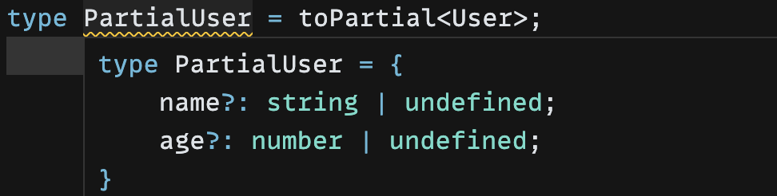
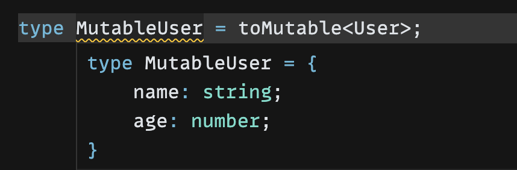

# TypeScript 高级类型

## 类型简介

TypeScript 包含了 JavaScript 的 8 种基本类型：

- number
- boolean
- object
- string
- bigint
- symbol
- undefined
- null

还有复合类型：

- Array
- class
- Promise
- ...

另外增加了三种复合类型：

- Tuple（元组）
- interface（接口）
- Enum（枚举）

以及四种特殊类型：

- void ：表示为空，一般用来表示返回值为 undefined
- never：表示永不可达的类型
- any：任意类型
- unknown：未知类型，任何类型都可以赋值给它，但是它不可以赋值给别的类型

同时，可以用 `type`来做类型别名。

> type 和 interface 的区别
>
> 1. 编译器对 type 更友好，通常能够在鼠标悬浮时直接显示 type 的字面量类型
>
>    
>
>    而 interface 则并没有那么友好
>
>    
>
> 2. type 是类型别名，interface 是接口。类型别名不能`extends`和`implements`,如果想要类似效果只能用`&`运算符交叉合并类型。
>
> 3. interface 没有办法写元组类型或者联合类型。
>
> 4. 同名的 interface 会合并，同名的 type 会报错。
>
>    ```js
>    interface User {
>      name: string;
>    }
>    interface User {
>      age: number;
>    }
>    let user: User = {
>      name: 'qiuyanxi',
>      age: 18,
>    };
>    ```
>
>    ```js
>    type Admin = {
>      name: string,
>    };
>    type Admin = {
>      age: number,
>    }; // ❎ 报错啦
>    ```

**Tuple**

元组（Tuple）就是元素的个数和类型固定的数组类型：

```js
type Tuple = [number, string];
let array: Tuple = [1, 2, '2']; // ❎  长度和类型不对
let array: Tuple = [1, '2']; // ✅
```

**interface**

接口（interface）可以用来描述函数、对象、构造器的结构，比如我需要描述对象：

```js
interface IPerson {
  name: string;
  age: number;
}

class Person implements IPerson {
  name: string;
  age: number;
}

const obj: IPerson = {
  name: 'guang',
  age: 18,
};
```

描述函数：

```js
interface SayHi {
  (name: string): string;
}
const sayHi: SayHi = (name: string) => {
  return `hi ${name}`;
};
```

描述构造器：

```js
interface PersonConstructor {
  new(name: string, age: number): IPerson;
}

function createPerson(ctor: PersonConstructor): IPerson {
  return new ctor('guang', 18);
}
```

对象类型、class 类型也叫做索引类型，也就是这几个类型索引了多个元素的类型的意思。

如果一个对象想要动态添加属性，但是又可以是任意属性，那么就使用索引签名：

```js
interface IPerson {
  [prop: string]: string | number; // 索引签名
}
const obj: IPerson = {};
obj.name = 'qiuyanxi';
obj.age = 18;
```

**Enum**

枚举是一系列值的复合，可以用枚举来敲定常量

```js
enum Transpiler {
    Babel = 'babel',
    Postcss = 'postcss',
    Terser = 'terser',
    Prettier = 'prettier',
    TypeScriptCompiler = 'tsc'
}

const transpiler = Transpiler.TypeScriptCompiler;
```

**字符串字面量**

`TypeSctipt`还支持字面量类型，也就是可以拿 123、’123‘等这些值来做类型。

其中字符串字面量支持普通字符串字面量还有模板字面量。

如果我们希望指定一个以`#`开头后面是任意`string`的字符串，那么可以使用模板字面量

```js
const hello: "hello" = "hello"; // 普通字面量
const temp:`#${string}`='#123' // 模板字面量
```

## 类型装饰

除了描述类型的结构外，TypeScript 还支持描述类型的属性，比如属性是否是可选的，是否是只读的：

```js
interface IPerson {
    readonly name: string;
    age?: number;
}

type tuple = [string, number?];
```

## 类型运算

### 条件类型

条件类型用来做一些动态的类型计算。比如以下例子：

```js
type isTwo<T> = T extends 2 ? true: false;

type res = isTwo<1>; // false类型
type res2 = isTwo<2>; // true 类型
```

这种类型也叫做`高级类型`。

**高级类型的特点是传入类型参数，经过一系列类型运算逻辑后，返回新的类型。**

### infer 推导

`infer`可以表示在 `extends` 条件语句中待推断的类型变量。

假设现在我需要两个类型，这两个类型分别是从两个对象的属性中提取出来的，而不是静态定义的类型：

```js
const user = { name: 'qiuyanxi', age: '12' };
const admin = { name: 'qiuyanxi', age: 12 };
```

我需要推导出 age 属性的两个类型，分别是 string 和 number，那么我应该这么做：

```js
type AgeTypeOf<T> = T extends { age: infer P } ? P : unknown;

type UserAgeType = AgeTypeOf<typeof user>; // string
type AdminAgeType = AgeTypeOf<typeof admin>; // number
```

如果想要收窄泛型 T ，那么还可以这么做：

```js
type AgeTypeOf<T extends { name: string }> = T extends { age: infer P }
  ? P
  : unknown;

type UserAgeType = AgeTypeOf<typeof user>;
type AdminAgeType = AgeTypeOf<typeof admin>;

const noName = { age: 12 };
type noName = AgeTypeOf<typeof noName>; // Type '{ age: number; }' does not satisfy the constraint '{ name: string; }'.
```

### 联合类型

联合类型使用`|`运算符，表示就这么几个类型之一：

```js
type Union = 1 | 2 | 3;
```

### 交叉类型

交叉类型使用`&`运算符，可以对类型进行合并

```js
type User = { age: string } & { name: string };
const user: User = {
  name: 'qiuyanxi',
  age: '18',
};
```

不同的类型则无法合并：


### 映射类型

对象、class 在 TypeScript 中对应的类型是索引类型（Index Type），如果我们想要查询索引类型中所有的索引，可以用索引查询：

```
let user = { age: 18, name: "qiuyanxi" };
type User = typeof user;
let admin: { [key in keyof User]: User[key] };
```

- `keyof User`是索引查询
- `User[key]`是索引访问
- `in`用来遍历联合类型


上面的方式中，我们通过关键字从**一个类型的集合映射出另一个集合，这就是映射类型**。

通过映射类型，我们可以做很多事，比如，根据`User`的类型映射出一个全新的类型

```js
let user = { age: 18, name: "qiuyanxi" };
type User = typeof user;
type MapType<T> = {
  [key in keyof T]: [T[key], T[key]];
};

type newType = MapType<User>;
```


### 小结

TypeScript 支持条件、推导、联合、交叉、映射等多种类型运算。

经过一系列类型运算后，返回出的新的类型，我们称之为高级类型。

这些语法经过组合通常可以实现很多复杂的逻辑。

## 模式匹配

TypeScript 的模式匹配非常重要，我们写类型时很多时候并不需要重新写类型，而是基于某个类型来匹配，并从匹配结果中提取出最新的类型。

比如下面有两个函数，我需要提取出它的返回值：

```js
function promiseWithNumber() {
  return Promise.resolve(1);
}
function promiseWithString() {
  return Promise.resolve("1");
}

type GetValueType<T> = T extends () => Promise<infer Value> ? Value : unknown; // *
type ValueTypeIsNumber = GetValueType<typeof promiseWithNumber>; // number
type ValueTypeIsString = GetValueType<typeof promiseWithString>; // string
```

第`*`行的意思是：

1. 基于传递进来的泛型进行匹配
2. 通过 extends 对传入的类型参数 T 做模式匹配,其中值的类型是需要提取的，通过 infer 声明一个局部变量 `Value` 来保存。`infer Value`表示`Value`是待推断的类型变量。
3. 如果匹配成功，则返回推导出来的 Value 的类型。如果没成功，则返回 unknown。

总结一下就是：

**TypeScript 类型的模式匹配是通过 extends 对类型参数（也就是泛型）做匹配，结果会用`infer`声明一个待推断的类型变量来保存。如果匹配成功就取出类型变量里面的类型。**

### 从数组中提取类型

现在有一个数组类型，我们希望提取出它的第一个元素和最后一个元素的类型：

```js
type arr = [1, 2, 3];
```

- 提取第一个元素的类型

  ```js
  type GetFirst<T extends unknown[]> = T extends [infer First, ...unknown[]]
    ? First
    : unknown;
  type First = GetFirst<[1, "2", 3]>;
  ```

  

- 提取最后一个元素的类型

  只需要换一下位置即可

  ```js
  type GetLast<T extends unknown[]> = T extends [...unknown[], infer Last]
    ? Last
    : unknown;
  type Last = GetLast<[1, "2", 3]>;
  ```

- 提取除第一个元素外的类型

  ```js
  type Shift<T extends unknown[]> = T extends [unknown, ...(infer Rest)]
    ? Rest
    : unknown;
  type ShiftArr = Shift<[1, "2", 3]>;
  ```

  

- 提取除最后一个元素外的类型

  ```js
  type Pop<T extends unknown[]> = T extends [...(infer Rest), unknown]
    ? Rest
    : unknown;
  ```

### 从对象中提取类型

我需要分别提取出 User 跟 Admin 的 value 的类型，应该怎么做？

```js
const User = {
  key: 'name',
  value: 'qiuyanxi',
};
const Admin = {
  key: 'age',
  value: 12,
};
```

从对象中提取类型其实更加简单：

```js
type ValueOf<T> = T extends { key: string; value: infer Value }
  ? Value
  : unknown;

type UserValueType = ValueOf<typeof User>;
type AdminValueType = ValueOf<typeof Admin>;
```

有时候我们的业务促使我们需要制定一个类型标注表：

```js
const user = {
  name: { type: 'string', default: 'qiuyanxi' },
  age: { type: 'number', default: 18 },
};
```

往往这一类类型标注表还会对应一套类型，如果我们纯手写，遇到类型很多的情况就会很麻烦：

```js
interface User {
  name: string;
  age: number; // 可能下面还有一百个要写
}
```

分析一下，实际上我们想要达成的类型，它的`key`都来自于`user`，`value`的类型则可以从`default`推导。

那么我们就可以使用索引查询（keyof）、in 运算符，索引访问、infer 推导来完成这一需求

- `key`都来自于`user`，那就使用索引查询和 in 运算符来定义键的内容

  ```js
  [key in keyof typeof user]
  ```

- `value`类型可以从 default 中取，那我们就需要用索引访问来访问对应的 key，infer 来推导其 default 的类型

  ```js
  type ValueOf<T> = T extends { default: infer Value } ? Value : unknown;

  type User = {
    [key in keyof typeof user]: ValueOf<typeof user[key]>;
  };
  ```

最后我们可以得出一个映射类型：



### 从函数提取类型

有一个函数是这样的：

```js
const getUser = (args: { name: string, age: number }) => {
  return args;
};
```

- 从函数的参数提取类型

  现在我需要用到这个函数的参数的类型，则可以用模式匹配将它的参数提取出来

  ```js
  type GetParameter<Func> = Func extends (arg: infer Arg) => any ? Arg : any;

  type Arg = GetParameter<typeof getUser>;
  ```

  

* 从函数的返回值提取类型

  还是同样的函数，我需要从中提取返回值的类型，只需要稍微改一下代码：

  ```js
  type GetReturnType<Func> = Func extends (arg: any) => infer Value ? Value : any;

  type ReturnValueType = GetReturnType<typeof getUser>;
  ```

  

### 小结

**TypeScript 类型的模式匹配是通过类型 extends 一个模式类型，把需要提取的部分放到通过 infer 声明的局部变量里，后面可以从这个局部变量拿到类型做各种后续处理。**

## 重新构造

TypeScript 类型系统支持 3 种可以声明任意类型的变量： type、infer、类型参数。

type 叫做类型别名，其实就是声明一个变量存储某个类型。

```js
type ttt = Promise<number>;
```

infer 用于类型的提取，然后存到一个变量里，相当于局部变量:

```js
type GetValueType<P> = P extends Promise<infer Value> ? Value : never;
```

类型参数用于接受具体的类型，在类型运算中也相当于局部变量：

```js
type isTwo<T> = T extends 2 ? true: false;
```

但是这些都不能重新赋值。

如果我们希望通过这些类型来做各种变换（增删改）就需要重新构造类型。

重新构造索引类型涉及到映射类型的语法。

### 实现 Readonly

TypeScript 内置 `Readonly` 关键字,它能够使得索引类型都添加上`readonly`装饰。

我们用映射类型也能写出来：

```js
type toReadonly<T> = {
  readonly [K in keyof T]: T[K];
};
```

其实源码也是这样的：

```js
type Readonly<T> = { readonly [P in keyof T]: T[P]; }
```

本质上就是传入一个泛型参数，然后用`in`运算符来遍历它的所有 `key`(keyof)，然后加上`readonly`。

### 实现 Partial

同样的，使用映射类型也可以实现`Partial`关键字的功能。

```js
type toPartial<T> = {
  [K in keyof T]?: T[K];
};

type User = {
  name: string;
  age: number;
};

type readonlyUser = toPartial<User>;
```

给索引类型 T 的索引添加了 ? 可选修饰符，其余保持不变。



### 移除 readonly

我们也可以手写实现移除`readonly`关键字：

```js
type toMutable<T> = {
  -readonly [K in keyof T]: T[K];
};
type User = {
  readonly name: string;
  readonly age: number;
};
type MutableUser = toMutable<User>;
```



可以看到移除`readonly`可以使用`-`修饰符。

### 实现 Required

同理，`-` 也可以实现移除`?`可选修饰符。

```js
type toRequired<T> = {
  [K in keyof T]-?: T[K];
};
```

### 实现 Pick

Pick 关键字可以将想要的属性类型拎出来。

```js
Pick<User, "name" | "age">;
```

其实我们要的就是`name`|`age`,那么可以通过`in`来遍历它们而不是遍历 `User`。

```js
type toPick<T, K extends keyof T> = {
  [P in K]: T[P];
};
```

需要注意的是，`K` 必须具备的条件是 `T` 的键，否则`T[P]`就没有意义，并且会报错。

所以我们必须手动写上`extends`关键字手动告诉`TypeScript` 类型系统`K`来自于`keyof T`

### 实现 Record

跟 Pick 差不多的套路。

```js
type toRecord<K extends string | number | symbol, V> = {
  [P in K]: V;
};
```

## 内置的高级类型

### Record

TypeScript 内置了高级类型 Record 来创建索引类型，它的源码是这样的：

```js
type Record<K extends string | number | symbol, T> = { [P in K]: T; }
```

它的源码刚好对应 JavaScript 的对象类型，JavaScript 的对象类型支持 string、number 和 symbol 作为键。

指定索引和值的类型分别为 K 和 T，就可以创建一个对应的索引类型。

当我们想要创建一个键为任意`string`的,值为对象类型的索引类型时，很多时候会这么创建：

```js
type Obj = {
  [key: string]: object,
};
```

现在我们也可以这么创建：

```js
type Obj = Record<string, object>;
```

同时，也可以更好地限制 `key`和 `value` 的类型

```js
interface CatInfo {
  age: number;
  breed: string;
}

type CatName = 'miffy' | 'boris' | 'mordred';

const cats: Record<CatName, CatInfo> = {
  miffy: { age: 10, breed: 'Persian' },
  boris: { age: 5, breed: 'Maine Coon' },
  mordred: { age: 16, breed: 'British Shorthair' },
};
```
