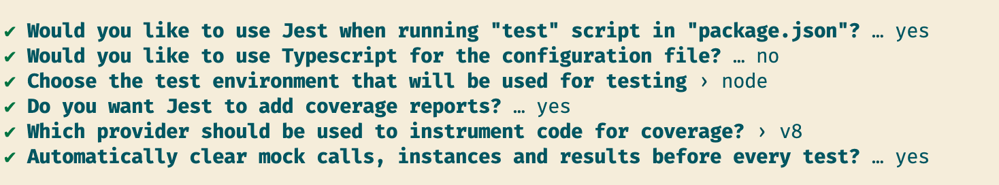
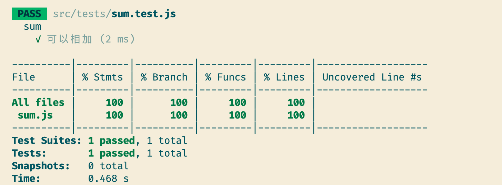
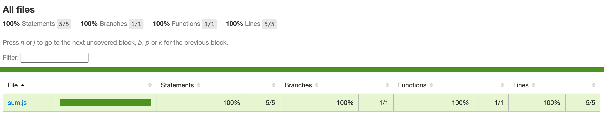
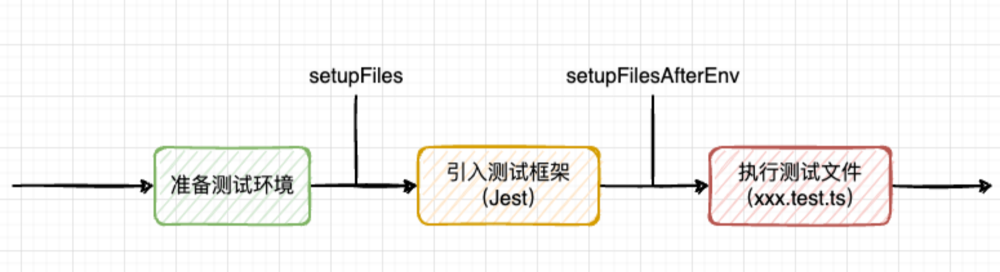
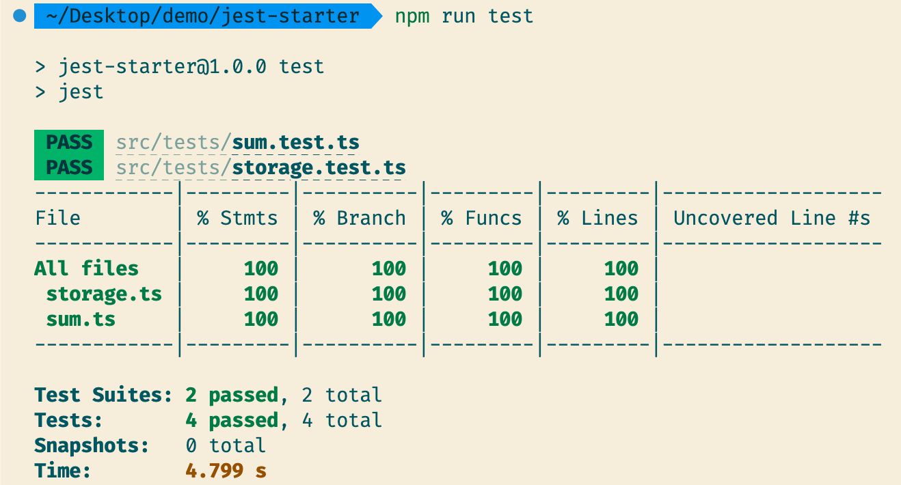
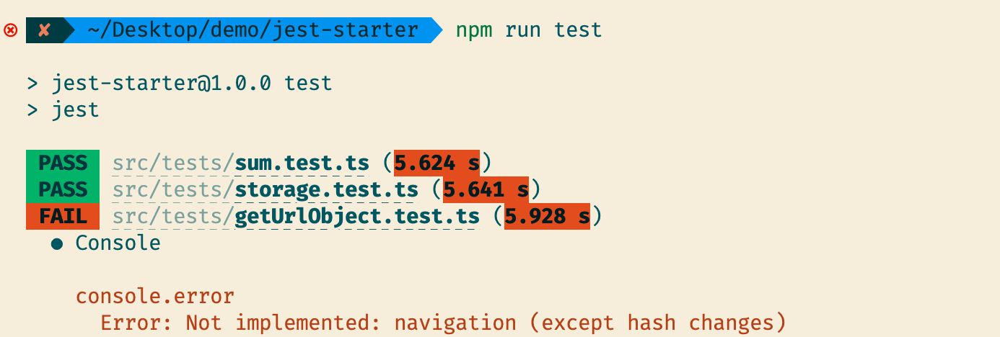
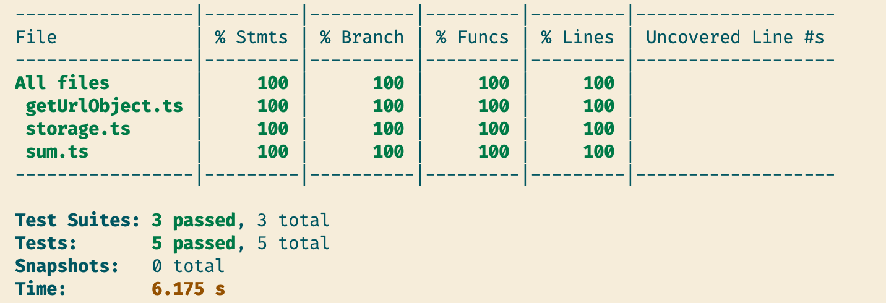
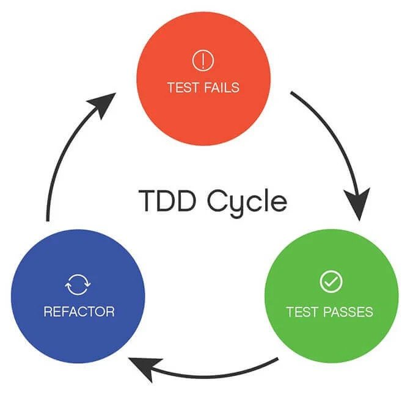
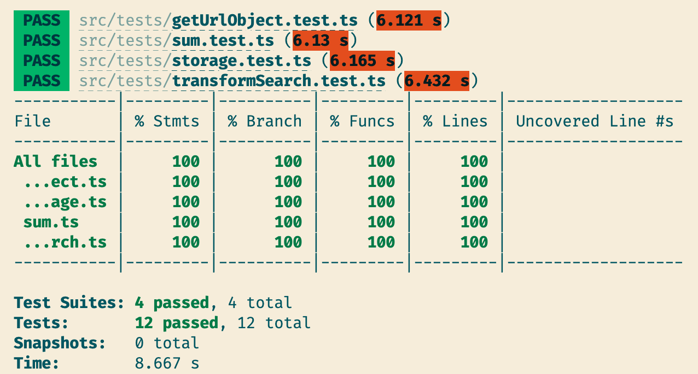

# 基础实践

## hello world

### 创建项目

```bash
cd jest-start
npm init -y
npm i -D jest@27.5.1
```

> 使用 27.5.1 稳定版本

安装 Jest 后用`jest-cli`初始化 `jest` 配置文件,刚开始先使用以下配置



执行完之后，会生成`jest.config.js`的配置文件

### 使用 JavaScript 测试

下面用 JavaScript 进行 Hello world 测试

```js
// src/utils/sum.js
const sum = (a, b) => {
  return a + b;
};

module.exports = sum;
```

```js
// src/utils/sum.test.js
const sum = require('../utils/sum');

describe('sum', () => {
  it('可以相加', () => {
    expect(sum(1, 1)).toEqual(2);
  });
});
```

此时项目结构

```bash
├── package-lock.json
├── package.json
└── src
    ├── tests
    │   └── sum.test.js
    └── utils
        └── sum.js
```

启动测试：

```
npm run test
```

得到测试报告



### 单文件测试

如果只想要测试一个 js 文件，则使用以下命令：

```bash
npm run test <文件相对路径>
```

例如：

```bash
 npm run test ./src/tests/sum.test.js
```

### 覆盖率报告

终端展示的是覆盖率情况，还有更加详细的覆盖率报告。

覆盖率报告在新生成的`coverage`目录中，有不同格式的覆盖率报告

```bash
├── clover.xml
├── coverage-final.json
├── lcov-report
│   ├── base.css
│   ├── block-navigation.js
│   ├── favicon.png
│   ├── index.html
│   ├── prettify.css
│   ├── prettify.js
│   ├── sort-arrow-sprite.png
│   ├── sorter.js
│   └── sum.js.html
└── lcov.info
```

我们可以打开 index.html 来查看网页版本的报告

```js
cd coverage/lcov-report
hs -c-1 . // 用 http-server 打开index.html
```



## 支持 TypeScript

想要支持 TypeScript，就必须转译 ts 代码。

Jest 本身不支持代码转译。在执行时会调用**转译器/编译器**做代码转译。所以就能够对 TypeScript 转译成 JS 代码从而让 Jest 支持对 TypeScript 的测试。

### TSC 转译

项目里安装 TypeScript

```bash
npm i -D typescript
```

生成 TypeScript 配置文件

```bash
tsc --init
```

安装 ts-jest 模块和 jest 的类型声明文件

```bash
npm i -D ts-jest@27.1.4
npm i -D @types/jest
```

> ts-jest 的大版本要和 jest 的一致，否则容易产生兼容问题。这里 Jest 用的是 27 版本，所以也下载 27 版本的 ts-jest

在`jest.config.js`中添加配置：

```json
module.exports = {
  preset: 'ts-jest',
  ...
  }
```

将 sum.js 修改成 sum.ts

```js
export const sum = (a: number, b: number) => {
  return a + b;
};
```

将 `sum.test.js` 修改成 `sum.test.ts`

```js
import { sum } from '../utils/sum';

describe('sum', () => {
  it('可以相加', () => {
    expect(sum(1, 1)).toEqual(2);
  });
});
```

最后执行

```bash
npm run test
```

### babal 转译

由于 Babel 转译并不能让 Jest 做类型检查，所以推荐使用`ts-jest`。如果是纯 js 项目，则可以使用`babel-jest`来转译。

[官网教程 ](https://jestjs.io/docs/getting-started#using-typescript-via-babel)

### 路径别名

所谓路径别名就是我希望从这个引入：

```js
import { sum } from '../utils/sum';
```

换成这个引入

```js
import { sum } from 'utils/sum';
```

实际上就是把`utils`映射成`src/utils`。

首先要在 `moduleDirectories`中配置

```json
// jest.config.js
 moduleDirectories: ['node_modules', 'src'],
```

这里的意思是让 jest 可以直接到 `node_modules` 或者 `src` 下去找文件。

其次在`tsconfig`中配置 path

```js
    "baseUrl": "./",
    "paths": {
      "utils/*": ["src/utils/*"]
    },
```

这样 ts 文件就能够按照 paths 的配置去对应的映射路径中找到该文件。

但是如果要改成这样引入：

```js
import { sum } from '@/utils/sum';
```

`@`代表`src`。

jest 想要识别这个符号就需要在`moduleNameMapper`中配置：

```js
modulex.exports = {
  moduleNameMapper: { '@/(.*)': '<rootDir>/src/$1' },
};
```

这是 jest 的路径匹配。

然后 tsconfig 中也加入对`@`的映射。

```js
    "baseUrl": "./",
    "paths": {
      "utils/*": ["src/utils/*"],
      "@/*": ["src/*"]
    },
```

此时我们就可以用两种方式引入啦

```js
import { sum } from '@/utils/sum';
// import { sum } from 'utils/sum';

describe('sum', () => {
  it('可以相加', () => {
    expect(sum(1, 1)).toEqual(2);
  });
});
```

### 小结

1. 要让 Jest 支持 TypeScript，需要用到转译器，主流的转译器有两个：tsc 和 babel。tsc 能让 Jest 支持类型检查，所以更推荐使用
2. 能够通过路径别名来让 `Jest` 识别路径映射。除了在 `tsconfig` 中写路径别名外，还需要在 `jest.config.js` 中配置`moduleDirectories` 和 `moduleNameMapper`来实现

## 测试环境

假设现在我需要对 localStorage 进行操作,我封装了两个函数：

```js
// utils/storage.ts
function set(key: string, value: any) {
  localStorage.setItem(key, JSON.stringify(value));
}
function get(key: string) {
  let value = localStorage.getItem(key);
  if (value) {
    return JSON.parse(value);
  }
  return undefined;
}
export default { set, get };
```

然后写对应的测试用例

```js
// tests/storage.test.ts
import local from 'utils/storage';
describe('测试 localStorage', () => {
  it(' set 数据', () => {
    local.set('value1', { name: 'qiuyanxi' });
    expect(local.get('value')).toEqual({ name: 'qiuyanxi' });
  });
});

describe('测试 localStorage', () => {
  it('key 正确则能够获取正确数据', () => {
    local.set('value2', 'hello jest');
    expect(local.get('value2')).toEqual('hello jest');
  });
  it('key 不正确则能够获取到 undefined', () => {
    local.set('value1', 'hello jest');
    expect(local.get('value2')).toEqual(undefined);
  });
});
```

但是在`npm run test`的时候，会发现 node 环境下并没有`localStorage`


这里有两种方法可以在环境中设置：

- 全局 Mock - 创建 localStorage 的 全局变量，并让它的实现跟浏览器环境中的类似
- 使用 jsdom 来创建虚拟的浏览器环境

### 全局 Mock

全局 Mock 可以帮助我们设置 localStorage 这个全局变量，分成两步：

1. 创建 global.localStorage 这个全局变量
2. 告诉 jest，我要在测试前先设置 global.localStorage —— 通过`setupFilesAfterEnv`选项

第一步：创建`tests/jest-setup.ts`文件

```js
Object.defineProperty(global, 'localStorage', {
  value: {
    store: {},
    setItem(key: string, value: string) {
      this.store[key] = value;
    },
    getItem(key: string) {
      return this.store[key];
    },
  },
});
```

上面的代码是在全局中设置一个 `localStorage` 的变量，并且它的 API 跟浏览器环境的相同。

第二步：在`jest.config.js` 中配置

```json
  setupFilesAfterEnv: ['./src/tests/jest-setup.ts'],
```

设置完这个属性后，`jest-setup.ts`会在**每个测试文件执行前先执行一次**,相当于每执行测试时，都会在全局添加 localStorage 的 Mock 数据。

> 跟 `setupFilesAfterEnv` 类似还有一个 `setupFiles` 选项，它也可以用来设置全局 Mock 数据。
>
> 
>
> `setupFiles` 比 `setupFilesAfterEnv`更早执行，所以也可以用来设置 Mock 全局变量。
>
> 不同之处在于，由于`setupFilesAfterEnv`是在引入测试框架 Jest 之后运行的，所以能够在此引入和配置`Jset/Jasmine`的插件。
>
> 如果在`setupFiles`中添加 Jest 的扩展和插件，就会得到报错。
>
> 这里有个 [issue](https://github.com/testing-library/jest-dom/issues/122#issuecomment-650520461) 可以参考

执行`npm run test`,就能够获得测试情况报告。

### jsdom 环境

为了还原浏览器的全部功能，还可以引入 jest 提供的 jsdom 环境。

```json
// jest.config.js
testEnvironment: "jsdom",
```

添加后，就能拥有一个全局的、完整的浏览器标准的 API。原理是使用了[jsdom](https://github.com/jsdom/jsdom),这个库用 JS 实现了一套 Node.js 环境下的 Web 标准 API。由于 Jest 的测试文件也是在 Node.js 环境下执行的，所以 Jest 用这个库充当浏览器环境的 Mock 实现。

现在暂时注释`setupFilesAfterEnv`，重新执行`npm run test`，也能够获得测试情况报告



### 小结

1. 通过 `setupFiles` 或者`setupFilesAfterEnv`添加一个指定文件，这个指定文件可以放置全局 Mock 或者其他的一些操作
2. 通过`testEnvironment: "jsdom"`来创建一个 Nodejs 的浏览器环境

## 如何 Mock 网页地址

虽然通过 jsdom 配置了浏览器环境，但是依然有不少难搞的地方。比如网页路径。

下面有一个函数能够将网页的地址变成 object。

```js
// getUrlObject.ts
export function getUrlObj() {
  let urlObj = new URL(window.location.href);
  let obj = {};
  for (let key in urlObj) {
    if (['protocol', 'search', 'hash', 'href', 'pathname'].includes(key)) {
      Object.assign(obj, { [key]: urlObj[key as keyof typeof urlObj] });
    }
  }
  return obj;
}
```

接着是对其的测试文件

```js
// utils/getUrlObject.test.ts
import { getUrlObj } from 'utils/getUrlObject';

describe('测试网页地址', () => {
  it('将网页地址映射成正确的 object 对象', () => {
    window.location.href = 'https://baidu.com/hello-jest?name=qyx#age';
    expect(getUrlObj()).toEqual({
      href: 'https://baidu.com/hello-jest?name=qyx#age',
      search: '?name=qyx',
      hash: '#age',
      protocol: 'https:',
      pathname: '/hello-jest',
    });
  });
});
```

然而执行 test 后会得到以下报错：



这说明 jsdom 不能直接用`window.location.href`这个 API 测试。

### jest-location-mock

有一个优雅的实现方法：[jest-location-mock](https://www.npmjs.com/package/jest-location-mock)，这个包提供修改和获取 url 的功能。

首先安装

```bash
npm i -D jest-location-mock
```

安装完包之后，需要在 jest 测试框架启动前装载上去。将之前注释过的`setupFilesAfterEnv`配置放开

```json
 setupFilesAfterEnv: ['./src/tests/jest-setup.ts'],
```

然后在`jest-setup.ts`中引入该包

```js
// 使用扩展包来 Mock 'window.location'
import 'jest-location-mock';
```

最后运行`npm run test`得到结果



### 小结

对于网页地址的修改和测试可以使用 jest-location-mock 来扩展 jsdom 的能力。

扩展的使用方法是先配置`setupFilesAfterEnv` 选项，然后在 setup 文件中引入，使其变成全局 Mock。

## TDD

TDD(测试驱动开发)是一种非常好的开发模式，原理是：**先写测试，再写业务代码，当所有测试用例都通过后，业务代码的实现也呼之欲出了**。



- 红色部分：在添加新功能前先写测试用例，同时这也是一个帮助缕逻辑的过程
- 绿色部分：开始添加业务代码来让测试通过
- 重构部分：回头审视自己的代码，将其重构成可读性和维护性高的代码。（同时重构后，测试用例会帮助检查重构后的逻辑是否有漏洞）
- ...重复上述过程

TDD 的主要作用并不是保证代码质量，而是创造一个更好的开发环境，在此基础上保证代码的主要逻辑正确 ✅。

### 实战一个 search 转化功能

下面有一个需求：

> 实现一个函数，该函数能够获取 url，然后将其 search 转化成对象。如果 search 不存在，则返回空对象
>
> 如果有传递参数，且参数为`xx=xxx&yy=yyy`字符串时，能够将其解析成`{xx:xxx,yy:yyy}`
>
> - `https://baidu.com?name=qyx` ===> `{ name: 'qyx' }`
> - `https://baidu.com` ===> `{}`
> - `?name=qyx&age=30` ===> `{ name: 'qyx',age: 30 }`

根据需求，我们先写好测试文件：

```js
import { transformSearch } from 'utils/transformSearch';

describe('将url 的 searchString 变成 object', () => {
  it('能正确转化成对象', () => {
    window.location.href = 'https://baidu.com?name=qyx&age=30#hello-jest';
    expect(transformSearch()).toEqual({ name: 'qyx', age: '30' });
  });

  it('无searchString 但有 ? 时解析出空对象', () => {
    window.location.href = 'https://baidu.com?#hello-jest';
    expect(transformSearch()).toEqual({});
  });

  it('无searchString 无 ? 时解析出空对象', () => {
    window.location.href = 'https://baidu.com#hello-jest';
    expect(transformSearch()).toEqual({});
  });

  it('传入?name=qyx&age=30解析成正确对象', () => {
    expect(transformSearch('?name=qyx&age=30')).toEqual({
      name: 'qyx',
      age: '30',
    });
  });

  it('传入name=qyx&age=30解析成正确对象', () => {
    expect(transformSearch('name=qyx&age=30')).toEqual({
      name: 'qyx',
      age: '30',
    });
  });

  it('传入https://baidu.com?name=qyx&age=30#hello-jest解析成正确对象', () => {
    expect(
      transformSearch('https://baidu.com?name=qyx&age=30#hello-jest'),
    ).toEqual({ name: 'qyx', age: '30' });
  });

  it('传入空字符串解析成空对象', () => {
    expect(transformSearch('')).toEqual({});
  });
});
```

通过 `window.location.href`来转化成对象，我们很容易写出来：

```js
export function transformSearch(searchString?: string) {
  if (searchString) {
  } else {
    let searchString = new URL(window.location.href).search;
    searchString = searchString.replace(/\?/g, '');
    return Object.fromEntries(new URLSearchParams(searchString).entries());
  }
}
```

测试后能通过大部分用例，只剩通过 searchString 参数的逻辑是失败的。通过用例，我们能分析出用户可能会传递三种情况：

1. 带问号的查询字符串
2. 不带问号的查询字符串
3. 带问号的整个 URL 连接
4. 传入一个空字符串

整个 URL 可以传递给 `new URL()`来构造一个 URL 对象，而其他的非 url 传进去会报错。所以我们可以这么写：

```js
export function transformSearch(searchString?: string) {
  if (searchString) {
    try {
      let searchStr = new URL(searchString).search;
      searchStr = searchStr.replace(/\?/g, '');
      return Object.fromEntries(new URLSearchParams(searchStr).entries());
    } catch (error) {
      let searchStr = searchString.replace(/\?/g, '');
      return Object.fromEntries(new URLSearchParams(searchStr).entries());
    }
  } else {
    let searchString = new URL(window.location.href).search;
    searchString = searchString.replace(/\?/g, '');
    return Object.fromEntries(new URLSearchParams(searchString).entries());
  }
}
```

执行`npm run test`查看到所有用例已经通过



现在可以优化代码啦,将它们共有的逻辑抽离出来即可:

```js
function getObjFromSearch(search: string) {
  let searchString = search.replace(/\?/g, '');
  return Object.fromEntries(new URLSearchParams(searchString).entries());
}
export function transformSearch(searchString?: string) {
  if (searchString) {
    try {
      return getObjFromSearch(new URL(searchString).search);
    } catch (error) {
      return getObjFromSearch(searchString);
    }
  }
  return getObjFromSearch(new URL(window.location.href).search);
}
```

重新执行`npm run test`,所有测试用例依然通过了。

即使重构再多代码，测试用例也能帮助我们兜底，避免重构后影响主逻辑的尴尬。

### 小结

有两种主要开发模式：

- TDD - 测试驱动开发，即先写测试用例，再根据它们补充业务代码
- BDD - 先写业务，再对重要的部分补充测试

TDD 的好处是我们在前期不仅能够对要做的功能有一个清晰的逻辑整理，还能够在后期重构代码时对主逻辑兜底，不陷入重构后主逻辑出问题的境地。
