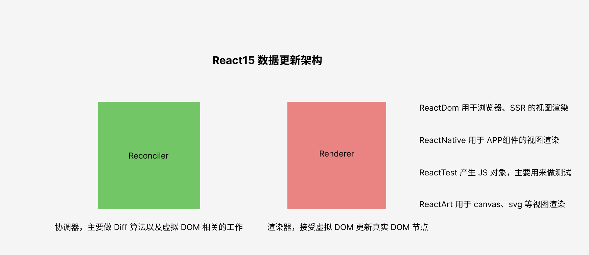
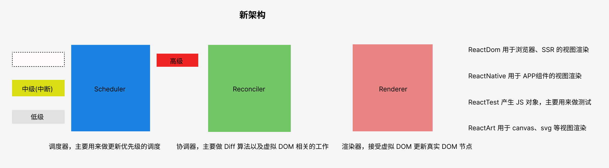
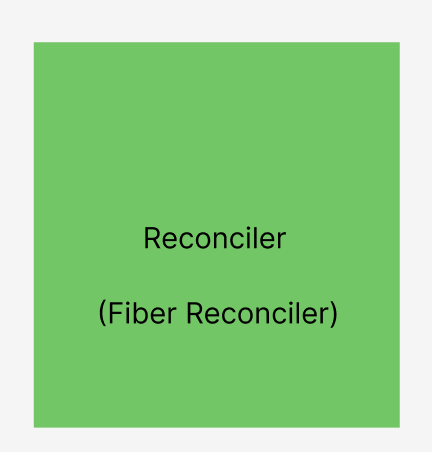
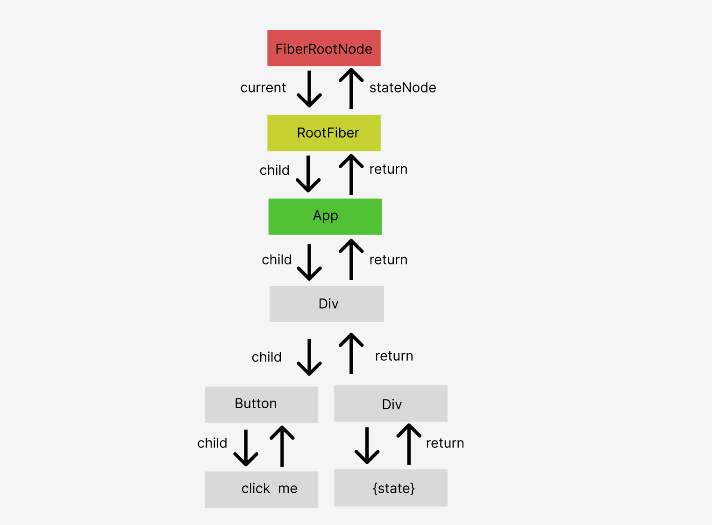
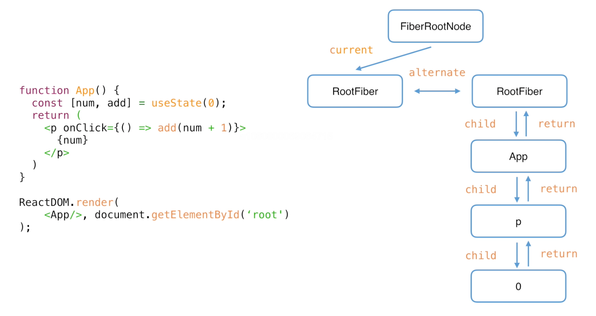
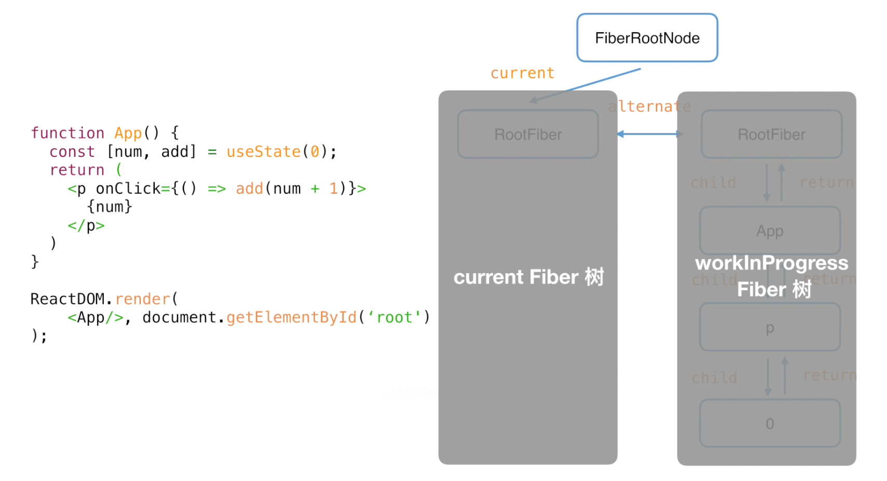
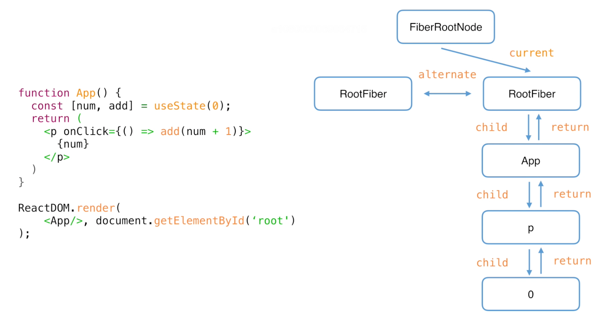
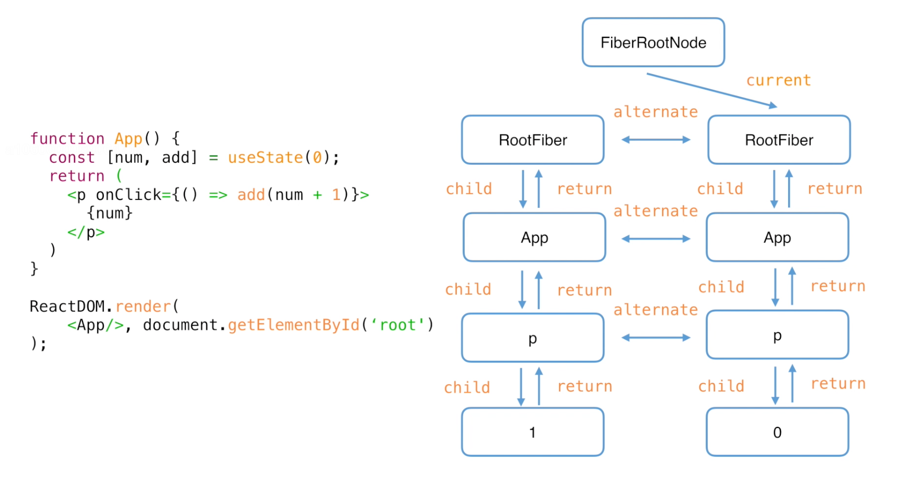
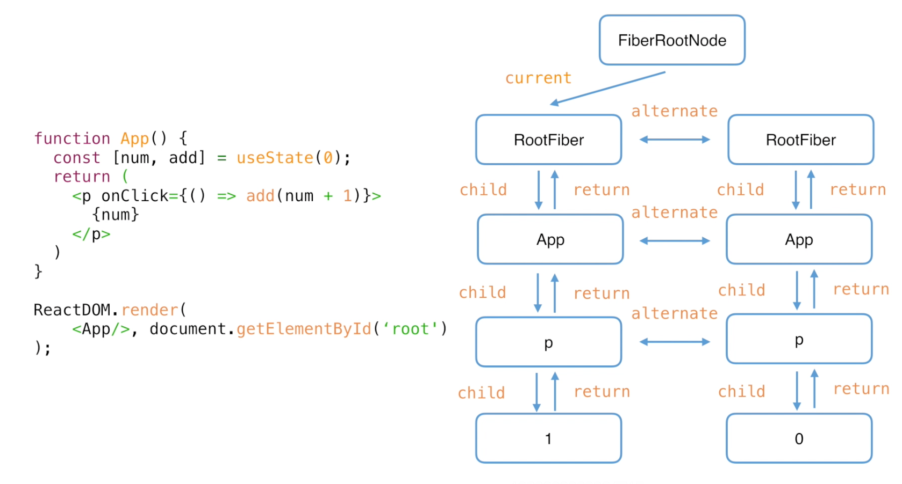

# 【设计理念】

## 架构的演进

让我们从一个很简单的功能着手：

```tsx
import React, { useState } from 'react';

export default function App() {
  const [state, setState] = useState(0);
  return (
    <div>
      <button onClick={() => setState(n => n + 1)}>click me</button>
      <div>{state}</div>
    </div>
  );
}
```

点击上面的按钮，视图上显示的值会加 1。

让我们看看 React15 是如何思考上面的功能的：

1. 通过一段描述（即 JSX）来告诉 React 你想要渲染怎样的 DOM 节点
2. 让 JSX 翻译成 虚拟 DOM，并交给 Renderer（渲染器）将虚拟 DOM 渲染成节点（mount 阶段）
3. 点击按钮后，通知 Reconciler（协调器）视图需要更新
4. Reconciler 内部产生新的虚拟 DOM，并将新旧虚拟 DOM 对比（Diff 算法）并提取出发生变化的部分。
5. 将产生差异的虚拟 DOM 交给 Renderer，Renderer 更新浏览器视图上的 DOM 节点

一张图表示 React15 的架构：



这个架构下，当数据不断更新时（假设用户不断点击按钮），会按照顺序做以下事情：

1. Reconciler 用 Diff 算法计算出需要更新的范围，并将结果提交给 Renderer
2. Renderer 根据差异结果更新真实的 DOM 节点
3. 浏览器视图发生变化
4. ... 上面的过程不断循环

整个处理过程像单一的队列般有序，最明显的是，整个过程是**同步**处理的。

这也意味着 React 的架构遇到了类似于 HTTP 的队首阻塞问题——一旦有一个地方产生了阻塞（用户的 input 行为造成大面积的视图更新时），浏览器忙于处理这些数据层面的运算导致页面卡顿。

而这个问题，使用`debounce`和`throttle`都不能很好地解决。

最佳的解决方式是**异步**，异步能通过优秀的调度来避免阻塞——浏览器已经证明了这一点。

在浏览器内部的异步 Schedule 中，采用双队列来循环调度 JS 代码的执行并协调视图的更新。

为了达成异步更新以提高 React 的性能，React 重写源码升级了新的架构，新架构下 React 实现了一个**异步可中断**的 Scheduler（调度器）。



新架构下的更新规则变成了：

1. Scheduler 判断更新等级，是否有更高的优先级需要被调度
2. 如果没有则将更新交给 Reconciler
3. Reconciler 接受到更新并创建新的虚拟 DOM 树与旧的虚拟 DOM 做对比
4. 对比完成后给需要更新的 DOM 打上 Update 标记交给 Renderer
5. Renderer 更新视图上的真实 DOM

在新架构中，Scheduler 负责接受更新任务，并对更新任务的优先级进行排序。

当把 A 更新推送给 Reconciler 时，Reconciler 会进行 Diff 运算。在这过程中如果 Scheduler 又接收到一个更高级的 B 更新，则中断处理 A 更新的计算，转而再去计算 B 更新。

## Fiber 架构

Fiber 是 React16 重写代码后产生的一种架构，它有三种含义：

1. 新版本的 Reconciler 也可以称为 Fiber Reconciler

   

2. Fiber 作为静态数据结构，它保存各个节点的虚拟 DOM

   以下面代码为例：

   ```js
   import React, { useState } from 'react';

   export default function App() {
     const [state, setState] = useState(0);
     return (
       <div>
         <button onClick={() => setState(n => n + 1)}>click me</button>
         <div>{state}</div>
       </div>
     );
   }
   ReactDOM.render(<App />, document.getElementById('root'));
   ```

   在 React 内部生产的 Fiber 节点的数据结构是这样的

   

   - 首先会生成一个根 `FiberRootNode`
   - `ReactDOM.render` 会生成`RootFiber` 节点,一个应用中可能存在多个 `RootFiber`
   - 从 RootFiber 开始，每个父节点的 child 属性保存着子节点的信息
   - 到 RootFiber 为止，每个子节点的 return 属性保存着父节点的信息
   - 从`FiberRootNode`往下是递的过程，从最后的子节点往上则是归的过程

3. 作为动态的工作单元保存着 Hooks 的副作用和状态等信息

## Fiber 工作原理

Fiber 架构采用**双缓存**来保存生成的虚拟 DOM，以下图为例



当`ReactDOM.render`首次挂载组件时，React 会创建一个`RootFiber`节点，并让 FiberRootNode 的 current 属性指向 RootFiber。

当首屏渲染时，React 会创建右侧的 RootFiber，并且递归返回第一批虚拟 DOM 节点。该虚拟 DOM 节点的 RootFiber 与第一个 RootFiber 节点之间用 alternate 属性连接。

当第二个 RootFiber 正在构建时，这个虚拟 DOM 树称为`WorkInProgress Fiber` 树。

FiberRootNode 的 current 指向的 Fiber 树称为`current Fiber`树。



当 `workInProgress`树完成后，`FiberRootNode`会将 `current` 指向它的 `RootFiber`节点，此时它变成了`current Fiber` 树。



接下来是点击 P 标签触发更新的逻辑。当用户点击 P 标签时，会基于 current Fiber 树的 RootFIber 的 alternate 指向的那个 Fiber 树创建一棵新的 workInProgress Fiber 树。



JSX 调用后返回的数据结构与 current Fiber 树做对比并构建出 workInProgress Fiber 树的算法叫做 `Diff` 算法。

当 workInProgress 树构建完成后，FiberRootNode 的 current 又指向它，它又会变成 current Fiber 树。



每个 Fiber 节点之间都会用 alternate 属性做连接。

# 【Diff 算法】

## Diff 算法的规则

在 React 16.8 后的实现上，**DIff 算法就是将 JSX 对象与 Current Fiber 节点做比较，然后根据对比结果构建出 workInProgress Fiber 节点。**

React 官方文档[reconciliation](https://zh-hans.reactjs.org/docs/reconciliation.html)说道：

> 在某一时间节点调用 React 的 `render()` 方法，会创建一棵由 React 元素组成的树。在下一次 state 或 props 更新时，相同的 `render()` 方法会返回一棵不同的树。React 需要基于这两棵树之间的差别来判断如何高效的更新 UI，以保证当前 UI 与最新的树保持同步。
>
> 此算法有一些通用的解决方案，即生成将一棵树转换成另一棵树的最小操作次数。然而，即使使用[最优的算法](http://grfia.dlsi.ua.es/ml/algorithms/references/editsurvey_bille.pdf)，该算法的复杂程度仍为 O(n 3 )，其中 n 是树中元素的数量。
>
> 如果在 React 中使用该算法，那么展示 1000 个元素则需要 10 亿次的比较。这个开销实在是太过高昂。于是 React 在以下两个假设的基础之上提出了一套 O(n) 的启发式算法：
>
> 1. 两个不同类型的元素会产生出不同的树；
> 2. 开发者可以使用 `key` 属性标识哪些子元素在不同的渲染中可能是不变的。
>
> 在实践中，我们发现以上假设在几乎所有实用的场景下都成立。

总结一下，React 的 O(n) 启发式算法是这样的：

1. 当根节点为不同类型的元素时，React 会拆卸原有的树并且建立起新的树。（这时候不走 diff 流程）

   用代码表示是这样的：

   ```js
   <div>
     <Counter />
   </div>
   // 变成了
   <span>
     <Counter />
   </span>
   ```

   React 会销毁 `Counter` 组件和 `div` 组件并且重新装载一个新的组件。

2. 当对比两个相同类型的 React 元素时，React 会保留 DOM 节点，仅比对及更新有改变的属性。

   ```js
   <div className="before" title="stuff" />

   <div className="after" title="stuff" />
   ```

   通过对比上面两个元素，会发现仅有 className 变化了，于是仅更新该 DOM 节点的 className

3. 对子节点进行递归

   默认情况下，当递归 DOM 节点的子元素时，React 会同时遍历两个子元素的列表；当产生差异时，生成一个 mutation。

   在子元素列表末尾新增元素时，更新开销比较小。比如：

   ```js
   <ul>
     <li>first</li>
     <li>second</li>
   </ul>

   <ul>
     <li>first</li>
     <li>second</li>
     <li>third</li>
   </ul>
   ```

   React 会先匹配两个 `<li>first</li>` 对应的树，然后匹配第二个元素 `<li>second</li>` 对应的树，最后插入第三个元素的 `<li>third</li>` 树。

   如果只是简单的将新增元素插入到表头，那么更新开销会比较大。比如：

   ```js
   <ul>
     <li>Duke</li>
     <li>Villanova</li>
   </ul>

   <ul>
     <li>Connecticut</li>
     <li>Duke</li>
     <li>Villanova</li>
   </ul>
   ```

   React 并不会意识到应该保留 `<li>Duke</li>` 和 `<li>Villanova</li>`，而是会重建每一个子元素。这种情况会带来性能问题。

4. 如果开发者用 key 标识的话，相同的 key 能够让 React 识别并尽可能地复用它。

   ```js
   <ul>
     <li key="2015">Duke</li>
     <li key="2016">Villanova</li>
   </ul>

   <ul>
     <li key="2014">Connecticut</li>
     <li key="2015">Duke</li>
     <li key="2016">Villanova</li>
   </ul>
   ```

   现在 React 知道只有带着 `'2014'` key 的元素是新元素，带着 `'2015'` 以及 `'2016'` key 的元素仅仅移动了。

以上总结是 React 为了方便开发者以及兼顾 Diff 更新性能所作出的规则，依据规则，就能写出性能更好的 React app。

从上面的介绍可以看出，Diff 算法分别考虑了子节点为多个以及子节点为 1 个（或 0 个）的处理情况。

这也就引出了多节点和单节点的 Diff 算法的不同处理方式。

## 单节点 Diff 算法

## 多节点 Diff 算法
