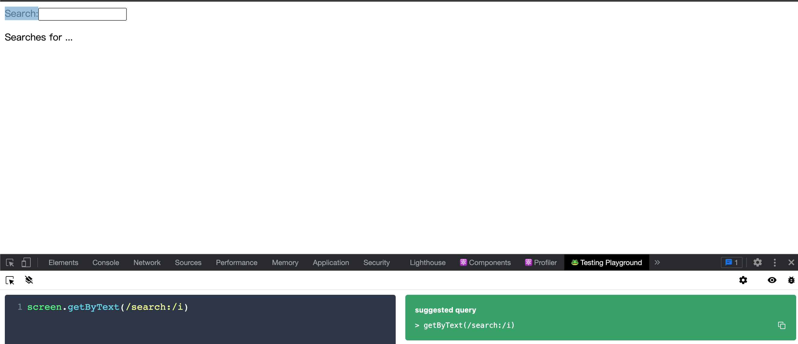

# testing-library 入门

## 先决条件

本文从`create-react-app` 着手入门`testing-library`框架，只需安装`cra`即可

```bash
npx create-react-app react-jest-demo --template typescript
```

安装完后，`src/App.test.tsx`中已经有预设好的 React 组件测试用例了

```js
import { render, screen } from '@testing-library/react';
import App from './App';

test('renders learn react link', () => {
  render(<App />);
  const linkElement = screen.getByText(/learn react/i);
  expect(linkElement).toBeInTheDocument();
});
```

- `render`是用来渲染 react 组件的函数
- `screen.getByText`是查询器，这个查询器会根据文字来查询出页面中对应的 dom 节点
- `toBeInTheDocument`是 jest 提供的匹配器，表示 dom 节点能够正常渲染到页面上

> 如果编辑器是 vscode 的话，可以下载插件 Jest ——用来自动运行测试用例以及其他功能
>
> chrome 浏览器中下载插件 Testing Playground。在测试组件时，经常需要用到查询器查询对应的 dom，查询器很多，比如 ByRole、ByText 等，用这个插件能够很好地提示我们用哪个查询器。——来自官方推荐

## 查看 dom 结构

将`App.tsx`中的代码替换成以下内容

```js
import React from 'react';

const title = 'Hello React';

function App() {
  return <div>{title}</div>;
}

export default App;
```

同时修改`src/App.test.tsx`

```diff
import React from 'react';
import { render, screen } from '@testing-library/react';

import App from './App';

describe('App', () => {
  test('renders App component', () => {
    render(<App />);

+    screen.debug();
  });
});
```

`screen.debug`方法能够打印出页面中现有的 dom 结构，通过它我们知道现在测试环境中的 dom 结构是这样的

```html
<body>
  <div>
    <div>
      Hello React
    </div>
  </div>
</body>
```

接下来我们给 App 组件增加 useState 以及一个子组件让它看起来更像平时编写的组件

```js
import React, { PropsWithChildren } from 'react';

function App() {
  const [search, setSearch] = React.useState('');

  function handleChange(event: React.ChangeEvent<HTMLInputElement>) {
    setSearch(event.target.value);
  }
  return (
    <div>
      <Search value={search} onChange={handleChange}>
        Search:
      </Search>

      <p>Searches for {search ? search : '...'}</p>
    </div>
  );
}
interface SearchProps {
  onChange: (e: React.ChangeEvent<HTMLInputElement>) => void;
  value: string;
}
const Search: React.FC<PropsWithChildren<SearchProps>> = ({
  value,
  onChange,
  children,
}) => {
  return (
    <div>
      <label htmlFor="search">{children}</label>
      <input id="search" type="text" value={value} onChange={onChange} />
    </div>
  );
};

export default App;
```

新的 dom 结构如下：

```html
<body>
  <div>
    <div>
      <div>
        <label for="search">
          Search:
        </label>
        <input id="search" type="text" value="" />
      </div>
      <p>
        Searches for ...
      </p>
    </div>
  </div>
</body>
```

## getByText

`testing-library`提供了非常多的`search function`来抓取 dom 元素，抓取到的 dom 元素可以用来断言或者其他交互行为。

最简单的抓取：

```js
describe('App', () => {
  test('renders App component', () => {
    render(<App />);

    +screen.getByText('Search:');
  });
});
```

> 可以始终使用`screen.debug`来获取 dom 结构，这样方便查看 DOM 结构。
>
> screen 是屏幕对象，表示用户在屏幕上能够看到的内容的集合

抓取到 dom 后就可以用来做某些交互或者断言。

比如我们要断言是否存在 document 内

```js
describe('App', () => {
  test('renders App component', () => {
    render(<App />);
    // 隐式断言，如果元素不存在则会抛出一个错误
    screen.getByText('Search:');
    // 推荐使用显式断言
    +expect(screen.getByText('Search:')).toBeInTheDocument();
  });
});
```

`screen.getByText`这样的 search 函数默认有隐式断言功能，如果被搜索的元素不在 document 中，就能够很快发现问题。

类似于 getByText 这样的函数特别多，除了挨个啃官方文档的 API 外，还有个简单的方法：

打开`localhost:3000`，利用 `Testing Playground`的功能能够很快知道想要搜索的 DOM 元素用什么 search 函数



`Playground`会给出一个比较不错的答案，是不是很方便呢？

## getByRole

还有一个很常用的 API —— getByRole。

这个 API 经常被用于抓取`aria-label` attributes（特性）的 HTML 标签。

也能被用于一些有隐式角色的 HTML 元素的抓取。

比如，页面上的`<Input/>`就能够被抓取，使用插件试一下：


会显示用 `getRole` 抓取到该元素的代码，我们用它来断言此元素是否在页面中。

```js
test('renders App component', () => {
  render(<App />);
  expect(
    screen.getByRole('textbox', {
      name: /search:/i,
    }),
  ).toBeInTheDocument();
});
```

## 其他 search 函数

`getByText` 和 `getByRole`是最常用的 search 页面 HTML 元素的函数，还有一些其他的：

- **LabelText** ：getByLabelText: `<label for="search" />`
- **PlaceholderText**： getByPlaceholderText: `<input placeholder="Search" />`
- **AltText:** getByAltText: ``
- **DisplayValue:** getByDisplayValue: `<input value="JavaScript" />`

## findBy 和 queryBy

跟 `getBy xxx`相似的，还有另外的搜索变种——`queryBy` 和`findBy`

findBy 有以下搜索函数：

- findByText
- findByRole
- findByLabelText
- findByPlaceholderText
- findByAltText
- findByDisplayValue

searchBy 有以下搜索函数：

- queryByText
- queryByRole
- queryByLabelText
- queryByPlaceholderText
- queryByAltText
- queryByDisplayValue

可以看出来就是把 `getBy` 换成`queryBy|findBy`。

那什么时候用 `getBy` 什么时候用 `queryBy` 或 `findBy` 呢？

### queryBy 和 getBy 的区别

我们已经知道了`getBy`会有隐式断言，所以假设我想要断言页面上没有某个元素时，用 getBy 是会报错的

```js
import React from 'react';
import { render, screen } from '@testing-library/react';

import App from './App';

describe('App', () => {
  test('renders App component', () => {
    render(<App />);

    screen.debug();

    // fails
    expect(screen.getByText(/Searches for JavaScript/)).toBeNull();
  });
});
```

通过`screen.debug`，我们知道页面上是不存在内容为`Searches for JavaScript`的元素的，所以上面的代码会一直报错。我们没办法用 getBy 断言一个不存在的元素。

用 `queryBy` 换掉`getBy`就可以：

```js
test('renders App component', () => {
  render(<App />);

  screen.debug();

  // fails
  expect(screen.queryByText(/Searches for JavaScript/)).toBeNull();
});
```

### findBy 和 getBy 的差别

findBy 用于最终将出现的异步元素。

举一个例子，App 组件在渲染后，将获取一次异步数据，然后异步数据获取完成后，会更新一次页面。

```diff
import React, { PropsWithChildren } from 'react';
+ function getUser() {
+   return Promise.resolve({ id: '1', name: 'Robin' });
+ }
function App() {
  const [search, setSearch] = React.useState('');
+  const [user, setUser] = React.useState<{ id: string; name: string } | null>(null);
+  React.useEffect(() => {
+    const loadUser = async () => {
+      const user = await getUser();
+      setUser(user);
+    };

+    loadUser();
+  }, []);
  function handleChange(event: React.ChangeEvent<HTMLInputElement>) {
    setSearch(event.target.value);
  }
  return (
    <div>
+      {user ? <p>Signed in as {user.name}</p> : null}

      <Search value={search} onChange={handleChange}>
        Search:
      </Search>

      <p>Searches for {search ? search : '...'}</p>
    </div>
  );
}
```

上面的 App 组件在 `useEffect`执行前不会渲染`<p>Signed in as {user.name}</p>`,我们需要等它一会，`findBy`就具有 “等待” 的作用

```diff
describe('App', () => {
  test('renders App component', async () => {
    render(<App />);

+    screen.debug();
+    expect(screen.queryByText(/Signed in as/)).toBeNull();

+    expect(await screen.findByText(/Signed in as/)).toBeInTheDocument();
+    screen.debug();
  });
});
```

如果仔细观察两个 `screen.debug`,会发现 dom 结构是不同的，在 `await screen.findByText`后面的`debug`打出来的 dom 中，会多一个

```html
<p>
  Signed in as Robin
</p>
```

### 小结

如果你希望断言一个不存在的元素，则使用 `queryBy`

如果你希望等待一会后抓取到某个元素，则使用`findBy`

否则则使用默认的`getBy`

## 如何抓取多个元素

只需要在`get`/`query`/`find`单词后加上`All`

- getAllBy
- queryAllBy
- findAllBy

这些都会返回一个数组。里面保存着多个抓取到的元素。

## 断言函数

大部分的断言函数都来自于 Jest， `RTL`也扩展了一些断言函数：

- toBeDisabled
- toBeEnabled
- toBeEmpty
- toBeEmptyDOMElement
- toBeInTheDocument
- toBeInvalid
- toBeRequired
- toBeValid
- toBeVisible
- toContainElement
- toContainHTML
- toHaveAttribute
- toHaveClass
- toHaveFocus
- toHaveFormValues
- toHaveStyle
- toHaveTextContent
- toHaveValue
- toHaveDisplayValue
- toBeChecked
- toBePartiallyChecked
- toHaveDescription

看名字也能猜到一二，实际用时翻阅一下文档即可。

## fireEvent

我们可以使用`fireEvent`来模拟用户的行为。

```js
describe('App', () => {
  test('renders App component', async () => {
    render(<App />);

    screen.debug();
    fireEvent.change(
      screen.getByRole('textbox', {
        name: /search:/i,
      }),
      {
        target: { value: 'JavaScript' },
      },
    );
    screen.debug();
  });
});
```

`fireEvent.change` 接受一个抓取到的元素和传递给 `onChange`函数的值为参数。

通过上面的代码，相当于用户模拟了在`<input id="search" type="text" value={value} onChange={onChange} />`这个组件上输入了`JavaScript`字符。

传给`onChange` 函数的参数是`{target: { value: 'JavaScript' }}`。对应源代码中的

```js
function handleChange(event: React.ChangeEvent<HTMLInputElement>) {
  setSearch(event.target.value);
}
```

通过第二个`screen.debug`，能清楚看到`input` 的值被设置成了：

```html
<input id="search" type="text" value="JavaScript" />
```

此外，还能看到`RTL`给我们报了一个 warning


这说明我们的组件有一些异步更新的操作。除了按照提示的使用`act`函数外，还能够用 `findByText`来消除这个警告：

```diff
describe('App', () => {
  test('renders App component', async () => {
    render(<App />);
    screen.debug();
+    expect(await screen.findByText(/Signed in as/i)).toBeInTheDocument();
    fireEvent.change(screen.getByRole('textbox', { name: /search:/i }), {
      target: { value: 'JavaScript' },
    });

    screen.debug();
  });
});
```

接着我们再对 change 前和 change 后做一些断言。

```diff
describe('App', () => {
  test('renders App component', async () => {
    render(<App />);
    screen.debug();
    expect(await screen.findByText(/Signed in as/i)).toBeInTheDocument();
+    expect(screen.queryByText(/Searches for JavaScript/)).toBeNull();
    fireEvent.change(screen.getByRole('textbox', { name: /search:/i }), {
      target: { value: 'JavaScript' },
    });
+    expect(screen.getByText(/Searches for JavaScript/)).toBeInTheDocument();

    screen.debug();
  });
});
```

我们使用`queryBy`搜索来检查元素在事件之前是否不存在，使用`getBy`搜索变体来检查它在事件之后是否存在。

`getBy`也可以替换成`queryBy`使用。

`RTL` 的 `fireEvent`可以直接模拟用户的行为，而且在之后可以用断言来判断此时应该发生什么。

## userEvent

还有一个`userEvent` 扩展能够更真实地模拟用户的行为。

`fireEvent.change`可以模拟用户的输入行为。

`userEvent.type`也能做到，但是它还能触发 `keyDown`、`keypress`和 `keyUp`事件

```diff
-    fireEvent.change(screen.getByRole('textbox', { name: /search:/i }), { target: { value: 'JavaScript' } });

+    userEvent.type(screen.getByRole('textbox', { name: /search:/i }), 'JavaScript');
```

如果有可能的话，优先考虑 `userEvent` 再考虑`fireEvent`

## mock callback 函数

有些时候我们需要进行单元测试，比如下面的子组件：

```js
const Search: React.FC<PropsWithChildren<SearchProps>> = ({
  value,
  onChange,
  children,
}) => {
  return (
    <div>
      <label htmlFor="search">{children}</label>
      <input id="search" type="text" value={value} onChange={onChange} />
    </div>
  );
};
```

我想要知道传递给 Search 组件的 onChange 方法是否被调用过。

这时候可以利用 `jest.fn`来模拟一个 callback，传递给 Search 组件并对 callback 的次数进行断言。

```js
test('renders search component', async () => {
  const callback = jest.fn();
  render(<Search value="1" onChange={callback}></Search>);

  userEvent.type(screen.getByRole('textbox'), 'JavaScript');

  expect(callback).toBeCalledTimes(10);
});
```

使用 userEvent.type 来模拟用户输入 JavaScript 时，共会触发 10 次按键。

如果使用 fireEvent 的话，只会触发一次。

```js
  test('renders search component', async () => {
    const callback = jest.fn();
    render(<Search value="1" onChange={callback}></Search>);

    // userEvent.type(screen.getByRole('textbox'), 'JavaScript');
    fireEvent.change(screen.getByRole('textbox'), {
      target: { value: 'JavaScript' },
    });

    // expect(callback).toBeCalledTimes(10);
    expect(callback).toBeCalledTimes(1);
  });
});
```

这也说明 userEvent 更接近用户行为。

## mock axios

```js
import React from 'react';
import axios from 'axios';

const URL = 'http://hn.algolia.com/api/v1/search';

function App() {
  const [stories, setStories] = React.useState([]);
  const [error, setError] = React.useState(null);

  async function handleFetch(event) {
    let result;

    try {
      result = await axios.get(`${URL}?query=React`);

      setStories(result.data.hits);
    } catch (error) {
      setError(error);
    }
  }

  return (
    <div>
      <button type="button" onClick={handleFetch}>
        Fetch Stories
      </button>

      {error && <span>Something went wrong ...</span>}

      <ul>
        {stories.map(story => (
          <li key={story.objectID}>
            <a href={story.url}>{story.title}</a>
          </li>
        ))}
      </ul>
    </div>
  );
}

export default App;
```

当点击按钮后，就可以发送异步请求，并将结果渲染到页面上。我们不在乎 axios 请求到的结果是不是正确的，这是后端单元测试的内容。

我们需要自己手动 mock axios 来返回一个数据

```js
import React from 'react';
import axios from 'axios';
import { render, screen } from '@testing-library/react';
import userEvent from '@testing-library/user-event';

import App from './App';

jest.mock('axios');

describe('App', () => {
  test('fetches stories from an API and displays them', async () => {
    const stories = [
      { objectID: '1', title: 'Hello' },
      { objectID: '2', title: 'React' },
    ];

    axios.get.mockImplementationOnce(() =>
      Promise.resolve({ data: { hits: stories } }),
    );

    render(<App />);

    await userEvent.click(screen.getByRole('button'));

    const items = await screen.findAllByRole('listitem');

    expect(items).toHaveLength(2);
  });
});
```

在模拟 API 并呈现组件之后，我们使用 userEvent API 单击按钮，该按钮将进入 API 请求。

由于请求是异步的，我们必须等待组件更新。与之前一样，我们使用`RTL`的`findBy`搜索来等待最终出现的元素。

还可以 mock 一个错误的数据，确保传送数据失败后，展示给用户的是一个带有 error 信息的页面

```js
test('fetches stories from an API and fails', async () => {
  axios.get.mockImplementationOnce(() => Promise.reject(new Error()));

  render(<App />);

  await userEvent.click(screen.getByRole('button'));

  const message = await screen.findByText(/Something went wrong/);

  expect(message).toBeInTheDocument();
});
```

## act 函数的用法

当页面会调用异步函数并更新页面时，使用 act 函数来传递一个新的数据。

```diff
import React from 'react';
import axios from 'axios';
+ import { render, screen, act } from '@testing-library/react';
import userEvent from '@testing-library/user-event';

import App from './App';

jest.mock('axios');

describe('App', () => {
  test('fetches stories from an API and displays them', async () => {
    const stories = [
      { objectID: '1', title: 'Hello' },
      { objectID: '2', title: 'React' },
    ];

+    const promise = Promise.resolve({ data: { hits: stories } });

+    axios.get.mockImplementationOnce(() => promise);

    render(<App />);

    await userEvent.click(screen.getByRole('button'));

+    await act(() => promise);

+    expect(screen.getAllByRole('listitem')).toHaveLength(2);
  });

  test('fetches stories from an API and fails', async () => {
    ...
  });
});
```

为了完整起见，最后的例子向你展示了怎么以更明确的方式 await promise，通过 `act` 函数而不是等待 HTML 出现在页面。

使用 RTL 去测试 React 的异步行为不是一件困难的事情。你已经在测试代码中通过使用 Jest 去 mock 了外部模块（remote API），并且 await 数据及重新渲染了 React 组件。
