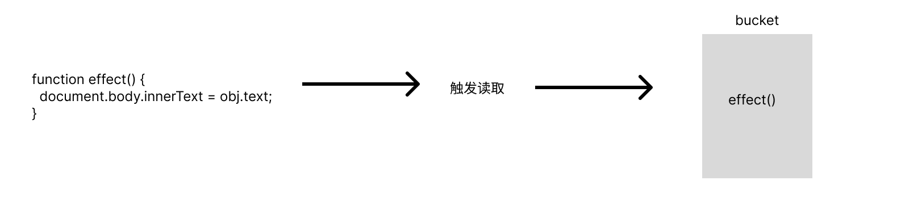
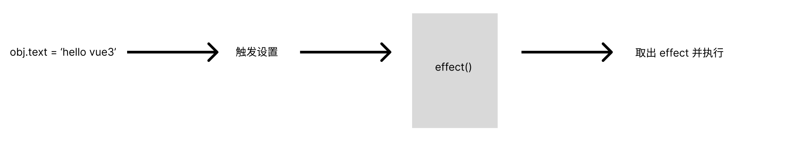
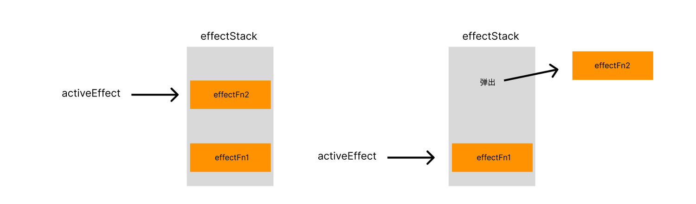

# 响应系统

## 1.1 响应式数据和副作用函数

副作用函数指的是会产生副作用的函数：

```js
function effect() {
  document.body.innerText = 'hello world';
}
```

当 effect 函数执行时，它会设置 body 的文本内容，但除了 effect 函数外的任何函数都可以读取或者设置 body 的文本内容。也就是说，effect 函数的执行会直接或者间接影响到其他函数的执行，这时 effect 产生了副作用。

副作用很容易产生，比如我们一个函数修改了全局变量，这也是一个副作用。

```js
// 全局变量
let global = 1;

function effect() {
  global = 2; // 修改全局变量，产生了副作用
}
```

响应式数据指的是会让副作用函数重新执行的数据。

例如下面有一个副作用函数读取了某个对象的值：

```js
const obj = { text: 'hello world' };
function effect() {
  document.body.innerText = obj.text;
}
```

当 obj.text 发生变化时，我们希望副作用函数 effect 会重新执行：

```js
obj.text = 'hello vue'; // 修改 obj.text后，副作用函数会重新执行
```

如果 obj.text 的值发生了变化，副作用函数真的重新执行了，那么对象 obj 就是响应式数据。

## 1.2 响应式数据的基本实现

如何让 obj 变成响应式数据呢？通过观察我们可以得出两个线索：

- 副作用 effect 函数执行时，会触发读取 obj.text 的操作
- 当修改 obj.text 时，会触发字段 obj.text 的设置操作

如果我们能拦截对象的读取和设置操作，事情就变得简单了。当读取字段 obj.text 时，我们可以将副作用函数 effect 存储到一个桶（bucket）里



当设置 obj.text 时，从桶里拿出 effect 并执行即可。



现在的关键问题在于如何拦截对象的读取和设置操作。vue2 用的是 object.defineProperty 函数实现的，Vue3 则用的是 Proxy 代理对象。

```js
const bucket = new Set();

const data = { text: 'hello world' };
const obj = new Proxy(data, {
  // 拦截读取操作
  get(target, key) {
    // 将副作用函数存进桶里
    bucket.add(effect);
    return target[key];
  },
  // 拦截设置操作
  set(target, key, newValue) {
    //设置新的值
    target[key] = newValue;
    // 从桶里取出副作用函数并执行
    bucket.forEach(fn => fn());
    //返回 true 表示成功
    return true;
  },
});
```

下面我们使用一个副作用函数进行测试：

```js
function effect() {
  document.body.innerText = obj.text;
}

effect();

setTimeout(() => {
  obj.text = 'hello vue'; // 触发读取和设置设置操作
}, 3000);
```

上面的代码会在 3 秒后将 body 的内容从 hello world 变成 hello vue 。

## 1.3 完善响应系统

上面的代码的逻辑非常简单：

1. 读取操作时，将副作用函数存在桶里
2. 设置操作时，将副作用函数从桶里拿出来执行

但是依然有不完善的地方，比如，我们硬编码了 effect 函数的名字，如果用户设置的副作用函数不叫 effect，那么响应系统就不能正确运行了。

为了让副作用函数可以是任意命名的函数，我们需要提供一个注册副作用函数的机制。

最简单的注册副作用函数的机制是这样的：

```js
// 用全局变量来保存被注册的副作用函数
let activeEffect;
// effect则用来注册副作用函数
function effect(fn) {
  activeEffect = fn;
  fn();
}
```

这样，用户就可以传入一个函数来注册副作用函数：

```js
effect(() => (document.body.innerText = obj.text));
```

当 effect 函数执行时，会把匿名函数赋值给全局变量 activeEffect。接着执行被注册的匿名副作用函数，这样也可以引发响应式数据 obj.text 的读取操作，此时会被 Proxy 对象拦截：

```js
const obj = new Proxy(data, {
  // 拦截读取操作
  get(target, key) {
    // 将保存在activeEffect 的匿名副作用函数存进桶里
    if (activeEffect) bucket.add(activeEffect);
    return target[key];
  },
  // 拦截设置操作
  set(target, key, newValue) {
    //设置新的值
    target[key] = newValue;
    // 从桶里取出副作用函数并执行
    bucket.forEach(fn => fn());
    //返回 true 表示成功
    return true;
  },
});
```

由于副作用函数已经储存到 activeEffect 中，所以在 get 拦截的时候把 activeEffect 收集到桶中，这样响应系统就不需要依赖函数的名字了。

现在虽然做到了不需要依赖函数名字，但是依然有 bug 存在。比如访问一个不存在的属性：

```js
effect(() => {
  console.log('effect run'); // 执行了两次

  document.body.innerText = obj.text;
});
setTimeout(() => {
  // obj.text = "hello vue";
  obj.notExit = '123';
}, 2000);
```

我们通过 log 台能够知道 effect 调用了两次。第一次是访问 obj.text 时，代理跟 effect 函数建立了响应联系。

第二次则是访问 obj.notExit 时，由于不存在这个属性，所以我们不需要访问这个属性时还会触发副作用函数，然而事与愿违，我们的代码逻辑是在 set 拦截时就触发副作用函数，不管之前有没有这个属性。这是不正确的。

要解决这个问题的根本在于，我们需要在 get 拦截时就让 effect 函数与被操作的目标字段之间建立某种联系。

仔细看代码就可以发现：

```js
effect(function effectFn() => {
  document.body.innerText = obj.text;
});
```

这段代码中存在三个角色：

1. 被操作的代理对象 obj
2. 被操作的字段名 text
3. 使用 effect 函数注册的函数 effectFn

如果我们用 target 表示被操作的代理对象，字段名作为 key，effectFn 作为被注册的副作用函数。我们可以为这三个角色建立如下关系：

> target
> ├─ key
> ├─ effectFn

现在，我们将 bucket 修改为 WeakMap 结构

```js
let bucket = new WeakMap();
```

然后修改 get/set 拦截器的代码：

```js
let obj = new Proxy(data, {
  get(target, key) {
    // 从桶里取得以当前对象为 key 的 depsMap，这是一个 Map 类型
    let depsMap = bucket.get(target);
    // 如果没有depsMap，那么就新建一个Map 并与 target 关联
    if (!depsMap) {
      bucket.set(target, (depsMap = new Map()));
    }
    // 根据 key 从 depsMap 中取得 deps
    let deps = depsMap.get(key);
    // 如果没有则新建一个 Set 类型并与 key 关联
    if (!deps) {
      depsMap.set(key, (deps = new Set()));
    }
    // 将当前激活的副作用函数添加到桶里
    deps.add(activeEffect);
    return target[key];
  },
  set(target, key, newValue) {
    // 设置属性值
    target[key] = newValue;
    // 根据 target 从桶里取出 depsMap
    const depsMap = bucket.get(target);
    if (!depsMap) return;
    // 再根据 key 从 depsMap 中取得注册的所有副作用函数依赖集合
    const effects = depsMap.get(key);
    // 执行副作用函数
    effects && effects.forEach(effectFn => effectFn());
    return true;
  },
});
```

从上面的代码可以看出我们目前的构建数据的方式是这样的：

- WeakMap 由 target --> Map 构成
- Map 由 key --> Set 构成

WeakMap 以 target 为键，值为一个 Map 实例。Map 以 target 的 key 为键，值为由副作用函数组成的 Set。

为了方便描述，我们将 Set 数据结构内的副作用函数集合称之为 key 的**依赖集合**。

> 为什么要用 WeakMap ？
>
> 以下面代码为例：
>
> ```js
> const map = new Map();
> const weakMap = new WeakMap();
> (function() {
>   let foo = { foo: 1 };
>   let bar = { bar: 2 };
>   map.set(foo, 1);
>   weakMap.set((bar: 2));
> })();
> ```
>
> map 以 foo 为键，weakMap 以 bar 为键。当匿名函数被执行后，map 中的对象 foo 依然被 map 的 key 所引用着，因此垃圾回收器不会将其回收；而 weakMap 的 key 是弱引用，它不会影响垃圾回收器的正常回收。所以当执行完毕后，对象 bar 会从内存中移除，并且我们无法从 weakMap 中获取对象 bar。
>
> WeakMap 经常用于存储那些只有当 key 所引用的对象存在时才有价值的信息。如果 target 对象没有任何引用了，那么说明用户不需要用它了，这时垃圾回收器就会完成回收任务。如果用 Map 来收集 target 对象，那么即使用户的代码对 target 没有任何引用，这个 target 也不会被回收，最终可能导致内存溢出。

现在，我们将 get 拦截里的代码抽离成一个 track 函数，函数 track 用来表示追踪。将 set 拦截里的代码抽离成 trigger 函数，表示触发副作用函数。

```js
let data = { text: 'hello world' };
let bucket = new WeakMap();
let activeEffect;
function effect(fn) {
  activeEffect = fn;
  fn();
}

let obj = new Proxy(data, {
  get(target, key) {
    // 将副作用函数 activeEffect 添加到存储副作用函数的桶中
    track(target, key);
    // 返回属性值
    return target[key];
  },
  set(target, key, newValue) {
    // 设置属性值
    target[key] = newValue;
    // 触发桶中的副作用函数
    trigger(target, key);
    return true;
  },
});

function track(target, key) {
  // 从桶里取得以当前对象为 key 的 depsMap，这是一个 Map 类型
  let depsMap = bucket.get(target);
  // 如果 bucket 里面找不到  那么就新建一个Map 并与 target 关联
  if (!depsMap) {
    bucket.set(target, (depsMap = new Map()));
  }
  // 根据 key 从 depsMap 中取得 deps
  let deps = depsMap.get(key);
  // 如果没有则新建一个 set 类型
  if (!deps) {
    depsMap.set(key, (deps = new Set()));
  }
  // 将当前激活的副作用函数添加到桶里
  deps.add(activeEffect);
}

function trigger(target, key) {
  // 根据 target 从桶里取出 depsMap
  const depsMap = bucket.get(target);
  if (!depsMap) return;
  // 再根据 key 从 depsMap 中取得注册的所有副作用函数列表
  const effects = depsMap.get(key);
  // 执行副作用函数
  effects && effects.forEach(effectFn => effectFn());
}
```

## 1.4 分支切换和 cleanup

什么是分支切换？

```js
const data = { ok: true, text: 'hello world' };
const obj = new Proxy(data, {});
effect(() => {
  document.body.innerText = obj.ok ? obj.text : 'not';
});
```

`effect`接受的副作用函数中的代码会根据字段 `obj.ok` 的变化来执行不同的分支。这就是分支切换。

分支切换可能会产生遗留的副作用函数。比如，字段 obj.ok 初始值为 true 时，会读取 obj.text 的值，那么这时候就会触发 obj.ok 和 obj.text 两个读取操作，此时会往 bucket 中存入两个副作用函数。

> data
> ├─ ok
> ├─ effectFn
> ├─ text
> ├─ effectFn

然而 obj.ok 为 false 时，effectFn 触发后并不会读取 obj.text ，那么理想情况下，effectFn 不会被 obj.text 对应的依赖集合所收集。

> data
> ├─ ok
> ├─ effectFn

不过按照现在的实现，即使将 obj.ok 修改为 false，并触发副作用函数重新执行，整个依赖关系并没有发生变化，这时就产生了遗留的副作用函数。

遗留的副作用函数会导致不必要的更新，举个例子：

```js
obj.ok = false;
```

现在我们已经将 obj.ok 修改成 false 了，按照之前的逻辑，obj.text 不会被读取。换句话说，即使 obj.text 怎么变，`document.body.innerText` 都是`not`,最好的结果是不需要再去执行 text 对应的副作用函数了。然而事实并非如此：

```js
obj.text = 'vue';
```

这依然会导致副作用函数重新执行，即使视图层面已经不需要更新了。

解决的思路很简单，每次副作用函数执行时，我们都先把它从所有与之相关的依赖集合中删除。

当副作用函数执行完毕后，会重新建立联系，但在新的联系中不会包含遗留的副作用函数。所以如果我们能够做到每次在副作用函数执行前，都将其从相关联的依赖集合中删除，问题就迎刃而解了。

想要将副作用函数将相关联的依赖集合中删除，首先就必须知道哪些依赖集合中包含了该函数。

我们需要在副作用函数中设置一个数组来保存所有收集到的依赖集合。

```js
// 用全局变量来保存被注册的副作用函数
let activeEffect;
function effect(fn) {
  const effectFn = () => {
    // 当 effectFn 执行时，将其设置为当前激活的副作用函数
    activeEffect = effectFn;
    fn();
  };
  // activeEffect.deps用来存储所有与该副作用函数相关联的依赖集合
  effectFn.deps = [];
  effectFn();
}
```

依赖集合可以在 track 函数中收集

```diff
function track(target, key) {
  // 从桶里取得以当前对象为 key 的 depsMap，这是一个 Map 类型
  let depsMap = bucket.get(target);
  // 如果 bucket 里面找不到  那么就新建一个Map 并与 target 关联
  if (!depsMap) {
    bucket.set(target, (depsMap = new Map()));
  }
  // 根据 key 从 depsMap 中取得 deps
  let deps = depsMap.get(key);
  // 如果没有则新建一个 set 类型
  if (!deps) {
    depsMap.set(key, (deps = new Set()));
  }
  // 将当前激活的副作用函数添加到桶里
  deps.add(activeEffect);

  // deps 就是一个与当前副作用函数存在联系的依赖集合
  // 将其添加到 activeEffect.deps数组中
+  activeEffect.deps.push(deps); // 新增
}
```

在 track 函数中，我们将 activeEffect 添加到依赖集合 deps 中，这说明 deps 就是一个与当前副作用函数存在联系的依赖集合。此时我们也将它添加到 activeEffect.deps 中，此时就完成了对依赖集合的收集。

此时移除函数 cleanup 就好写了：

```js
function cleanup(effectFn) {
  for (let i = 0; i < effectFn.deps.length - 1; i++) {
    // deps 是收集到的依赖集合
    let deps = effectFn.deps[i];
    // 从依赖集合中将副作用函数删除
    deps.delete(effectFn);
  }
  // 重置effectFn.deps数组
  effectFn.deps.length = 0;
}
```

最后在每次 effectFn 执行时就将副作用函数从依赖集合中删除。

```js
function effect(fn) {
  const effectFn = () => {
    // 从依赖集合中清除 effectFn
    cleanup(effectFn);
    // 当 effectFn 执行时，将其设置为当前激活的副作用函数
    activeEffect = effectFn;
    fn();
  };
  // activeEffect.deps用来存储所有与该副作用函数相关联的依赖集合
  effectFn.deps = [];
  effectFn();
}
```

此时还需要修改 trigger 中的代码，否则会引起 bug。

```js
function trigger(target, key) {
  // 根据 target 从桶里取出 depsMap
  const depsMap = bucket.get(target);
  if (!depsMap) return;
  // 再根据 key 从 depsMap 中取得注册的所有副作用函数列表
  const effects = depsMap.get(key);
  // 执行副作用函数
  effects && effects.forEach(effectFn => effectFn()); // 注意这段代码
}
```

trigger 函数会执行 deps 中的 effectFn，而 effectFn 执行后又将其从 deps 中删除，然后 effectFn 函数中的代码`document.body.innerText = obj.ok ? obj.text : "not"`又会将 effectFn 往 deps 中塞。

根据 JS 的语言规范，在调用 forEach 遍历 Set 集合时，如果一个值已经被访问过，但该值被删除并重新添加到集合，如果此时 forEach 遍历没有结束，那么该值就会重新被访问。因此，上面的逻辑类似于以下代码，会无限被循环下去：

```js
const set = new Set([1]);
set.forEach(item => {
  set.delete(item);
  set.add(item);
  console.log('遍历还未结束');
});
```

解决办法是构造一个新的 Set ，并遍历它，代替直接遍历 effects，从而避免无限循环。

```js
function trigger(target, key) {
  // 根据 target 从桶里取出 depsMap
  const depsMap = bucket.get(target);
  if (!depsMap) return;
  // 再根据 key 从 depsMap 中取得注册的所有副作用函数列表
  const effects = depsMap.get(key);
  // 构造一个新的 Set 代替直接遍历 effects
  const newEffects = new Set(effects);
  newEffects.forEach(effectFn => effectFn());
  // effects && effects.forEach((effectFn) => effectFn());
}
```

## 1.5 嵌套的 effect 和 effect 栈

effect 是可以嵌套的，例如：

```js
effect(function effectFn1() {
  effect(function effectFn2() {
    // ...
  });
  //...
});
```

effectFn1 的执行会触发 effectFn2 的执行。

在 Vue 中，渲染函数是在一个 effect 中执行的。

```js
// Foo 组件
const Foo = {
  render() {
    return; /*...*/
  },
};
// 在 effect 中执行 Foo 组件的渲染函数
effect(() => {
  Foo.render();
});
```

当组件发生嵌套时，就会产生 effect 嵌套。

```js
// Bar 组件
const Bar = {
  render() {
    return; /*...*/
  },
};
// Foo 组件渲染了 Bar 组件
const Foo = {
  render() {
    return <Bar />;
  },
};
```

此时 effect 执行就相当于：

```js
effect(() => {
  Foo.render();
  // 嵌套
  effect(() => {
    Bar.render();
  });
});
```

明白了为什么需要支持 effect 嵌套，我们来测试一下目前的响应系统对嵌套的支持情况：

```js
let data = { foo: true, bar: true };
let temp1, temp2;
let obj = new Proxy(data, {
  /* 省略 */
});
effect(function effectFn1() {
  console.log('effectFn1 执行');
  effect(function effectFn2() {
    console.log('effectFn2 执行');
    temp2 = obj.bar;
  });
  temp1 = obj.foo;
});
```

需要注意的是，我们在 effectFn2 中读取 obj.bar，在 effectFn1 中读取 obj.foo，并且 effectFn2 的执行要优先于 obj.foo 的读取操作。

理想情况下，我们希望的依赖关系是这样的：

> data
> ├─ foo
> ├─ effectFn1
> ├─ bar
> ├─ effectFn2

当修改 obj.foo 时，effectFn1 会执行。由于 effectFn1 里面也有一个 effect，所以当执行了 effectFn1 时，毫无疑问也会触发 effectFn2 的执行。

当修改 obj.bar 时，我们希望只有 effectFn2 会执行。

但是结果并不是这样的，比如尝试修改 obj.foo：

```js
obj.foo = false;
```

结果为：

```bash
effectFn1 执行
effectFn2 执行
effectFn2 执行
```

前两个结果是 effectFn1 第一次执行后产生的正常输出，问题出在第三个输出。当修改 obj.foo 后，effectFn1 并没有执行，反而仅仅执行了 effectFn2。

仔细思考一下问题所在：

1. 当执行 effect 时，effectFn1 会被包裹在 effectFn 里，此时 activeEffect 是 effectFn1 的包裹函数。然后调用 effectFn1

2. 打印 effectFn1 执行

3. 进入第二层 effect 执行逻辑，调用 effectFn2。此时 effectFn2 会被包裹在 effectFn 里并赋值给 activeEffect。

4. 打印 effectFn2 执行

5. 在 effectFn 内部发现 obj.bar 被访问，进入 get 拦截， activeEffect 作为 effectFn2 会被收集到桶里。

   > data
   > ├─ bar
   > ├─ effectFn2

6. effectFn2 执行结束后，发现 obj.foo 被访问，此时走 get 拦截，activeEffect 并没有变化！

通过分析定位到问题就出在 activeEffect 上，它作为全局的变量，在内层 effect 执行后会将原来保存的值给覆盖掉，并且不会被恢复。外层的 obj.foo 被拦截后，依赖只能收集到内层的副作用函数。

解决的方法是巧妙利用函数执行时的调用栈原理，将 activeEffect 变成一个栈，遇到嵌套 effect 时，activeEffect 就从外到内不断 push。在 bucket 收集副作用函数时，就从后面挨个弹出来，这样就做到了收集正确的副作用函数。

```js
// let activeEffect
let effectStack = [];
function effect(fn) {
  const effectFn = () => {
    cleanup(effectFn);
    // 将副作用函数压入栈中
    effectStack.push(effectFn);
    fn();
  };
  // activeEffect.deps用来存储所有与该副作用函数相关联的依赖集合
  effectFn.deps = [];
  effectFn();
}
```

```js
function track(target, key) {
  // 从桶里取得以当前对象为 key 的 depsMap，这是一个 Map 类型
  let depsMap = bucket.get(target);
  // 如果 bucket 里面找不到  那么就新建一个Map 并与 target 关联
  if (!depsMap) {
    bucket.set(target, (depsMap = new Map()));
  }
  // 根据 key 从 depsMap 中取得 deps
  let deps = depsMap.get(key);
  // 如果没有则新建一个 set 类型
  if (!deps) {
    depsMap.set(key, (deps = new Set()));
  }
  // 从effect栈的最后一位中拿出当前执行的副作用函数赋值给activeEffect
  const activeEffect = effectStack.pop();
  // 将当前激活的副作用函数添加到桶里
  deps.add(activeEffect);
  // deps就是一个与当前副作用函数存在联系的依赖集合
  activeEffect.deps.push(deps);
}
```

此外，为了遵循最小修改原则，还有一个仅修改 effect 函数内代码的处理方法：

```diff
let activeEffect;
+ let effectStack = [];
function effect(fn) {
  const effectFn = () => {
    cleanup(effectFn);
    // 当 effectFn 执行时，将activeEffect设置为当前激活的副作用函数
    activeEffect = effectFn;
+    // 在调用副作用函数之前将当前副作用函数保存入effectStack 中
+    effectStack.push(effectFn);
    fn();
+    // 在副作用函数执行之后将 effectFn 弹出，并把 activeEffect 还原成之前的值
+    effectStack.pop();
+    activeEffect = effectStack[effectStack.length - 1];
  };
  // activeEffect.deps用来存储所有与该副作用函数相关联的依赖集合
  effectFn.deps = [];
  effectFn();
}
```

当内层副作用函数 effectFn2 执行后，副作用函数栈就把它弹出，并将存储在栈顶的 effectFn1 设置为 `activeEffect`



## 1.6 避免无限递归循环

现在我们的响应式系统已经能够正常收集嵌套依赖了。但依然要考虑到诸多细节，比如：

```js
effect(function effectFn1() {
  obj.foo = !obj.foo;
});
```

这段代码会造成无限递归循环。

```bash
Maximum call stack size exceeded
```

原因是这段代码又读取了 obj.foo 的值，又设置了 obj.foo 的值。

当读取操作时，我们会收集依赖。

当设置操作时，我们会执行收集到的依赖。

于是上面代码就在不断自己收集和自己执行中进入了无限递归循环。

通过分析可以发现，收集时的 effectFn 是 activeEffect，触发时的 effectFn 也是 activeEffect。所以解决的方法是在 trigger 动作发生时增加守卫条件：如果 trigger 触发执行的副作用函数与当前正在执行的副作用函数相同，则不触发执行。

```js
function trigger(target, key) {
  // 根据 target 从桶里取出 depsMap
  const depsMap = bucket.get(target);
  if (!depsMap) return;
  // 再根据 key 从 depsMap 中取得注册的所有副作用函数列表
  const effects = depsMap.get(key);
  const newEffects = new Set();
  effects.forEach(effectFn => {
    // 如果 trigger 触发执行的副作用函数与当前执行的副作用函数相同，则不触发执行
    if (effectFn !== activeEffect) {
      newEffects.add(effectFn);
    }
  });
  newEffects.forEach(effectFn => effectFn());
  // effects && effects.forEach((effectFn) => effectFn());
}
```

## 1.7 调度执行

可调度指的是当 trigger 动作触发副作用函数重新执行时，有能力决定副作用函数执行的时机、次数和方式。

比如以下代码：

```js
effect(function effectFn1() {
  console.log(obj.foo);
});

obj.foo = false;
console.log('结束了');
```

执行结果：

```bash
true
false
结束了
```

现在我们需要增加调度器，在不调整代码的情况下让代码的执行顺序变为：

```bash
true
结束了
false
```

为了实现这个需求，我们需要让响应系统支持调度。

可以给 effect 函数设计一个选项参数 options，允许用户指定调度器。

```js
effect(
  () => {
    console.log(obj.foo);
  },
  // options
  {
    scheduler(fn) {
      //...
    },
  },
);
```

如上所述，用户在调用 effect 注册副作用函数时，可以通过第二个参数 options 来指定 scheduler。同时在 effect 函数内部我们需要将 options 选项挂载到对应的副作用函数上。

```js
function effect(fn, options) {
  const effectFn = () => {
    cleanup(effectFn);
    activeEffect = effectFn;
    effectStack.push(effectFn);
    fn();
    // 当 effectFn 执行时，将其设置为当前激活的副作用函数
    effectStack.pop();
    activeEffect = effectStack[effectStack.length - 1];
  };
  // activeEffect.deps用来存储所有与该副作用函数相关联的依赖集合
  effectFn.deps = [];
  // 将 options 挂载到 effectFn 上
  effectFn.options = options;
  effectFn();
}
```

有了调度函数，我们在 trigger 函数中触发副作用函数重新执行时，可以调用用户传入的调度器函数，从而把控制权交给用户：

```js
function trigger(target, key) {
  // 根据 target 从桶里取出 depsMap
  const depsMap = bucket.get(target);
  if (!depsMap) return;
  // 再根据 key 从 depsMap 中取得注册的所有副作用函数列表
  const effects = depsMap.get(key);
  const newEffects = new Set();
  effects.forEach(effectFn => {
    // 如果 trigger 触发执行的副作用函数与当前执行的副作用函数相同，则不触发执行
    if (effectFn !== activeEffect) {
      newEffects.add(effectFn);
    }
  });
  newEffects.forEach(effectFn => {
    // 如果副作用函数中存在 options.scheduler，则调用该函数。并将 effectFn 作为参数传递
    if (effectFn.options.scheduler) {
      // 新增
      effectFn.options.scheduler(effectFn); // 新增
    } else {
      effectFn(); // 新增
    }
  });
}
```

如上述代码所示，在 trigger 函数执行副作用函数时，我们优先判断该副作用函数中是否存在调度器，如果存在，则直接调用调度器，并将 effectFn 作为参数传递进去；如果不存在，则直接执行该副作用函数。

现在我们的代码已经支持自定义调用顺序了：

```js
effect(() => console.log(obj.foo), {
  scheduler(fn) {
    setTimeout(fn);
  },
});
obj.foo = false;
console.log('结束了');
```

结果为：

```js
true;
结束了;
false;
```

除了控制顺序外，还能通过调度器做到控制它的次数。比如以下例子：

```js
let data = { foo: 1 };
const obj = new Proxy(data,{...})
effect(()=>{console.log(obj.foo)})
obj.foo++
obj.foo++
```

打印的结果是：

```js
1;
2;
3;
```

由输出结果可以看到，obj.foo 最终会从 1 变成 3,2 只是它的过渡状态。如果我们只关心最终结果而不关心过程，那么执行三次打印是多余的，我们希望能够跳过第二次，直接从 1 变成 3：

```js
1;
3;
```

基于调度器，我们可以完成此功能，思路如下：

```js
// 定义一个任务队列
const jobQueue = new Set();
// 创建一个 promise 实例，通过它将任务添加到微任务队列中，异步执行
const p = Promise.resolve();
// 一个标志，用来表示队列是否正在刷新队列
let isFlushing = false;
function flushJob() {
  // 如果队列正在刷新，则什么都不做
  if (isFlushing) return;
  // 设置为 true，表示正在刷新
  isFlushing = true;
  // 在微任务队列中刷新 jobQueue 队列
  p.then(() => jobQueue.forEach(job => job())).finally(() => {
    // 结束后重置 isFlushing
    isFlushing = false;
  });
}

effect(() => console.log(obj.foo), {
  scheduler(fn) {
    // 每次调度时，将副作用函数添加到 jobQueue 队列中
    jobQueue.add(fn);
    // 调用 flushJob 刷新队列
    flushJob();
  },
});
obj.foo++;
obj.foo++;
```

整段代码的效果如下：

1. 执行第一个 `obj.foo++`时，触发调度器，将 effectFn 的任务添加到 `jobQueue` 的任务队列中，并刷新队列
2. 此时`flushJob` 会将 `isFlushing` 设置为 `true`，代表正在刷新队列，然后 `p.then`会将遍历队列的操作放到微任务队列中
3. 继续执行`obj.foo++`，继续触发调度器，将 effectFn 的任务添加到 `jobQueue` 的任务队列中。由于`jobQueue` 是一个`Set`数据结构，具有自动去重的能力，所以 `jobQueue` 始终只有一个副作用函数，即当前副作用函数。
4. flushJob 也会执行两次，但由于`isFlushing`的存在，实际上 `flushJob`在一个事件循环过程中只执行了一次，即在微任务队列中执行一次。
5. 当微任务队列开始执行时，就会遍历 `jobQueue` 中储存的副作用函数。由于 `jobQueue` 中只有一个副作用函数，所以只会执行一次。当它执行时，obj.foo 的值已经变成 `3` 了

上面的代码需要注意的细节有三点：

1. 巧妙利用 Set 数据结构自动去重的能力，否则`jobQueue`会遍历多次相同的 `effectFn`
2. 利用 `isFlushing`标志，确保任务队列在一个周期内只会执行一次。
3. 通过`p.then`将整个刷新队列的函数放到微任务队列中。

整个功能有点类似于`Vue.js` 中连续修改多次响应式数据但只会更新一次，实际上 `Vue`内部实现了更完善的调度器，思路大体相同。
