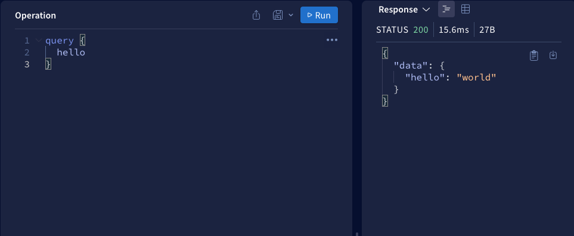
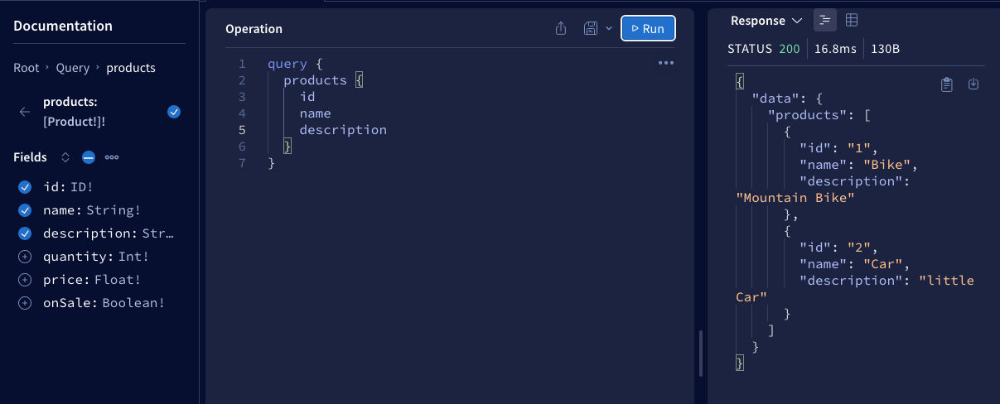
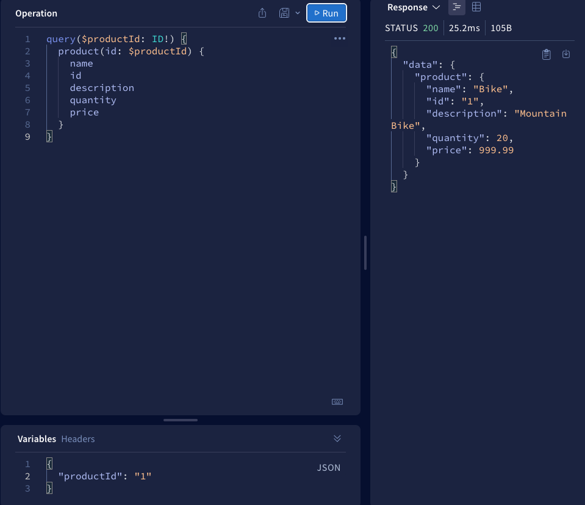
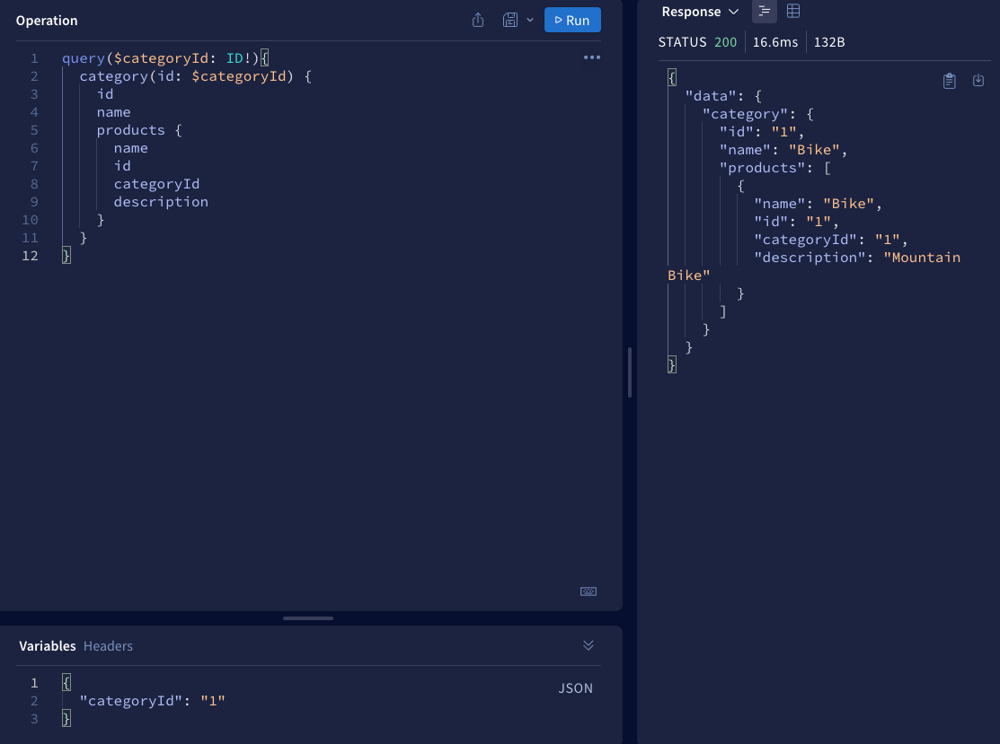
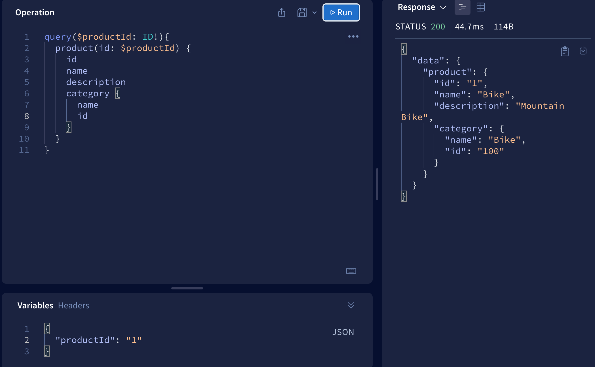
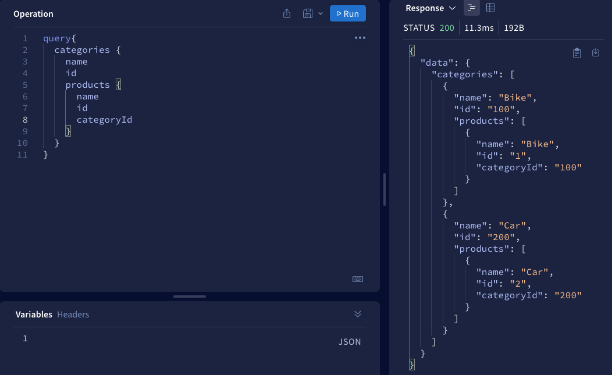
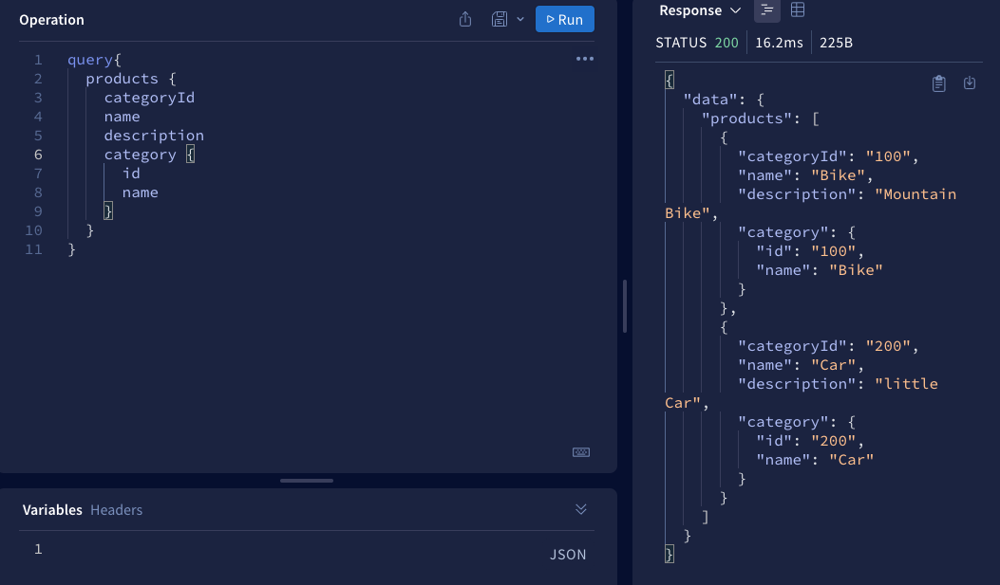

# GraphQL

## Apollo-server

### hello world 示例

使用 Apollo-server 并安装依赖：

```bash
npm install apollo-server
```

接着在 `index.js`中写入一个`hello world`的示例：

```js
const { ApolloServer, gql } = require('apollo-server');
// 定义 schema
const typeDefs = gql`
  type Query {
    hello: String
  }
`;
// 处理数据
const resolvers = {
  Query: {
    hello: () => {
      return 'world';
    },
  },
};
const server = new ApolloServer({
  typeDefs,
  resolvers,
});

server.listen().then(({ url }) => {
  console.log(`server is ready`);
});
```

在写 graphql 时，我们分成两步：

- 使用`typeDefs`是用来定义`graphql` 的 `schema` 查询语句
- 使用`resolvers`来实现`schema`，将数据返回出去

接着我们可以访问`http://localhost:4000/graphql`，这时候会跳转到`Apollo Server`的`graphql playground`页面，我们可以通过这个页面来测试刚才写的 `hello`有没有效果。

`query`语句在前端对应的查询语句是：

```scheme
query {
  hello
}
```



### 基本类型

在`hello world`示例中，我们定义的 `hello`的返回值是 `String`。

下面是所有的`schema`的基本类型：

- `String` - 字符串
- `Int` - 数字
- `Float` - 浮点数
- `Boolean` - 布尔值
- `ID` - 约定唯一的字符串

其中 ID 表示一个不会重复的值，项目中我们可以使用`uuid`来生成。

下面是返回所有基本类型的示例：

```js
var { v4: uuidv4 } = require('uuid');

const typeDefs = gql`
  type Query {
    userID: ID
    hello: String
    numberOfAnimals: Int
    price: Float
    isCool: Boolean
  }
`;
// 获取数据
const resolvers = {
  Query: {
    userID: () => uuidv4(),
    hello: () => {
      return 'world';
    },
    numberOfAnimals: () => {
      return 100;
    },
    price: () => {
      return 3.1415926;
    },
    isCool: () => false,
  },
};
```

### 非空声明

默认情况下，每个类型都是可以为空的——这表示所有标量类型都可以返回 null。

如果不想为空则可以用一个感叹号表示一个类型不可为空，例如：`String!`表示非空字符串。

### 列表类型

如果是列表类型，使用方括号将对应类型包起来，如 `[String]` 就表示一个字符串列表。

```js
const typeDefs = gql`
  type Query {
    friends: [String!]
  }
`;
```

上面的例子表示`friends`可以是 `null`或者是数组项不为`null`的数组。

### 对象类型

如果我们想要回传的数据是对象类型，那么我们需要在`gql`中声明对象类型

```scheme
const typeDefs = gql`
  type Query {
    products: [Product!]!
  }

  type Product {
  	id:ID!
    name: String!
    description: String!
    quantity: Int!
    price: Float!
    onSale: Boolean!
  }
`
```

上面示例中`Product`就是对象类型。当`query`查询`products`时，会返回一个不为`null`的数组，数组项是`Product`类型且不能为`null`。

下面是我们定义的`Product`类型的 `resolvers`实现：

```js
const database = {
  products: [
    {
      id: '1',
      name: 'Bike',
      description: 'Mountain Bike',
      quantity: 20,
      price: 999.99,
      onSale: false,
    },
    {
      id: '2',
      name: 'Car',
      description: 'little Car',
      quantity: 10,
      price: 99999.99,
      onSale: true,
    },
  ],
};

const resolvers = {
  Query: {
    products: () => {
      return database.products;
    },
  },
};
```

使用`graphql playground`的查询也非常简单：



需要什么就在 `query` 语句中输入什么即可返回想要的数据。

### 传递参数

上面的例子中，我们已经能够将所有`products`查询出来了，但是如果我想要某一款`product`数据怎么办呢？

我们需要传递参数给服务端，让服务端根据这个参数来查询出对应的数据，开发中经常使用的参数就是 `id`。

我们首先定义`typeDefs`:

```js
const typeDefs = gql`
  type Query {
    products: [Product!]!
    product(id: ID!): Product
  }

  type Product {
    id: ID!
    name: String!
    description: String!
    quantity: Int!
    price: Float!
    onSale: Boolean!
  }
```

上面的`product(id: ID!): Product`表示我们需要根据`id`来查询出某一款`Product`类型的数据，有可能会为`null`，所以我们不加`!`。

此时我们需要在`resolvers`中将实现`schema`，将数据返回出去。

这种情况下当`graphql`调用我们`resolver`函数时，会给我们传递三个值：

- **parent**
- **args** - 表示查询时传递过来的参数
- **context**

那么我们就可以通过`args`获取到前端传递过来的查询参数，所以对应的`resolvers`实现是这样的：

```js
const resolvers = {
  Query: {
    products: () => {
      return database.products;
    },
    product: (parent, args, context) => {
      console.log(args); // args就是前端传递过来的参数
      const productId = args.id;
      return database.products.find(product => product.id === productId);
    },
  },
};
```

在`playground`中测试时，我们一般会通过`Variables`的方式进行传递



`$productId`是表示一个变量标识，在前端使用`productId`查询，`graphql`会将它传递给`schema`中定义的`id`。

### 一对多连接

现在我们已经可以查询所有`products`以及根据`id`查询具体哪个`product`了。

整个过程有点类似单表查询，但实际开发中还有多表查询。

比如，现在还有一个品类的数据，会对`product`进行分类，数据是这样的：

```js
const database = {
  products: [
    {
      id: '1',
      name: 'Bike',
      description: 'Mountain Bike',
      quantity: 20,
      price: 999.99,
      onSale: false,
      categoryId: '1',
    },
    {
      id: '2',
      name: 'Car',
      description: 'little Car',
      quantity: 10,
      price: 999.99,
      onSale: true,
      categoryId: '2',
    },
  ],
  categories: [
    { id: '1', name: 'Bike' },
    { id: '2', name: 'Car' },
  ],
};
```

现在，我们的`product`多了一个属性`categoryId`是对应`categories`中`id`,表示这个产品是属于这个品类下的，他们之间用`categoryId`表示关系。

接下来更新一下的`type`

```diff
const typeDefs = gql`
  type Query {
    products: [Product!]!
    product(id: ID!): Product
+   categories: [Category!]!
+ 	category(id: ID!): Category
  }
+ type Category {
+   name: String!
+   id: ID!
+ }
  type Product {
    id: ID!
    name: String!
    description: String!
    quantity: Int!
    price: Float!
    onSale: Boolean!
+   categoryId: ID!
  }
`
```

以及`resolvers`:

```diff
const resolvers = {
  Query: {
    products: () => {
      return database.products
    },
    product: (parent, args, context) => {
      console.log(parent)
      console.log(args)
      const productId = args.id
      console.log(context)
      return database.products.find(product => product.id === productId)
    },
+    categories: () => {
+     return database.categories
+    },
+    category: (parent, args, context) => {
+      const { id } = args
+      return database.categories.find(category => category.id === id)
+    },
  },
}
```

目前我们的功能是能够根据 `id` 查到是哪个`category`以及`categories`数据了。

但是还没有实现根据`category`来查询出对应的`product`

倒推一下前端传递的写法，应该是这样的：

```scheme
query($categoryId: ID!){
  category(id: $categoryId) {
    id
    name
    products {
      name
      id
      categoryId
      description
    }
  }
}
```

我们应该通过 `categoryId` 查具体哪一个`category`,然后再使用`categoryId`对`products`进行筛选。

为了实现这一目标，需要更新一下`Category`的 `type`:

```diff
  type Category {
    name: String!
    id: ID!
+   products: [Product!]!
  }
```

其次，必须在`resolvers`中再声明一个与`Query`同级的`Category`

```js
const resolvers = {
  Query: {...
  },
  Category: {
    products: (parent, args, context) => {
      const { id } = parent
      return database.products.filter(product => product.id === id)
    },
  },
}
```

这里的 `parent`中取出来的`id`就是通过前端传递的`categoryId`查询到的`category`的`id`。

- `parent`表示父级拿到的数据。

- `args`表示本级传递过来的参数

现在我们已经能够实现根据`category`查询对应的`product`了。



通过 `product` 查询对应的 `category`也是同样的思路，我们首选需要更新`Product`类型：

```diff
  type Product {
    id: ID!
    name: String!
    description: String!
    quantity: Int!
    price: Float!
    onSale: Boolean!
    categoryId: ID!
+   category: Category!
  }
```

接着更新`resolvers`:

```js
  // 与 Query是同级的
  Product: {
    category: (parent, args, context) => {
      const { categoryId } = parent
      return database.categories.find(category => category.id === categoryId)
    },
  },
```

通过 `parent` 属性我们能够取到查询到的的`product`的数据。然后从里面拿出`categoryId`,最后找到对应的`category`数据。

以下是前端查询：



### 多对多连接

我们已经完成了从`product`查询`categray`以及从`categray`查询到对应的`product`了。

接下去就可以实现查询`products`时让每个`product`都能显示`categray`,以及查询`categories`时让每个`category`都能查到对应的`products`。

即多对多的连接。

事实上，由于我们已经完成了`product`到`category`以及`category`到`product`的逻辑，此时`graphql`已经帮我们做好了多对多的连接了，以下是查询示例：

**查询`categories`时找出所有对应的`products`**



**查询`products`时找出所有对应的`category`**


