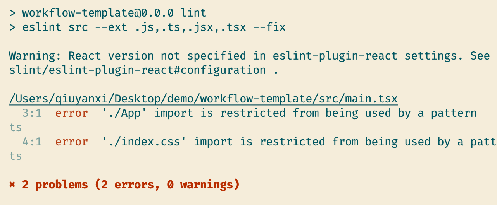

# ESLint 前端工作流

## 前置工作

**涉及到的 npm 模块**

1. eslint —— 用来检查代码规范性
2. prettier —— 用来格式化代码
3. stylelint —— 用来检查 css
4. husky —— git 的钩子，在 git 的 hook 中执行一些命令
5. lint-staged —— 对 git 暂存的文件进行 lint 检查

**前置工作**

1. 手动安装三个 vscode 插件：

   - ESLint —— 配合编辑器检查，有报错提醒功能

   - StyleLint —— 配合编辑器格式化 css

   - Prettier - Code formatter —— 配合编辑器格式化代码

2. 用 `vite` 起一个支持 `TS` 的`React`项目模板

```bash
npm create vite@latest workflow-template --template react-ts
npm install
```

## 配置 eslint

安装 eslint 依赖：

```bash
npm install eslint --save-dev
eslint --init
```

我们的思路是用 `eslint` 帮助我们检查语法，找到不符合规范的代码。所以这里选择第二个选项：


其他选择根据实际情况一路选择下去即可。

然后会自动生成`.eslintrc`的文件，我这里选择的是`json`方式，生成的 JSON 内容是这样的：

```js
{
    "env": {
        "browser": true,
        "es2021": true
    },
    "extends": [
        "eslint:recommended",
        "plugin:react/recommended",
        "plugin:@typescript-eslint/recommended"
    ],
    "parser": "@typescript-eslint/parser",
    "parserOptions": {
        "ecmaFeatures": {
            "jsx": true
        },
        "ecmaVersion": 12,
        "sourceType": "module"
    },
    "plugins": [
        "react",
        "@typescript-eslint"
    ],
    "rules": {
    }
}
```

**配置 eslint 规则**

1. react-in-jsx-scope

   ```json
     "rules": {
       "react/react-in-jsx-scope": "off",
     }
   ```

   由于`plugin:react/recommended`会强制提示所有 React 组件都需要引入 React，比如每个`tsx` 文件都需要这样写一遍：

   ```js
   import React from 'react';
   ```

   否则会报错

   

   如果不需要这样的默认规则，则用上面的选项禁用掉。

2. [ no-console](https://cn.eslint.org/docs/rules/no-console)

   ```json
   "no-console": "error"
   ```

   顾名思义就是有 console 就会报错，配合 ESLint 插件能马上得到提示

   

3. [eqeqeq](https://cn.eslint.org/docs/rules/eqeqeq)

   ```json
   "eqeqeq": "error"
   ```

   要求使用 `===` 和 `!==`

4. [no-restricted-imports](https://cn.eslint.org/docs/rules/no-restricted-imports)

   该规则允许你指定你不想使用的 import。

   ```json
       "no-restricted-imports": [
         "error",
         {
           "patterns": ["./*", "../*"]
         }
       ]
   ```

   比如上面的配置方式是不想用相对路径来引入，那写相对路径就会报错

   

5. [unused-imports/no-unused-imports](https://www.npmjs.com/package/eslint-plugin-unused-imports)

   这个规则是用来对`import`了但没有使用的依赖进行报错的。

   该规则需要额外安装插件[eslint-plugin-unused-imports](https://www.npmjs.com/package/eslint-plugin-unused-imports)

   ```bash
   npm install eslint-plugin-unused-imports --save-dev
   ```

   然后添加到`plugins`中

   ```js
     "plugins": ["react", "@typescript-eslint", "unused-imports"],
   ```

   最后添加规则：

   ```json
       "unused-imports/no-unused-imports": "error"
   ```

6. import/order

   `eslint-plugin-import`这个插件可以用来对 `import` 引入的代码进行排序

   ```bash
   npm install --save-dev eslint-plugin-import
   ```

   ```json
     "plugins": [
       "import",
     ],
   ```

   ```json
       "import/order": [
         "error",
         {
           "alphabetize": {
             "order": "asc"
           }
         }
       ]
   ```

7. 其他规则

   已经有很多默认规则是被`eslint:recommended`这个扩展内置了的，详情看[eslint 中文官网](https://cn.eslint.org/docs/rules/)，内置的规则都已经被标记 ✅。

   剩下缺少什么自己添加即可。

**在 Package.json 中添加 lint 命令：**

```
  "scripts": {
    "lint": "eslint src --ext .js,.ts,.jsx,.tsx --fix",
  },
```

- `eslint src`指定检查当前项目中 `src` 目录下的文件
- \*`--ext`为指定 lint 哪些后缀的文件
- `--fix`开启自动修复

执行`npm run lint`即可检查代码



如果在 vscode 有下载 ESLint 这个插件，那么不需要执行命令，编辑器也能够报告错误


同时，需要在 Code > Preferences > Settings 中加入以下配置


```json
{
  // ...
  "eslint.format.enable": true,
  "editor.codeActionsOnSave": {
    "source.fixAll.eslint": true
  }
}
```

第一个是允许用 eslint 的格式化，下一个是保存时会自动修复错误代码（比如`import { xxx }` 后没用到的 xxx 引入会被删除）

## 配置 prettier

```bash
npm install --save-dev eslint-config-prettier
npm install --save-dev eslint-plugin-prettier
npm install --save-dev --save-exact prettier
```

在`.eslintrc.json`中加入以下内容：

```js
{
  "plugins": ["prettier"],
  "extends": ["plugin:prettier/recommended"],
  "rules": {
    "prettier/prettier": "error"
  }
}
```

需要解释一下的是`eslint`与`prettier`会有格式化的差异，所以需要额外加上`eslint-config-prettier`来禁用所有与格式化相关的 ESLint 规则。

这一点在[eslint-plugin-prettier](https://github.com/prettier/eslint-plugin-prettier)的 [README](https://github.com/prettier/eslint-plugin-prettier#recommended-configuration) 上有提到。

接着，创建一个空的`.prettierrc.json`文件，根据要求写上格式化样式的配置,举例一下：

```json
{
  "trailingComma": "all",
  "bracketSpacing": true,
  "arrowParens": "always",
  "printWidth": 120,
  "singleQuote": true,
  "semi": false
}
```

除此之外，还可以把这个配置写到`.eslintrc`的`rules`中：

```json
  "rules": {
  	"prettier/prettier": [
   	 "error",
   	 {
    	  "singleQuote": true,
    	  ...
   	 }
  	]
	}
```

> 这个规则将合并和覆盖配置的.pretierrc 文件，建议单独创建.pretierrc 文件

然后在 Package.json 中添加以下脚本命令：

```json
  "scripts": {
    "format": "prettier --write \"src/**/*.{html,ts,js,json,jsx,tsx}\""
  },
```

这时候执行`npm run format`就能够通过脚本命令格式化 `src` 目录下所有匹配得上扩展名的文件。

> 我们安装的 vscode 插件`Prettier - Code formatter`也会根据`.prettierrc.json`的配置自动格式化。

## 配置 styleLint

`styleLint`可格式化 css 代码，检查 css 语法错误与不合理的写法，指定 css 书写顺序等。

```bash
npm install --save-dev stylelint stylelint-config-standard stylelint-config-prettier postcss-less
```

说明：

- stylelint —— css 的 lint 工具

- stylelint-config-standard —— 官方内置一些标准规则，搭配 extends 使用

- stylelint-config-prettier —— 抹平与 prettier 的格式化冲突问题，搭配 extends 使用
- postcss-less —— 当 lint 非 css 代码时，需要用到额外的 syntax 插件识别，这里以 less 代码为例，其他的插件可以看[官网](https://stylelint.io/developer-guide/syntaxes/)

创建`.stylelintrc.json`文件，内容这样写：

```json
{
  "extends": ["stylelint-config-standard", "stylelint-config-prettier"],
  "customSyntax": "postcss-less"
}
```

现在配合 vscode 的 StyleLint 插件已经能够实现报错提示了：


最后在 Package.json 中添加以下脚本命令：

```json
  "scripts": {
    "lint:style": "stylelint \"**/*.{css,less}\" --fix"
  },
```

其中`--fix`在执行`npm run lint:style`时会将一些不正确的格式自动修复成正确的格式。

顺便在 Code > Preferences > Settings 中加入以下配置

```diff
  "editor.codeActionsOnSave": {
    "source.fixAll.eslint": true,
+   "source.fixAll.stylelint": true
  },
```

这样在 vscode 中保存文件时就可以用 `stylelint` 修复错误的代码。

## 配置 husky

我们需要引入强制的手段来保证提交到`git`仓库的代码是符合我们的要求的。`husky`是一个用来管理`git hook`的工具，`git hook`即在我们使用`git`提交代码的过程中会触发的钩子。

简单来说，我们需要用 husky 安装 `pre-commit`钩子，这样就可以在`git commit`之前运行脚本来检测提交的代码是否规范并且格式化不规范的代码。

安装

```bash
npm install --save-dev husky
```

安装之后还需要执行以下命令安装钩子

```bash
husky install
```

但是拉取我们项目的其他同事可不一定会这样执行一次。这时候我们需要用`npm scripts`的钩子：`prepare`

```json
  "scripts": {
    "prepare": "husky install",
  }
```

为了测试这个钩子，我们现将原来下载过得`node_modules`文件夹删除

```bash
rm -rf node_modules
```

然后重新安装一遍：

```bash
npm i
```

不出意外的话，当所有包都``install`后，会触发`prepare`脚本，这时就会自动执行`husky install`命令啦


执行后我们会得到`.husky`目录

接下来我们就为 git 仓库添加一个`pre-commit`钩子

```bash
npx husky add .husky/pre-commit "npm run format && npm run lint:style && npm run lint"
```

- npx husky —— 运行 husky
- add .husky/pre-commit —— 添加一个 pre-commit 钩子
- npm run format && npm run lint:style && npm run lint —— 先`format` 代码然后用 eslint 检查

这样在我们提交前就会对**全部代码**进行格式化和检查。

通过分析我们发现，commit 前应该只需 lint 暂存区的代码即可。

那么该如何只对 git 暂存区的代码进行 lint 呢？需要用到`lint staged`

## 配置 lint-staged

安装

```bash
npm i --save-dev lint-staged
```

在 package.json 中配置

```diff
  "scripts": {
    "prepare": "husky install",
-    "lint": "eslint src --ext .js,.ts,.jsx,.tsx --fix",
-    "format": "prettier --write \"src/**/*.{html,ts,js,json,jsx,tsx}\"",
-    "lint:style": "stylelint \"**/*.{css,less}\" --fix",
+    "lint": "eslint --fix",
+    "format": "prettier --write",
+    "lint:style": "stylelint --fix"
+  },
+  "lint-staged": {
+    "*.{css,less}": [
+      "npm run lint:style"
+    ],
+    "*.{html,ts,js,json,jsx,tsx}": [
+      "npm run format"
+    ],
+    "*.{js,ts,jsx,tsx}": [
+      "npm run lint"
+    ]
  },

```

## 总结

1. 通过 eslint 完成对规则的限制

2. 通过 prettier 完成对格式化定义，以及使用`eslint-config-prettier`抹平与 eslint 自带格式化的冲突问题

3. 通过 stylelint 完成对 css 的检查和格式化，以及使用`stylelint-config-prettier`抹平与 prettier 格式化的冲突问题

4. 通过 husky 添加 pre-commit 钩子，这里还用的 scripts 的一个钩子 —— prepare 用来执行 husky install

5. 通过 lint-staged 完成只对暂存区代码的校验和格式化工作

6. 搭配 VSCode 的插件`StyleLint`和`ESLint`以及`Prettier - Code formatter`使用加强提示和自动格式化功能

7. setting.json 中添加三条允许自动 fix 的属性：

   ```json
   {
     // ...
     "eslint.format.enable": true,
     "editor.codeActionsOnSave": {
       "source.fixAll.eslint": true,
       "source.fixAll.stylelint": true
     }
   }
   ```

## 最终配置

**.eslintrc.json**

```json
{
  "env": {
    "browser": true,
    "es2021": true,
    "node": true
  },
  "extends": [
    "eslint:recommended",
    "plugin:react/recommended",
    "plugin:@typescript-eslint/recommended",
    "plugin:prettier/recommended"
  ],
  "parser": "@typescript-eslint/parser",
  "parserOptions": {
    "ecmaFeatures": {
      "jsx": true
    },
    "ecmaVersion": 12,
    "sourceType": "module"
  },
  "plugins": [
    "react",
    "@typescript-eslint",
    "prettier",
    "unused-imports",
    "import"
  ],
  "rules": {
    "react/react-in-jsx-scope": "off",
    "no-console": "error",
    "eqeqeq": "error",
    "unused-imports/no-unused-imports": "error",
    "no-restricted-imports": [
      "error",
      {
        "patterns": ["./*", "../*"]
      }
    ],
    "import/order": [
      "error",
      {
        "alphabetize": {
          "order": "asc"
        }
      }
    ],
    "prettier/prettier": "error"
  }
}
```

**.prettierrc.json**

```json
{
  "trailingComma": "all",
  "bracketSpacing": true,
  "arrowParens": "always",
  "printWidth": 120,
  "singleQuote": true,
  "semi": false
}
```

**.stylelintrc.json**

```json
{
  "extends": ["stylelint-config-standard", "stylelint-config-prettier"],
  "customSyntax": "postcss-less"
}
```

**package.json**

```json
  "scripts": {
    "prepare": "husky install",
    "lint": "eslint --fix",
    "format": "prettier --write",
    "lint:style": "stylelint --fix"
  },
  "lint-staged": {
    "*.{css,less}": [
      "npm run lint:style"
    ],
    "*.{html,ts,js,json,jsx,tsx}": [
      "npm run format"
    ],
    "*.{js,ts,jsx,tsx}": [
      "npm run lint"
    ]
  }
```
