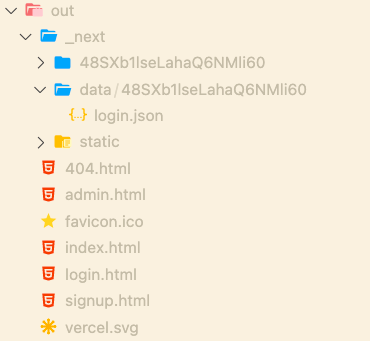

# 性能优化

## 前言

性能优化的最终目标是提高用户体验。

当用户将 url 输入浏览器后，会发生以下过程：

1. DNS 解析，通过域名查找服务器 IP
2. 建立 TCP 连接
3. HTTP 请求
4. 服务器将结果返回给浏览器
5. 浏览器解析返回的结果并渲染页面

性能优化就是尽可能提高这几个过程的效率，让用户更快、更爽地与客户端进行交互。

比如说：

- 建立 HTTP 请求是非常消耗网络资源和服务器资源的行为，我们可以减少请求次数和减少请求花费的时间
- 静态资源从服务器返回给客户端同样消耗带宽和服务器，我们可以利用 CDN 和 HTTP 缓存加快请求静态资源的速度
- 浏览器的回流非常消耗性能，我们可以在代码上优化 DOM，比如 React 使用 useMemo 和 useCallback 等钩子来减少非必要的组件更新
- 用节流和防抖来延缓用户频繁操作带来的副作用
- 浏览器一次性需要渲染的内容太多，可能导致白屏，用户等待焦灼，可以放一个骨架屏延缓用户焦虑
- 渲染长列表时，可能因为数据量太大导致浏览器卡顿，我们可以利用分时函数（timeChunk）来慢慢渲染页面或者将数据缓存、分页
- Lazy-load 实现图片懒加载等
- ...

总的来说，前端性能优化就是从网络、资源消耗、浏览器渲染这三个维度入手，对每个过程进行优化。

## 1.选择合适的图片格式

优化图片的体积对于网页的效果是显著的，前端开发者需要根据实际情况对不同的图片合理取舍。

以下是不同图片格式的特点：

- **JPG/JPEG**

  特点是有损压缩，体积小，加载快。适合用于大图，比如 Banner 图、背景图等。

- **PNG-8 与 PNG-24**

  PNG 格式是无损压缩的高保真图片格式，比 JPG 有更多的色彩表现力，缺点是体积太大。适合 LOGO 图、一些小图。

- **SVG**

  SVG 是一种矢量图，是基于 XML 语法的图像格式，优点是图片可无限放大不失真，即使放到视网膜屏幕上也能够保持较高的品质，而且 SVG 可被编程，灵活性高。缺点是浏览器渲染成本高。适合用于做图标。

- **Base64**

  Base64 是文本文件，把图片解码成 Base64 字符串直接写入 img 标签中，是可以被浏览器解析成图片的，这样做的好处是不需要再去发送 HTTP 请求即可显示图片，节省了传统的浏览器单独向服务器请求图片资源的 HTTP 开销。但是过大的图片转成 Base64 会给浏览器的解析带来困扰，所以推荐用来放 20kb 以内，体积小，更新频率低的图片。

### 通过 webpack 自动将图片转成 Base64

webpack 有个 asset 模块，支持将图片在打包时直接打包成 Base64 格式，我们需要这样配置：

**webpack.config.js**

```javascript
  module: {
    rules: [
    ...
      {
        test: /\.(png|jpe?g|gif|svg)$/i,
        type: 'asset',
        generator: {
          filename: 'assets/[name].[hash:6][ext]', //输出规则
        },
        parser: {
          dataUrlCondition: {
            maxSize: 20 * 1024, // 小于20kb则解析成dataUrl
          },
        },
      },
    ],
  }
```

上面的配置意思是将 20kb 以内的 png/jpg/jpeg/svg 等打包成 Base64，其他的情况依然打包成原来的格式。

### WebP 图片格式

webP 是 google 提出来专门为 Web 开发的**旨在加快图片加载速度**的图片格式，它支持有损压缩和无损压缩。

它集多种图片文件格式的优点于一身，官方介绍是这样的：

> 与 PNG 相比，WebP 无损图像的尺寸缩小了 26％。在等效的 SSIM 质量指数下，WebP 有损图像比同类 JPEG 图像小 25-34％。

在现有页面 1MB 大小的情况下，如果图片占一半，那 WebP 就可以节省 20%-30%的字节，对每个页面就是几百 KB。

这种图片格式太新，对用户的浏览器来说太新颖的东西兼容性就差。

但目前淘宝依然有很多这种格式图片的应用，以下是淘宝中的某一个图片的链接：

```html

```

它在.webp 前面，额外跟了一个.jpg 后缀。

然后用 js 判断浏览器能不能支持 webP ，如果不能就使用 JavaScript 切割字符串，将 webP 转化为 jpg 格式。

### 转换为 webP 图片

可以手动，也可以加入构建自动化生成。

- 手动，可以使用**webP-converter**、智图等工具，但建议使用官方 `webP-converter`，除了便捷性，同质量下体积各方面均优于智图。

```
./cwebp -q 75 login_plane_2.png -o login_plane_2.webp
复制代码
```

- 自动化生成，可以使用 `image-min-webp` 或其他 `webpack` 插件

### 建议兼容方案

比起淘宝的方案，这里有种更简单的方法

- HTML 中使用，`<picture>`标签兼容

  ```html
  <picture>
    <source srcset="hehe.webp" type="image/webp" />
    
  </picture>
  ```

  如果浏览器支持 `image/webp` 类型的图片，则加载 `<source>` 元素中 `srcset` 属性指向的资源，如果不支持则跳过 `<source>` 元素，加载 `` 元素

* CSS 中使用，需要配合 JS 做判断

  ```javascript
  // main.js
  window.addEventListener('DOMContentLoaded', () => {
      const isSupportWebP = document.createElement('canvas')
      .toDataURL('image/webp')
      .indexOf('data:image/webp') === 0
      document.documentElement.classList.add(isSupportWebP ? '' : '.no-support-webp');
  })
  // css
  .support-webp .bg{
      background-image: url("hehe.webp");
  }

  .no-support-webp .bg {
      background-image: url("hehe.png");
  }
  ```

  本质上就是写一个 `className` ，然后通过判断是否支持 webP 来给 HTML 标签加`className`以触发不同的图片格式。

## 2.利用 HTTP 缓存机制

浏览器缓存机制有四个方面，按照资源请求时的优先级是这样排列的：

1. Memory Cache
2. Service Worker Cache
3. HTTP Cache
4. Push Cache

我们可以通过 NetWork 看到资源来自什么缓存。


前端的重点优化策略是 HTTP Cache ，详情可以看[【HTTP 缓存控制】](https://github.com/18888628835/Blog/blob/main/HTTP/HTTP缓存控制.md)

## 3.Gzip 资源

所有文本资源都应该使用 Gzip 压缩，然后再在客户端与服务器间传输。一般来说，Gzip 可以减少 60%～ 80%的文件大小，也是一个相对简单（只要在服务器上配置一个选项），但优化效果较好的举措。

1. 首先浏览器端会发送一个请求头表示支持`Gzip`

```http
Accept-Encoding: gzip, deflate, br
```

2. 然后服务端需要开启 `gzip`,比如 `nginx`就只需要加几个配置项就行

```nginx
#  gzip 可以在 http, server, location 中和配置，这里配置到 http 下是全局配置，
#  只要是使用当前 nginx 服务器的站点都会开启 gzip
http {
  gzip on;
  gzip_comp_level 5;
  gzip_min_length 1k;
  gzip_buffers 4 16k;
  gzip_proxied any;
  gzip_vary on;
  gzip_types
    application/javascript
    application/x-javascript
    text/javascript
    text/css
    text/xml
    application/xhtml+xml
    application/xml
    application/atom+xml
    application/rdf+xml
    application/rss+xml
    application/geo+json
    application/json
    application/ld+json
    application/manifest+json
    application/x-web-app-manifest+json
    image/svg+xml
    text/x-cross-domain-policy;
  gzip_static on;
  gzip_disable "MSIE [1-6]\.";
}
```

- **gzip on;**：开启 gzip，Default: off
- **gzip_comp_level 5;**：压缩级别： 1-9。5 是推荐的压缩级别，Default: 1
- **gzip_min_length 1k;**：gzip 压缩文件体积的最小值。如果文件已经足够小了，就不需要压缩了，因为即便压缩了，效果也不明显，而且会占用 CPU 资源。Default: 20
- **gzip_buffers 4 16k;**：设置用于压缩响应的 number 和 size 的缓冲区。默认情况下，缓冲区大小等于一个内存页。根据平台的不同，它也可以是 4K 或 8K。
- **gzip_proxied any;**：是否开启对代理资源的压缩。很多时候，nginx 会作为反向代理服务器，实际的静态资源在上有服务器上，只有开启了 gzip_proxied 才会对代理的资源进行压缩。Default: off
- **gzip_vary on;**：每当客户端的 Accept-Encoding-capabilities 头发生变化时，告诉代理缓存 gzip 和常规版本的资源。避免了不支持 gzip 的客户端（这在今天极为罕见）在代理给它们 gzip 版本时显示乱码的问题。如果指令 gzip， gzip_static 或 gunzip 处于活动状态， 则启用或禁用插入“ Vary：Accept-Encoding”响应标头字段。Default: off
- **gzip_types**：压缩文件的 MIME 类型。`text/html` 默认就会开启 gzip 压缩，所以不用特别显示配置 `text/html` 的 MIME 类型。Default: text/html
- **gzip_static on;**：服务器开启对静态文件（ CSS, JS, HTML, SVG, ICS, and JSON）的压缩。但是，要使此部分与之相关，需要在 gzip_types 设置 MIME 类型，，仅仅设置 gzip_static 为 on 是不会自动压缩静态文件的。
- **gzip_disable “MSIE [1-6]\.”;**：IE6 以下的浏览器禁用 gzip 压缩。

3. 配置成功后服务器会在响应头上返回对应的内容：
   - **content-type: text/html; charset=utf-8：**表示返回的数据的 MIME 类型是 text/html；
   - **content-encoding: gzip：**当服务器压缩内容时，它会用`content-encoding`头进行响应，后面接的 gzip 表示服务器对该文件采用了 gzip 压缩编码
   - **vary: Accept-Encoding：**（配置说明中提到的）当客户端的 `Accept-Encoding-capabilities` 头发生变化时，告诉代理缓存 gzip 和常规版本的资源。(出现这个就意味着 nginx 配置的`gzip_vary`生效)
4. 浏览器得到`content-encoding: gzip` 响应头后，会对采用 gzip 编码的实体内容进行解码。

整个过程中客户端跟服务端就是通过 `HTTP headers`进行`body`数据的内容协商。

对于这个过程详细点可以查看：[Body 数据的内容协商 ](https://github.com/18888628835/Blog/issues/33)

## 4.使用 CDN 缓存静态资源

CDN 全称是内容分发网络 Content Delivery Network，它是浏览器和服务器之间的内容架设，它应用了 HTTP 协议中的缓存和代理技术，能够代理源站响应客户端的请求。

使用 CDN 的一个好处是能够加快静态资源被本地浏览器读取的速度，即提高服务器响应速度的能力。

它可以缓存源站数据，让浏览器不用再千里迢迢到达源站服务器，而是在半路直接获取响应。如果 cdn 的调度算法优秀，那么就可以找到距离用户更近的节点，大幅度缩短响应时间。

举个例子，假设我的服务器是在北京，用户在杭州，那么用户打开网站向北京的服务器发送请求，这个响应速度一定没有我直接将服务器放在杭州快。

CDN 就可以充当放在杭州的服务器，它向北京的服务器拷贝资源，杭州的用户访问时，直接访问杭州的 CDN 缓存资源，使得响应速度大大提升。如果用户的资源在 CDN 上没有，CDN 会向北京的服务器索要这个资源。

CDN 的核心点有两个，一个是**缓存**，一个是**回源**。

缓存就是拷贝资源，回源就是当没有这个资源时，向根服务器要资源的过程。

### CDN 的实际应用

CDN 往往被用来存放静态资源。

静态资源就是 CSS、图片等一些不需要经过服务器计算的资源。

与静态资源对应的是动态资源，动态资源往往需要经过业务服务器对用户的权限验证，再决定呈现给用户怎样的内容，换句话说是后端生成的。比较常见的动态资源是 JSP、服务端渲染的页面。

参考淘宝网，它的大量图片都被存到 CDN 服务器中，以下是淘宝 WEB 端请求 CDN 获取的一张图片

```javascript
https://img.alicdn.com/imgextra/i2/O1CN010DBuyg1LkqcCrN3MF_!!6000000001338-2-tps-630-400.png
```

目前市面上大部分云服务器厂商都会提供 CDN 服务，并且拥有自动回源功能，只需要用户将服务器地址配置到购买的 CDN 服务器上，如果 CDN 服务器上没有缓存，就会先去用户的服务器上拉取图片，再对外输出；如果命中缓存，则直接对外输出。 这样对于经常访问的图片，理论上只会有 CDN 服务器拉取一次，用户的请求流量都打到 CDN 上。

## 5.服务端渲染 SSR

服务端渲染是一个相对的概念，它的对立面是“客户端渲染”。

### 客户端渲染 CSR

客户端渲染模式下，服务端会把渲染需要的静态文件发送给客户端，客户端加载过来之后，自己在浏览器里跑一遍 JS，根据 JS 的运行结果，生成相应的 DOM。这种特性使得客户端渲染的 HTML 源代码总是特别简洁，往往是这样：

```html
<!DOCTYPE html>
<html>
  <head>
    <title>我是客户端渲染的页面</title>
  </head>
  <body>
    <div id="root"></div>
    <script src="bundle.js"></script>
  </body>
</html>
```

我们常见的 Vue、React 等的框架代码就是被打包在`bundle.js` 中，当浏览器将加载过来的 `bundle.js`跑一遍后，才将 root 节点内的 DOM 给创造出来。

### 服务端渲染

服务端渲染的模式下，当用户第一次请求页面时，由服务器把需要的组件或页面渲染成 HTML 字符串，然后把它返回给客户端。客户端拿到手的，是可以直接渲染然后呈现给用户的 HTML 内容，不需要为了生成 DOM 内容自己再去跑一遍 JS 代码。

使用服务端渲染的网站，可以说是“所见即所得”，**页面上呈现的内容，我们在 html 源文件里也能找到**。

知乎就是采用 SSR 渲染的，我们打开知乎的首页可以看到它的内容跟服务器传送过来的是一致的。


### React 简单实现服务端渲染

以下简单介绍如何使用 React 做服务端渲染，首先我们需要准备好要渲染的组件，它可能是这样的：

**VDom.jsx**

```jsx
import React from 'react';

const VDom = () => {
  return <div>我是一个被渲染为真实DOM的虚拟DOM</div>;
};

export default VDom;
```

在服务端的入口处，引入这个组件，然后使用 React 提供的 SSR 方法生成 DOMString。

```javascript
import express from 'express';
import React from 'react';
import { renderToString } from 'react-dom/server';
import VDom from './VDom';

// 创建一个express应用
const app = express();
// renderToString 是把虚拟DOM转化为真实DOM的关键方法
const RDom = renderToString(<VDom />);
// 编写HTML模板，插入转化后的真实DOM内容
const Page = `
            <html>
              <head>
                <title>test</title>
              </head>
              <body>
                <span>服务端渲染出了真实DOM:  </span>
                ${RDom}
              </body>
            </html>
            `;
// 配置HTML内容对应的路由
app.get('/index', function(req, res) {
  res.send(Page);
});

// 配置端口号
const server = app.listen(8000);
```

此时，访问 `localhost:8000/index`路由就可以拿到服务端渲染的内容了。


整体的流程只需要三步：

- 让 React 代码在 Node 环境下跑一遍，生成虚拟 DOM
- 调用 renderToString() 方法将结果转化成真实 DOM
- 最后将 DOM 塞进 HTML 模板中返回给浏览器

### 服务端渲染解决的问题

1.  SEO

在 SEO 方面，服务端渲染要优于客户端渲染。

采用客户端渲染有个缺点，需要跑完 JS 脚本才能将所有内容呈现出来，搜索引擎爬虫只能够爬取 HTML 源代码，并不会跑 JS 脚本，这就使得客户端渲染出来的网站内容不能被搜索引擎给收集到。

服务端渲染是直接生成 HTML 源代码，这些现成的内容方便搜索引擎收集，我们的网站也就能够更快地被用户定位到。

2. 首屏加载

   在客户端渲染模式下，浏览器除了加载基本的 HTML，还要将打包过的 JS 文件执行一遍才能最终将页面渲染出来。在 JS 文件执行的这段时间，用户一直处于等待的状态。

   相比之下，服务端渲染就直接将结果呈现给用户，中间环节已经被服务器给做掉了，这样就提高了首屏加载的速度。

### 服务端渲染的缺陷

服务端渲染本质上就是将浏览器做的事，搬到性能更强的服务器上做了。

通过这样的方式的确可以加快资源呈现的速度，但对服务器的性能开销要求也是极大的。

所以服务端渲染一般是用于对网页加载速度要求极高或者对 SEO 有极高需求的网站。

## 6.静态站点生成 SSG

SSG 全称是 Static Site Generation ，翻译过来是静态站点生成。在资源构建阶段就直接把结果页面输出`HTML`文件到磁盘，每次访问直接把 html 返回给客户端。

### SSG 跟 SSR 的差别

SSG 跟 SSR 很像，都属于`pre-rendering`的一种，也就是说当客户端请求资源时，资源已经在服务器上准备好了，直接将资源返回给客户端就能够直接看到数据了，这就叫预渲染。

差别在于，SSG 是预先将静态页面打包为`html`文件，而`SSR`则需要服务器实时跑代码生成`html`文件，对于服务器来说，SSG 的压力小很多，而且更适合数据变化不频繁的场景。

SSG 是介于 CSR 与 SSR 之间的一种技术，它没有 SSR 那么吃服务器性能，也不需要像 CSR 这样需要获取到 `JS`后通过跑`JS`代码来生成页面，而且 SEO 友好。

要实现 SSG 并不是很容易，需要考虑到很多因素。

比如，假设我有一段数据，只有在服务端拿到了这些数据，我才能渲染页面。

### Next 框架

Next 框架是集 SSG 和 SSR 、CSR 为一体的 React 框架，直接使用时，会将资源打包成多个`html`页面，默认开启 SSG 。

如果仅仅是将资源打包成多个页面，那么开发者只使用`webpack`也可以做到，这并不是`nextjs`独有的。

Nextjs 开发者考虑了诸多 SSR、SSG 的场景，并且给了非常友好的解决方案。

比如，在 Nextjs 中，使用`getStaticProps`函数，会在打包时执行这里的代码，然后将数据预先打包到`data`目录下，当用户请求时，这些数据实际上已经在静态资源里面生成了，然后将数据和`html`文件一起发送给客户，这样就解决了先拿数据后渲染页面的问题。

举个例子，以下代码是在 `page/login.tsx`中定义一个`getStaticProps`的代码。

```js
export async function getStaticProps() {
  const allPostsData = ['123'];
  return {
    props: {
      allPostsData,
    },
  };
}
```

`build`后，会将所有页面都打包出来，并且额外生成一个`data`目录，里面存放着对应页面数据的`json`文件。



```js
// login.json
{"pageProps":{"allPostsData":["123"]},"__N_SSG":true}
```

用户请求后，就将这个 JSON 文件以及`login.html`一起发送出去，数据和页面就都有了。

### SSG 的限制场景

我们从根源来看，SSG 就是预先将页面打包好，然后存放到服务器里，当用户请求时，直接由服务器将页面数据返回给用户的一种技术。

那么在这种情况下，预渲染的数据就不能非常频繁得变更，最好是跟用户关系不大，且固定的数据。比如某人的博客站点，由于博客文章都是固定的，每个人看到的都一样，那么就可以用 SSG 先将所有页面资源都打包成多个`html`文件，再存放到服务器中，等有人访问时，由服务器将对应的博客页面发送给用户。

而像新浪微博 Top 榜单 这些数据量大且变动频繁的页面，因为数据变化太快，且跟每个用户息息相关，并且还必须保障 SEO，就只能采取 SSR 了。

## 7.避免浏览器解析阻塞

当主线程正在执行 JavaScript 脚本文件时，渲染线程是停止工作的，所以 JavaScript 会影响页面加载首屏的速度。

当页面构建 DOM 和 CSSOM 树时，如果给 JavaScript 脚本添加上 defer 或者 async 属性，就能够有效解决这种问题。

[浏览器加载页面过程](https://github.com/18888628835/Blog/blob/main/浏览器/浏览器渲染过程.md)

[浏览器加载文档和资源](https://github.com/18888628835/Blog/blob/main/浏览器/浏览器加载文档和资源.md)

## 8.减少不必要的 DOM 操作

每次操作 DOM 都是一次性能开销，它意味着需要修改 DOM 树，还有可能触发浏览器的回流和重绘。

如果巧用 DOMFragment 或者数组方式减少 DOM 操作开销，就可以提高浏览器渲染的速度。

[DocumentFragment](https://github.com/18888628835/Blog/blob/main/浏览器/Document.md)

## 9.用宏/微任务异步执行

浏览器采用事件循环来管理同步、异步代码。

简单来说，浏览器就是在内部有两个队列，宏任务队列和微任务队列，其中微任务队列是在宏任务开启后生成的，并非独立于宏任务的队列。

1. 宏任务队列的第一个任务是 script 脚本，
2. 在执行宏任务时会往内部的微任务队列中塞微任务（queueMicrotask、promise.then）等，当微任务队列里的所有任务都执行完，就会触发 UI 线程的 render 行为。
3. 继续往宏任务队列中塞宏任务，比如 setTimeout 或者用户的点击事件、XHR 等，继续第 2 步..
4. 整个过程循环往复进行...

根据这个特点，我们可以将某些费时的任务放在异步完成，这样就能减轻浏览器单线程执行代码的压力，好处是页面执行速度变快了，减少页面卡顿。

[事件循环](https://github.com/18888628835/Blog/blob/main/浏览器/事件循环.md)

## 10.Lazy-Load

两种方式的图片懒加载，

单个图片懒加载：[虚拟代理实现图片预加载](https://github.com/18888628835/Blog/blob/main/JavaScript设计模式/单例模式、策略模式、代理模式、发布订阅模式、命令模式、组合模式.md#63-虚拟代理实现图片预加载)

图片列表实现懒加载：[原生实现图片懒加载](https://github.com/18888628835/Blog/issues/48)

## 11.防抖节流

代码：[手写防抖节流](https://github.com/18888628835/Interview/issues/12)

细节：[手写防抖和节流](https://github.com/18888628835/Blog/issues/42)或[掘金-「查漏补缺」手写节流 throttle 和防抖 debounce](https://juejin.cn/post/6906501329209393159)

## 12.网页性能查看器 Lighthouse

Chrome 浏览器的 LightHouse 模块提供性能报告和性能建议的功能。

打开 Dev tools — Lighthouse — generator 即可生成


出来报告后，直接查看浏览器给的`OPPORTUNITIES`建议，然后一条一条优化即可


