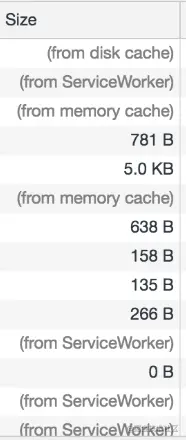
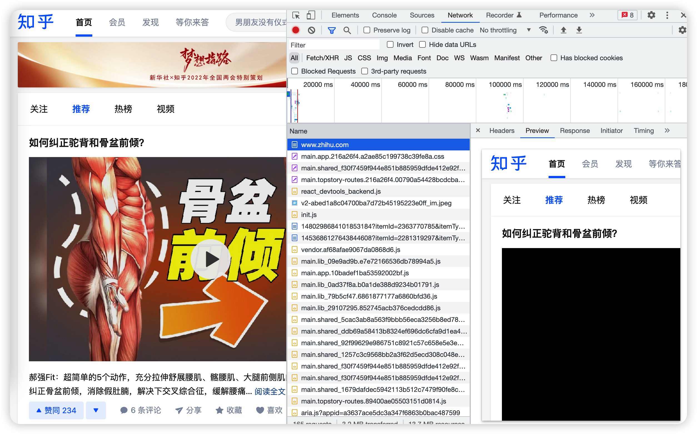
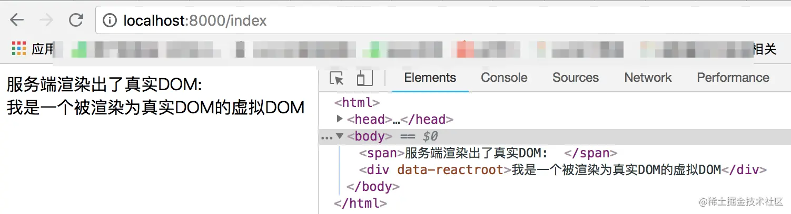
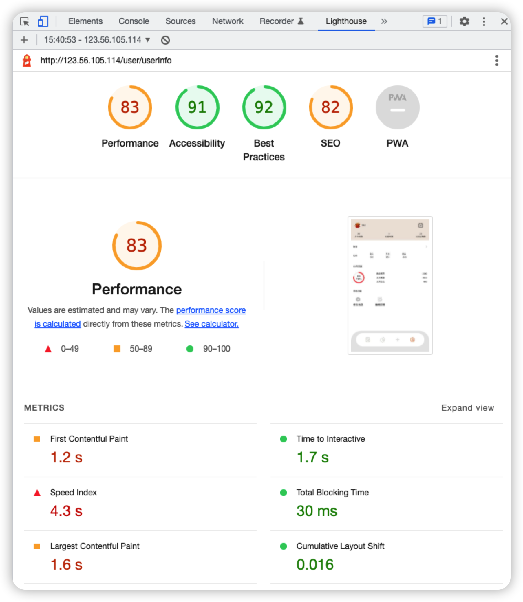
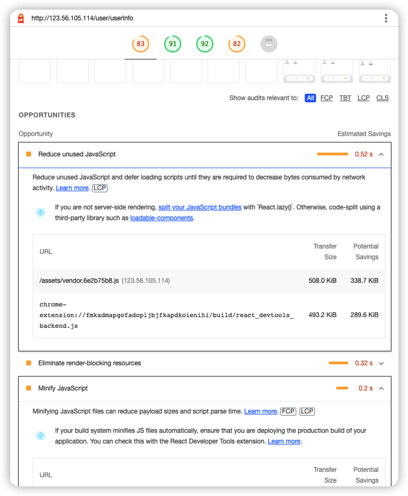

# 其他

## 利用 HTTP 缓存机制

浏览器缓存机制有四个方面，按照资源请求时的优先级是这样排列的：

1. Memory Cache
2. Service Worker Cache
3. HTTP Cache
4. Push Cache

我们可以通过 NetWork 看到资源来自什么缓存。



前端的重点优化策略是 HTTP Cache ，详情可以看[【HTTP 缓存控制】](https://github.com/18888628835/Blog/blob/main/HTTP/HTTP缓存控制.md)

## 使用 CDN 缓存静态资源

CDN 全称是内容分发网络 Content Delivery Network，它是浏览器和服务器之间的内容架设，它应用了 HTTP 协议中的缓存和代理技术，能够代理源站响应客户端的请求。

使用 CDN 的一个好处是能够加快静态资源被本地浏览器读取的速度，即提高服务器响应速度的能力。

它可以缓存源站数据，让浏览器不用再千里迢迢到达源站服务器，而是在半路直接获取响应。如果 cdn 的调度算法优秀，那么就可以找到距离用户更近的节点，大幅度缩短响应时间。

举个例子，假设我的服务器是在北京，用户在杭州，那么用户打开网站向北京的服务器发送请求，这个响应速度一定没有我直接将服务器放在杭州快。

CDN 就可以充当放在杭州的服务器，它向北京的服务器拷贝资源，杭州的用户访问时，直接访问杭州的 CDN 缓存资源，使得响应速度大大提升。如果用户的资源在 CDN 上没有，CDN 会向北京的服务器索要这个资源。

CDN 的核心点有两个，一个是**缓存**，一个是**回源**。

缓存就是拷贝资源，回源就是当没有这个资源时，向根服务器要资源的过程。

### CDN 的实际应用

CDN 往往被用来存放静态资源。

静态资源就是 CSS、图片等一些不需要经过服务器计算的资源。

与静态资源对应的是动态资源，动态资源往往需要经过业务服务器对用户的权限验证，再决定呈现给用户怎样的内容，换句话说是后端生成的。比较常见的动态资源是 JSP、服务端渲染的页面。

参考淘宝网，它的大量图片都被存到 CDN 服务器中，以下是淘宝 WEB 端请求 CDN 获取的一张图片

```javascript
https://img.alicdn.com/imgextra/i2/O1CN010DBuyg1LkqcCrN3MF_!!6000000001338-2-tps-630-400.png
```

目前市面上大部分云服务器厂商都会提供 CDN 服务，并且拥有自动回源功能，只需要用户将服务器地址配置到购买的 CDN 服务器上，如果 CDN 服务器上没有缓存，就会先去用户的服务器上拉取图片，再对外输出；如果命中缓存，则直接对外输出。 这样对于经常访问的图片，理论上只会有 CDN 服务器拉取一次，用户的请求流量都打到 CDN 上。

## 服务端渲染 SSR

服务端渲染是一个相对的概念，它的对立面是“客户端渲染”。

### 客户端渲染

客户端渲染模式下，服务端会把渲染需要的静态文件发送给客户端，客户端加载过来之后，自己在浏览器里跑一遍 JS，根据 JS 的运行结果，生成相应的 DOM。这种特性使得客户端渲染的 HTML 源代码总是特别简洁，往往是这样：

```html
<!DOCTYPE html>
<html>
  <head>
    <title>我是客户端渲染的页面</title>
  </head>
  <body>
    <div id="root"></div>
    <script src="bundle.js"></script>
  </body>
</html>
```

我们常见的 Vue、React 等的框架代码就是被打包在`bundle.js` 中，当浏览器将加载过来的 `bundle.js`跑一遍后，才将 root 节点内的 DOM 给创造出来。

### 服务端渲染

服务端渲染的模式下，当用户第一次请求页面时，由服务器把需要的组件或页面渲染成 HTML 字符串，然后把它返回给客户端。客户端拿到手的，是可以直接渲染然后呈现给用户的 HTML 内容，不需要为了生成 DOM 内容自己再去跑一遍 JS 代码。

使用服务端渲染的网站，可以说是“所见即所得”，**页面上呈现的内容，我们在 html 源文件里也能找到**。

知乎就是采用 SSR 渲染的，我们打开知乎的首页可以看到它的内容跟服务器传送过来的是一致的。



### React 简单实现服务端渲染

以下简单介绍如何使用 React 做服务端渲染，首先我们需要准备好要渲染的组件，它可能是这样的：

**VDom.jsx**

```jsx
import React from 'react';

const VDom = () => {
  return <div>我是一个被渲染为真实DOM的虚拟DOM</div>;
};

export default VDom;
```

在服务端的入口处，引入这个组件，然后使用 React 提供的 SSR 方法生成 DOMString。

```javascript
import express from 'express';
import React from 'react';
import { renderToString } from 'react-dom/server';
import VDom from './VDom';

// 创建一个express应用
const app = express();
// renderToString 是把虚拟DOM转化为真实DOM的关键方法
const RDom = renderToString(<VDom />);
// 编写HTML模板，插入转化后的真实DOM内容
const Page = `
            <html>
              <head>
                <title>test</title>
              </head>
              <body>
                <span>服务端渲染出了真实DOM:  </span>
                ${RDom}
              </body>
            </html>
            `;
// 配置HTML内容对应的路由
app.get('/index', function(req, res) {
  res.send(Page);
});

// 配置端口号
const server = app.listen(8000);
```

此时，访问 `localhost:8000/index`路由就可以拿到服务端渲染的内容了。



整体的流程只需要三步：

- 让 React 代码在 Node 环境下跑一遍，生成虚拟 DOM
- 调用 renderToString() 方法将结果转化成真实 DOM
- 最后将 DOM 塞进 HTML 模板中返回给浏览器

### 服务端渲染解决的问题

1.  SEO

在 SEO 方面，服务端渲染要优于客户端渲染。

采用客户端渲染有个缺点，需要跑完 JS 脚本才能将所有内容呈现出来，搜索引擎爬虫只能够爬取 HTML 源代码，并不会跑 JS 脚本，这就使得客户端渲染出来的网站内容不能被搜索引擎给收集到。

服务端渲染是直接生成 HTML 源代码，这些现成的内容方便搜索引擎收集，我们的网站也就能够更快地被用户定位到。

2. 首屏加载

   在客户端渲染模式下，浏览器除了加载基本的 HTML，还要将打包过的 JS 文件执行一遍才能最终将页面渲染出来。在 JS 文件执行的这段时间，用户一直处于等待的状态。

   相比之下，服务端渲染就直接将结果呈现给用户，中间环节已经被服务器给做掉了，这样就提高了首屏加载的速度。

### 服务端渲染的缺陷

服务端渲染本质上就是将浏览器做的事，搬到性能更强的服务器上做了。

通过这样的方式的确可以加快资源呈现的速度，但对服务器的性能开销要求也是极大的。

所以服务端渲染一般是用于对网页加载速度要求极高或者对 SEO 有极高需求的网站。

## 避免浏览器解析阻塞

当主线程正在执行 JavaScript 脚本文件时，渲染线程是停止工作的，所以 JavaScript 会影响页面加载首屏的速度。

当页面构建 DOM 和 CSSOM 树时，如果给 JavaScript 脚本添加上 defer 或者 async 属性，就能够有效解决这种问题。

[浏览器加载页面过程](https://github.com/18888628835/Blog/blob/main/浏览器/浏览器渲染过程.md)

[浏览器加载文档和资源](https://github.com/18888628835/Blog/blob/main/浏览器/浏览器加载文档和资源.md)

## 减少不必要的 DOM 操作

每次操作 DOM 都是一次性能开销，它意味着需要修改 DOM 树，还有可能触发浏览器的回流和重绘。

如果巧用 DOMFragment 或者数组方式减少 DOM 操作开销，就可以提高浏览器渲染的速度。

[DocumentFragment](https://github.com/18888628835/Blog/blob/main/浏览器/Document.md)

## 用宏/微任务异步执行

浏览器采用事件循环来管理同步、异步代码。

简单来说，浏览器就是在内部有两个队列，宏任务队列和微任务队列，其中微任务队列是在宏任务开启后生成的，并非独立于宏任务的队列。

1. 宏任务队列的第一个任务是 script 脚本，
2. 在执行宏任务时会往内部的微任务队列中塞微任务（queueMicrotask、promise.then）等，当微任务队列里的所有任务都执行完，就会触发 UI 线程的 render 行为。
3. 继续往宏任务队列中塞宏任务，比如 setTimeout 或者用户的点击事件、XHR 等，继续第 2 步..
4. 整个过程循环往复进行...

根据这个特点，我们可以将某些费时的任务放在异步完成，这样就能减轻浏览器单线程执行代码的压力，好处是页面执行速度变快了，减少页面卡顿。

[事件循环](https://github.com/18888628835/Blog/blob/main/浏览器/事件循环.md)

## Lazy-Load

两种方式的图片懒加载，

单个图片懒加载：[虚拟代理实现图片预加载](https://github.com/18888628835/Blog/blob/main/JavaScript设计模式/单例模式、策略模式、代理模式、发布订阅模式、命令模式、组合模式.md#63-虚拟代理实现图片预加载)

图片列表实现懒加载：[原生实现图片懒加载](https://github.com/18888628835/Blog/issues/48)

## 防抖节流

代码：[手写防抖节流](https://github.com/18888628835/Interview/issues/12)

细节：[手写防抖和节流](https://github.com/18888628835/Blog/issues/42)或[掘金-「查漏补缺」手写节流 throttle 和防抖 debounce](https://juejin.cn/post/6906501329209393159)

## Lighthouse

Chrome 浏览器的 LightHouse 模块提供性能报告和性能建议的功能。

打开 Dev tools — Lighthouse — generator 即可生成



出来报告后，直接查看浏览器给的`OPPORTUNITIES`建议，然后一条一条优化即可


