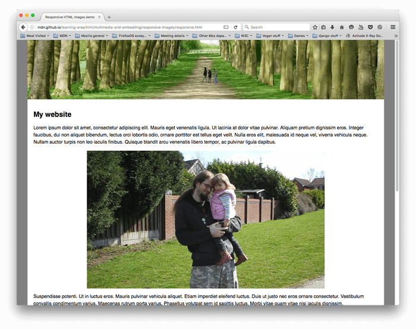
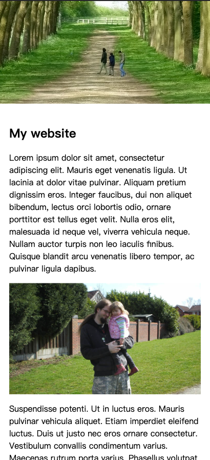

# 第四弹：图片优化

## 合理选择图片格式

优化图片的体积对于网页的效果是显著的，合理根据使用场景使用图片是基础。

如果没有选择好图片的格式，比如一张网页超大背景图，如果是 png 格式，那它的大小会在 MB 级别，而如果是 jpg 格式，很可能才几百 KB。

以此可见，前端开发者需要根据实际情况对不同的图片格式合理选择。

以下是不同图片格式的特点：

- **JPG/JPEG**

  特点是有损压缩，体积小，加载快，画质效果还保持得不错。适合用于大图，比如 Banner 图、背景图等。

- **PNG-8 与 PNG-24**

  PNG 格式是无损压缩的高保真图片格式，比 JPG 有更多的色彩表现力，缺点是体积太大。适合 LOGO 图、一些小图等。

- **SVG**

  SVG 是一种矢量图，是基于 XML 语法的图像格式，优点是图片可无限放大不失真，即使放到视网膜屏幕上也能够保持较高的品质，而且 SVG 可被编程，灵活性高。缺点是浏览器渲染成本高。适合用于做图标。

- **Base64**

  Base64 是文本文件，把图片解码成 Base64 字符串直接写入 img 标签中，是可以被浏览器解析成图片的，这样做的好处是不需要再去发送 HTTP 请求即可显示图片，节省了传统的浏览器单独向服务器请求图片资源的 HTTP 开销。但是过大的图片转成 Base64 会给浏览器的解析带来困扰，所以推荐用来放 20kb 以内，体积小，更新频率低的图片。

## 通过 imagemin 压缩 png 和 jpg 图片

选择好对应格式的图片后，还可以对图片进行压缩。

如果是一些静态资源的图片，前端在打包时就能够通过`webpack`完成压缩工作。

`webpack5`官方推荐插件：[image-minimizer-webpack-plugin](https://webpack.docschina.org/plugins/image-minimizer-webpack-plugin/)

`imagemin`一个`nodejs` 压缩工具，在 webpack 中已经有了对应的插件——`ImageMinimizerWebpackPlugin`。

这个插件可以压缩`jpg`、`png`、`gif`、`svg`等图片格式，让图片的体积更小，并且几乎不损失画质。

如果是后端，依然可以单独使用[imagemin](https://github.com/imagemin/imagemin)模块压缩用户上传的图片。

使用方法非常简单：

```js
import imagemin from 'imagemin';
import imageminJpegtran from 'imagemin-jpegtran';
import imageminPngquant from 'imagemin-pngquant';

const files = await imagemin(['images/*.{jpg,png}'], {
  destination: 'build/images',
  plugins: [
    imageminJpegtran(),
    imageminPngquant({
      quality: [0.6, 0.8],
    }),
  ],
});

console.log(files);
//=> [{data: <Buffer 89 50 4e …>, destinationPath: 'build/images/foo.jpg'}, …]
```

## 通过 webpack 自动将图片转成 Base64

webpack 有个 asset 模块，支持将图片在打包时直接打包成 Base64 格式，我们需要这样配置：

**webpack.config.js**

```javascript
  module: {
    rules: [
    ...
      {
        test: /\.(png|jpe?g|gif|svg)$/i,
        type: 'asset',
        generator: {
          filename: 'assets/[name].[hash:6][ext]', //输出规则
        },
        parser: {
          dataUrlCondition: {
            maxSize: 20 * 1024, // 小于20kb则解析成dataUrl
          },
        },
      },
    ],
  }
```

上面的配置意思是将 20kb 以内的 png/jpg/jpeg/svg 等打包成 Base64，其他的情况依然打包成原来的格式。

## lazy-load 懒加载图片

两种原生的的图片懒加载方案如下：

- 单个图片懒加载：[虚拟代理实现图片预加载](https://github.com/18888628835/Blog/blob/main/JavaScript设计模式/单例模式、策略模式、代理模式、发布订阅模式、命令模式、组合模式.md#63-虚拟代理实现图片预加载)

- 图片列表实现懒加载：[原生实现图片懒加载](https://github.com/18888628835/Blog/issues/48)

`React` 项目图片懒加载插件推荐：[react-lazy-load-image-component](https://github.com/Aljullu/react-lazy-load-image-component)

## 响应式图片

什么是响应式图片？

MDN 原文是这样描述的：

> 在不同的屏幕尺寸、分辨率或具有其他类似特性的设备上都呈现良好的图片

用例子来说明响应式图片的重要性。

这里有一个[在线演示](https://mdn.github.io/learning-area/html/multimedia-and-embedding/responsive-images/not-responsive.html)，它有两张图片。



顶部的是背景图，中间位置是 img 标签设置的图片。

他们有一个特点：

- 顶部背景图设置了 `background-image` 的 `position`为`center`。即使页面缩小了，图片的中心始终会处于`header`的中间，两边超出的部分会消失。
- 内容图片设置了`max-width:100%`,这样即使页面缩放了，图片总是在 body 中而不会超出。

让我们调整到手机设备来查看这个网站：



可以看到`header`位置在手机上占用了太多屏幕高度，内容里的图片则很难看清人脸。

一个改进方法是，在非常宽的屏幕查看时，让浏览器显示原图片；当网站在非常窄的屏幕上查看时，让它显示为一张裁剪过的图片。

通过响应式图片技术，能够很轻松地实现上面的功能。

在使用响应式图片时，需要判断使用场景，不同的场景下，响应式图片的用法不同。

### 不同大小的屏幕用不同尺寸的图片

这种场景下的响应式图片通过``的 `srcset`、`size`两个属性完成。

```html

```

- `srcset`

  **`srcset`** 定义了浏览器可选择的图片设置以及每个图片的大小。

  每张图片信息的设置用逗号隔开，每个设置要写：

  1. 文件名
  2. 空格
  3. 图片的真实宽度。注意，这里使用的宽度描述符为`w`，并不是 `px`。通过`Cmd`+`I`可以显示图片的真实宽度。

- `size`

  `size`定义一组媒体查询的条件（屏幕宽度），当匹配到的第一个媒体条件为真时，则忽略后面的条件。每一组媒体查询的条件也都用逗号隔开，每个设置要写：

  1. 媒体条件,例如`(max-width:600px)`代表当视口宽度小于等于 `600px` 时
  2. 空格
  3. 当媒体条件为真时，图像将填充的宽度。对于槽的宽度，你也许会提供一个固定值（如 `480px`）， 或者是一个相对于视口的宽度 （如 `50vw`），但不是百分比。

有了这些属性后，浏览器会：

- 检查设备宽度
- 检查 sizes 列表中为真的媒体条件
- 查看媒体条件的图片填充宽度大小
- 加载 srcset 列表中引用的最接近所选的槽大小的图像

以上面的代码为例，如果当前的浏览器是`480px`的视口宽度，那么对应为真的媒体条件是`max-width:600px`。在这种情况下，浏览器会去查看槽大小——`480px`，并从 `srcset`中挑选最接近的图片，即`elva-fairy-480w.jpg`。

使用这种技术还有一个好处，同格式下，800px 的图片明显比 480px 的图片要更大。如果一个页面中图片很多，那这种技术能够为移动端用户节省下大量的带宽。

> 如果用户的浏览器不支持`srcset`和`size`属性，则会直接加载`src`属性引用的图片。相当于`src`此时是一个保底的属性。

> HTML 文件中的`<head>`标签中，有一行代码`<meta name="viewport" content="width=device-width">`,这行代码会强制让手机浏览器采用它们真实可视窗口的宽度来加载页面。
>
> 下面截取手机淘宝网的 `viewport` 设置，我们在项目里直接使用即可
>
> `<meta name="viewport" content="width=device-width,initial-scale=1,minimum-scale=1,maximum-scale=1,user-scalable=no,viewport-fit=cover">`

### 相同尺寸但不同分辨率的图片

不同的手机分辨率不同。如果希望支持多分辨率显示，但每个人在屏幕上看到的图片实际尺寸是一样的，可以使用`srcset`结合 x 语法——不使用`sizes`属性，让浏览器选择合适分辨率的图片。

你可以参考这个示例 [srcset-resolutions.html](https://mdn.github.io/learning-area/html/multimedia-and-embedding/responsive-images/srcset-resolutions.html)

核心代码如下：

```html

```

这个例子中，图片设置了一个固定的 css 像素

```css
img {
  width: 320px;
}
```

在这种情况下，我们就用不到`sizes`属性。浏览器会去检查设备是否支持高分辨率，如果设备有高分辨率，能够用两个或更多的设备像素去表示一个 css 像素，则会加载`elva-fairy-640w.jpg`这张图片。如果设备用一个设备像素去表示一个 css 像素，则会加载`elva-fairy-320w.jpg`。

### 不同屏幕宽度用不同的图片

`<picture>`标签允许在不同的屏幕宽度下引用不同的资源。

你可以从 Github 上的 [responsive.html](https://mdn.github.io/learning-area/html/multimedia-and-embedding/responsive-images/responsive.html) 中查看示例，里面的核心代码是以下几行：

```html
<picture>
  <source media="(max-width: 799px)" srcset="elva-480w-close-portrait.jpg" />
  <source media="(min-width: 800px)" srcset="elva-800w.jpg" />
  
</picture>
```

- `<source>`元素包含一个`media`属性，这个属性包含媒体条件，这个条件可以决定显示哪张图片。如上面的例子，屏幕小于 799px 时，则会显示`elva-480w-close-portrait.jpg`
- `srcset`属性包含要显示图片的路径。正如我们在 `` 上面看到的那样，`<source>` 可以使用引用多个图像的 `srcset` 属性，还有 `sizes` 属性。所以你可以通过一个 `<picture>` 元素提供多个图片，不过也可以给每个图片提供多分辨率的图片。
- 在任何情况下，我们都必须提供一个``元素以及它的`src`和`alt`属性，否则不会有图片显示。当媒体条件都不返回真的时候（你可以在这个例子中删除第二个 `<source>` 元素），它会显示默认图片；如果浏览器不支持 `<picture>` 元素时，它可以作为后备方案。
- 当使用`media`属性时，不要使用`sizes`属性。

### 为什么不用 CSS 或者 JavaScript 实现

当浏览器开始加载一个页面，它会在主解析器开始加载和解析页面的 CSS 和 JavaScript 之前先下载（预加载）任意的图片。

这种有用的机制总体上会减少页面加载时间，但是它对响应式图片没有帮助，所以需要类似 `srcset` 的实现方法。

因为你不能先加载好 `` 元素后，再用 JavaScript 检测可视窗口的宽度，如果觉得大小不合适，再动态地加载小的图片替换已经加载好的图片，这样的话，原始的图像已经被加载了，然后你又加载了小的图像，这反而更不“响应”了。

### 现代图像格式

像 [WebP](https://developer.mozilla.org/zh-CN/docs/Web/Media/Formats/Image_types#webp_image) 和 [AVIF](https://developer.mozilla.org/zh-CN/docs/Web/Media/Formats/Image_types#avif_image) 等新型图片格式可以做到高质量的同时保持较低的文件大小，如今这些格式已有相对广泛的浏览器支持，且几乎没有“历史包袱”。

`webP` 是 google 提出来专门为 Web 开发的**旨在加快图片加载速度**的图片格式，它支持有损压缩和无损压缩。

它集多种图片文件格式的优点于一身，官方介绍是这样的：

> 与 PNG 相比，WebP 无损图像的尺寸缩小了 26％。在等效的 SSIM 质量指数下，WebP 有损图像比同类 JPEG 图像小 25-34％。

在现有页面 1MB 大小的情况下，如果图片占一半，那 WebP 就可以节省 20%-30%的字节，对每个页面就是几百 KB。

`<picture>` 让我们能继续满足老式浏览器的需要。你可以在 `type` 属性中提供 MIME 类型，这样浏览器就能立即拒绝其不支持的文件类型：

```html
<picture>
  <source type="image/svg+xml" srcset="pyramid.svg" />
  <source type="image/webp" srcset="pyramid.webp" />
  
</picture>
```

- 在 `<source>` 元素中，你只可以引用在 `type` 中声明的文件类型。
- 如果有必要，可以在`srcset`和`sizes`中使用逗号分隔的列表
- 如果**不是**不同屏幕宽度使用不同图片的应用场景，不要使用`media`属性

**淘宝网中的 webp 应用**

目前淘宝有很多`webp`格式图片的应用，以下是淘宝中的某一个图片的链接：

```html

```

它在.webp 前面，额外跟了一个.jpg 后缀。

然后用 js 判断浏览器能不能支持 webP ，如果不能就使用 JavaScript 切割字符串，将 webP 转化为 jpg 格式。

**项目中将其他图片格式转换为 webP **

可以手动，也可以加入构建自动化生成。

- 手动，可以使用**webP-converter**、智图等工具，但建议使用官方 `webP-converter`，除了便捷性，同质量下体积各方面均优于智图。

```
./cwebp -q 75 login_plane_2.png -o login_plane_2.webp
```

- 自动化生成，可以使用 `image-min-webp` 或其他 `webpack` 插件

**css 中使用 webp 图片**

CSS 中使用，需要配合 JS 做判断

```javascript
// main.js
window.addEventListener('DOMContentLoaded', () => {
    const isSupportWebP = document.createElement('canvas')
    .toDataURL('image/webp')
    .indexOf('data:image/webp') === 0
    document.documentElement.classList.add(isSupportWebP ? '' : '.no-support-webp');
})
// css
.support-webp .bg{
    background-image: url("hehe.webp");
}

.no-support-webp .bg {
    background-image: url("hehe.png");
}
```

本质上就是写一个 `className` ，然后通过判断是否支持 webP 来给 HTML 标签加`className`以触发不同的图片格式。

## 参考文档

[Responsive_images --MDN](https://developer.mozilla.org/zh-CN/docs/Learn/HTML/Multimedia_and_embedding/Responsive_images)
