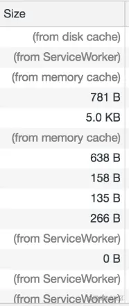
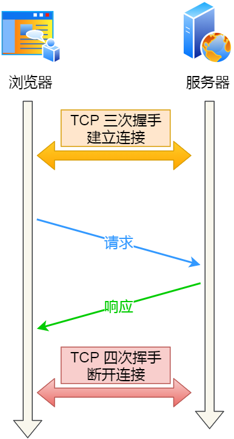
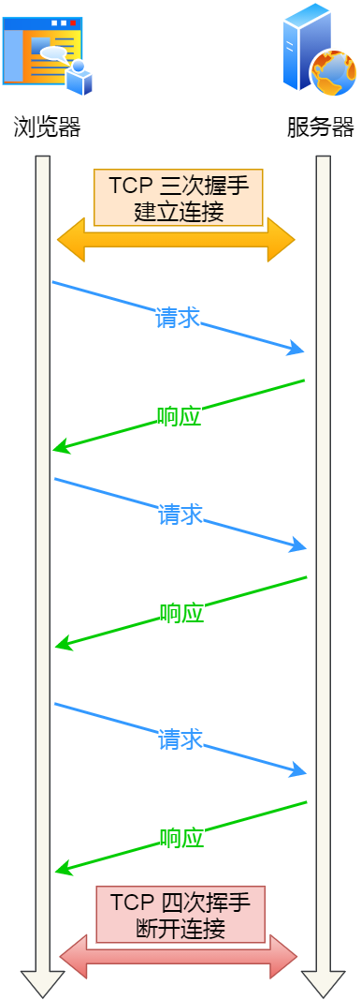
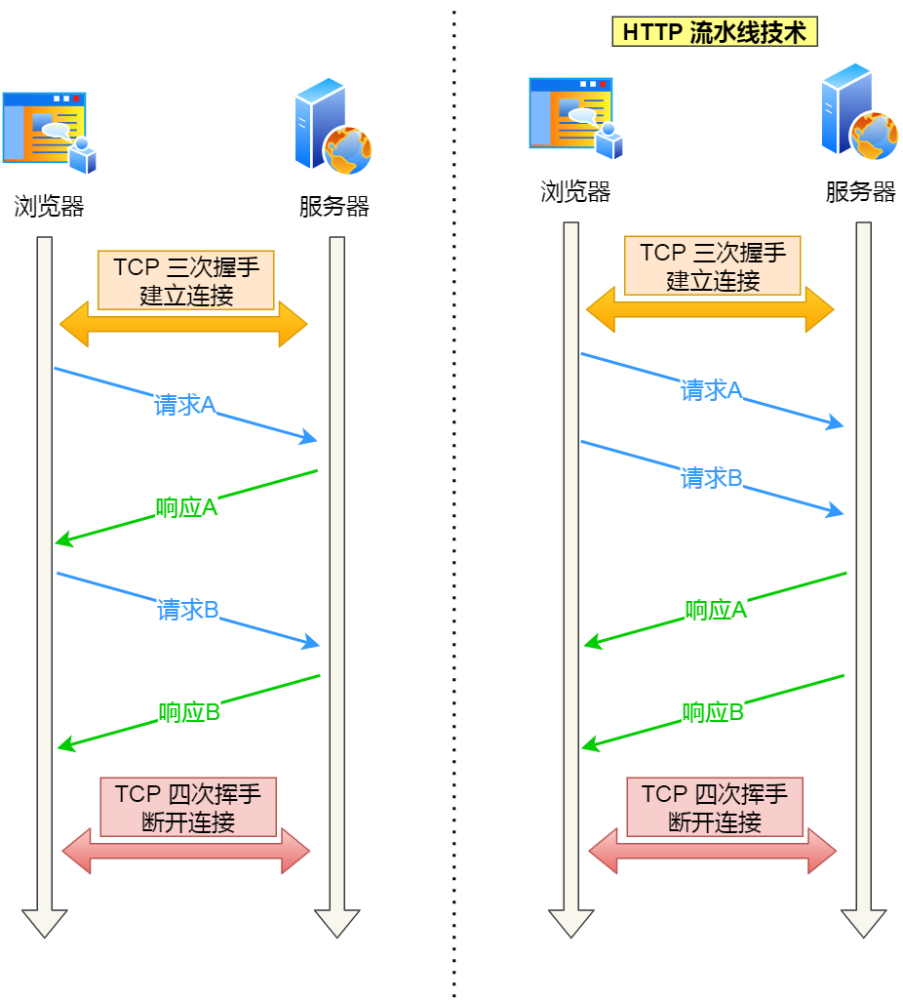

# 第五弹：传输加载优化

## 利用 HTTP 缓存机制

浏览器缓存机制有四个方面，按照资源请求时的优先级是这样排列的：

1. Memory Cache
2. Service Worker Cache
3. HTTP Cache
4. Push Cache

我们可以通过 NetWork 看到资源来自什么缓存。



前端的重点优化策略是 HTTP Cache ，详情可以看[【HTTP 缓存控制】](https://github.com/18888628835/Blog/blob/main/HTTP/HTTP缓存控制.md)

## Gzip 资源

所有文本资源都应该使用 Gzip 压缩，然后再在客户端与服务器间传输。一般来说，Gzip 可以减少 60%～ 80%的文件大小，也是一个相对简单（只要在服务器上配置一个选项），但优化效果较好的举措。

1. 首先浏览器端会发送一个请求头表示支持`Gzip`

```http
Accept-Encoding: gzip, deflate, br
```

2. 然后服务端需要开启 `gzip`,比如 `nginx.conf`就只需要加几个配置项就行

```nginx
#  gzip 可以在 http, server, location 中和配置，这里配置到 http 下是全局配置，
#  只要是使用当前 nginx 服务器的站点都会开启 gzip
http {
  gzip on;
  gzip_comp_level 5;
  gzip_min_length 1k;
  gzip_buffers 4 16k;
  gzip_proxied any;
  gzip_vary on;
  gzip_types
    application/javascript
    application/x-javascript
    text/javascript
    text/css
    text/xml
    application/xhtml+xml
    application/xml
    application/atom+xml
    application/rdf+xml
    application/rss+xml
    application/geo+json
    application/json
    application/ld+json
    application/manifest+json
    application/x-web-app-manifest+json
    image/svg+xml
    text/x-cross-domain-policy;
  gzip_static on;
  gzip_disable "MSIE [1-6]\.";
}
```

- **gzip on;**：开启 gzip，Default: off
- **gzip_comp_level 5;**：压缩级别： 1-9。5 是推荐的压缩级别，Default: 1
- **gzip_min_length 1k;**：需要 gzip 压缩的文件体积的最小值。如果文件已经足够小了，就不需要压缩了，因为即便压缩了，效果也不明显，而且会占用 CPU 资源。Default: 20
- **gzip_buffers 4 16k;**：设置用于压缩响应的 number 和 size 的缓冲区。默认情况下，缓冲区大小等于一个内存页。根据平台的不同，它也可以是 4K 或 8K。
- **gzip_proxied any;**：是否开启对代理资源的压缩。很多时候，nginx 会作为反向代理服务器，实际的静态资源在上有服务器上，只有开启了 gzip_proxied 才会对代理的资源进行压缩。Default: off
- **gzip_vary on;**：每当客户端的 Accept-Encoding-capabilities 头发生变化时，告诉代理缓存 gzip 和常规版本的资源。避免了不支持 gzip 的客户端（这在今天极为罕见）在代理给它们 gzip 版本时显示乱码的问题。如果指令 gzip， gzip_static 或 gunzip 处于活动状态， 则启用或禁用插入“ Vary：Accept-Encoding”响应标头字段。Default: off
- **gzip_types**：压缩文件的 MIME 类型。`text/html` 默认就会开启 gzip 压缩，所以不用特别显示配置 `text/html` 的 MIME 类型。Default: text/html
- **gzip_static on;**：服务器开启对静态文件（ CSS, JS, HTML, SVG, ICS, and JSON）的压缩。但是，要使此部分与之相关，需要在 gzip_types 设置 MIME 类型，仅仅设置 gzip_static 为 on 是不会自动压缩静态文件的。
- **gzip_disable “MSIE [1-6]\.”;**：IE6 以下的浏览器禁用 gzip 压缩。

3. 配置成功后服务器会在响应头上返回对应的内容：
   - **content-type: text/html; charset=utf-8：**表示返回的数据的 MIME 类型是 text/html；
   - **content-encoding: gzip：**当服务器压缩内容时，它会用`content-encoding`头进行响应，后面接的 gzip 表示服务器对该文件采用了 gzip 压缩编码
   - **vary: Accept-Encoding：**（配置说明中提到的）当客户端的 `Accept-Encoding-capabilities` 头发生变化时，告诉代理缓存 gzip 和常规版本的资源。(出现这个就意味着 nginx 配置的`gzip_vary`生效)
4. 浏览器得到`content-encoding: gzip` 响应头后，会对采用 gzip 编码的实体内容进行解码。

整个过程中客户端跟服务端就是通过 `HTTP headers`进行`body`数据的内容协商。

对于这个过程详细点可以查看：[Body 数据的内容协商 ](https://github.com/18888628835/Blog/issues/33)

## Keep alive

### 什么是 Keep alive

这里的 Keep alive 主要指的是 HTTP 层面的。

我们知道 HTTP 协议采用的是“请求-应答”的模式，当客户端发起请求，服务端才会响应。

由于 HTTP 是基于 TCP 传输协议实现的，客户端与服务端在进行 HTTP 通信前，需要先建立 TCP 连接，然后客户端发送 HTTP 请求，服务端就收到响应，至此“请求-应答”模式完成，接着会释放 TCP 连接。



如果每次连接都要重新建立 TCP ==> 请求资源 ==> 响应资源 ==> 释放连接，那么这种方式我们叫**HTTP 短连接**。

有没有一种机制，可以让 HTTP 只建立一次 TCP 连接，而发生多次资源请求和响应呢？

Keep-alive 就是这样一种机制，可以使用同一种 TCP 连接来发送和接收多个 HTTP 请求/应答，减少连接/释放的开销。我们也称这种方法为 **HTTP 长连接**



HTTP 长连接的特点是，只要任意一端没有明确提出断开连接，则保持 TCP 连接状态。

实际上这个功能是 HTTP1.1 默认开启的，一旦浏览器跟服务器达成协议，那么长连接就建立完成了。

打开 www.baidu.com 的`HTTP` `Headers`，可以看到请求头和响应头都显示 `Connection:keep-alive`。这表示百度网站是开启了 `keep-alive` 功能的。


### HTTP 流水线（pipeline）

HTTP 长连接不仅减少了 TCP 连接资源的开销，还为 HTTP 流水线（pipeline）技术提供了可实现的基础。

所谓 HTTP 流水线，就是客户端先一次性发送多个请求，而在发送过程中不需要等待服务器的回应，这样可以减少整体的响应时间。

举例来说，客户端如果要请求两个资源。在没有 HTTP 流水线的情况下，同一个 TCP 连接里，需要先发送 A 请求，收到服务器响应后，再发送 B 请求。

有了 HTTP 流水线机制，则允许客户端一次性发送 A 请求和 B 请求，服务器端则依然**按照顺序**接收、返回。



> 如果服务器还没响应完第一批浏览器发送的请求，也就是说服务器在响应时发生了阻塞，那么客户端无法发出下一批请求，此时会造成队头阻塞的问题。

### 如何控制 Keep alive

通过 Nginx 服务器（或者其他 Web 服务器），我们可以开启或者关闭 Keep alive 的功能（默认开启）。

```nginx
http {
    keepalive_timeout  65;   #超时时间,设置为 0 则代表关闭 Keep alive 功能
  	keepalive_requests 100; # 超过100 请求数，会关闭当前tcp 连接
}
```

- `keepalive_timeout`

  我们已经知道`Keep_alive`能够建立长连接，那么如果客户端发送完请求后，不再继续发送请求，那么这个长连接就会一直被占用着无法得到释放。

  这时我们就能够通过`keepalive_timeout`指定 HTTP 长连接的超时时间。

  比如，上面的配置是将 Keep alive 的超时时间设定在 65 秒，Nginx 会**开启一个定时器**。如果 65 秒内客户端没有继续发送请求给服务端，那么 Nginx 就会触发定时器的回调，释放该 TCP 连接。

- `keepalive_requests`

  此外，还有一个`keepalive_requests`配置，它在内部会**开启一个计数器**。如果当前 TCP 连接下的 HTTP 请求达到一个数量，则会释放当前 TCP 连接。

## 使用 CDN 缓存静态资源

CDN 全称是内容分发网络 Content Delivery Network，它是浏览器和服务器之间的内容架设，它应用了 HTTP 协议中的缓存和代理技术，能够代理源站响应客户端的请求。

使用 CDN 的一个好处是能够加快静态资源被本地浏览器读取的速度，即提高服务器响应速度的能力。

它可以缓存源站数据，让浏览器不用再千里迢迢到达源站服务器，而是在半路直接获取响应。如果 cdn 的调度算法优秀，那么就可以找到距离用户更近的节点，大幅度缩短响应时间。

举个例子，假设我的服务器是在北京，用户在杭州，那么用户打开网站向北京的服务器发送请求，这个响应速度一定没有我直接将服务器放在杭州快。

CDN 就可以充当放在杭州的服务器，它向北京的服务器拷贝资源，杭州的用户访问时，直接访问杭州的 CDN 缓存资源，使得响应速度大大提升。如果用户的资源在 CDN 上没有，CDN 会向北京的服务器索要这个资源。

CDN 的核心点有两个，一个是**缓存**，一个是**回源**。

缓存就是拷贝资源，回源就是当没有这个资源时，向根服务器要资源的过程。

### CDN 的实际应用

CDN 往往被用来存放静态资源。

静态资源就是 CSS、图片等一些不需要经过服务器计算的资源。

与静态资源对应的是动态资源，动态资源往往需要经过业务服务器对用户的权限验证，再决定呈现给用户怎样的内容，换句话说是后端生成的。比较常见的动态资源是 JSP、服务端渲染的页面。

参考淘宝网，它的大量图片都被存到 CDN 服务器中，以下是淘宝 WEB 端请求 CDN 获取的一张图片

```javascript
https://img.alicdn.com/imgextra/i2/O1CN010DBuyg1LkqcCrN3MF_!!6000000001338-2-tps-630-400.png
```

目前市面上大部分云服务器厂商都会提供 CDN 服务，并且拥有自动回源功能，只需要用户将服务器地址配置到购买的 CDN 服务器上，如果 CDN 服务器上没有缓存，就会先去用户的服务器上拉取图片，再对外输出；如果命中缓存，则直接对外输出。 这样对于经常访问的图片，理论上只会有 CDN 服务器拉取一次，用户的请求流量都打到 CDN 上。

## HTTP2

### 如何开启 HTTP2

相对于 HTTP1.1，HTTP2 有以下优势：

1. 二进制传输
2. 请求响应多路复用
3. Server push

开启 HTTPS 需要 SSL 证书，如果作为企业使用，一般是需要付钱的。

但是在本地环境中，开发者可以自行生成一个 SSL 证书，运行下面四行命令：

```bash
openssl genrsa -des3 -passout pass:x -out server.pass.key 2048

openssl rsa -passin pass:x -in server.pass.key -out server.key

openssl req -new -key server.key -out server.csr

openssl x509 -req -sha256 -days 3650 -in server.csr -signkey server.key -out server.crt
```

上面的四行命令会在本地生成四份文件


其中 `server.key`和`server.crt`就是 `ssl` 所需要的密钥和证书。

接着我们在`nginx.conf`中，配置以下内容来开启 HTTP2：

```nginx
# HTTPS server
server{
	listen 443 ssl http2;# 监听端口号，https是443 开启ssl证书 开启 http2
	server_name localhost;
	ssl on; # 开启 ssl 协议，拥有 https 证书的网站才能使用 http2
	ssl_certificate /usr/ssl/server.crt; # ssl 证书路径
	ssl_certificate_key /usr/ssl/server.key; # ssl 私钥
}
```

有关于 Nginx 的配置，可以参考本人的这个项目[account-book](https://github.com/18888628835/account-book)。

配置完成后，重启 `Nginx` ，访问https://localhost/ ，并打开`Network`工具查看效果


可以看到 `HTTP2`和 `HTTPS`都已经成功开启了。

> 由于是自生成的 SSL 证书，所以谷歌浏览器会提示不安全。https 功能是生效的，比如需要 https 才能用的 `Navigator.clipboard` API 能够成功调用。

### HTTP2 解决的问题

在[Keep alive](##Keep alive) 的章节，我们已经知道`HTTP 1.x`会产生一个叫**队头阻塞**的问题。即使有 `pipeline`，这个问题依然存在。

本质上来说，是因为服务器需要按照顺序处理客户端的请求。一旦有一个请求需要处理的时长阻塞住了，那么剩下的的请求都会被推迟。

HTTP2.0 是多路复用 TCP 连接，在一个连接里，不但客户端和浏览器可以同时发送多个请求或者回应，而且不需要按照顺序一一对应。

那它是怎么做到不需要按照顺序一一对应呢？原因如下：

> HTTP2.0 并不采用 1.x 的文本传输，而是基于二进制帧传输。这里面有两个非常重要的概念——帧（frame）和流（stream）。每个帧的头部信息会标识出该帧属于哪个流，流也就是多个帧组成的数据流。
>
> 多路复用，就是在一个 TCP 连接中可以存在多条流。即使发送多个请求，接受端也可以通过帧中的标识知道属于哪个请求。
>
> 所以这些帧可以交错传输，然后在接收端通过帧头的信息来组成完整的数据。
>
> 通过这个技术，可以避免 HTTP 旧版本中的队头阻塞问题，极大的提高传输性能。

### Server push

在 `http1.x`中，所有响应都需要请求后才能获取。在请求过程中又需要建立`tcp`连接、三次握手等等一系列操作。

有很多请求实际上服务端已经预先知道客户端是需要的。如果客户端不需要发送请求，服务器端也预先准备好了这些资源，并推送给客户端，那么这中间的开销就被节省下来了。

`HTTP2`的`Server push`就提供了这样的支持。

在 `nginx.conf`中，简单配置一下即可实现`server push`

```nginx
    server {
    		...
        location / {
             root   /usr/share/nginx/html;
             index  index.html index.htm;
             try_files $uri $uri/ /index.html;
    				 http2_push /img/a.jpg;
      			 http2_push /img/b.jpg;
        }
  			...
}
```
