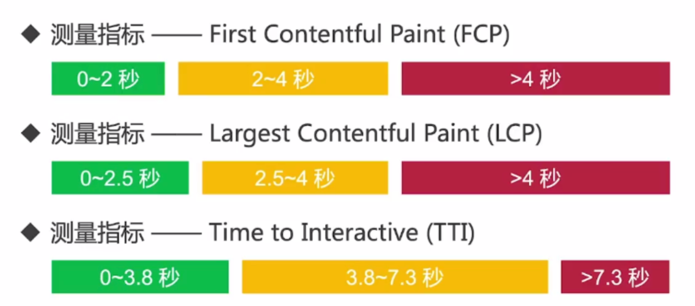

# 性能优化相关面试题

## 什么是首屏加载？

首屏指的是用户访问网站时，第一眼看到的显示在屏幕上的内容。

> 首屏（above the fold）用来表示初次的印象，起源于早期人们看报纸的习惯。
>
> 由于报纸太长，所以需要折叠起来看，那么报纸的版头就是折叠后看到的第一个内容。

下图就是一个完整的首屏展示时所发生的时间线

它涉及到几个关键的指标：

- First paint 是指页面导航和浏览器将第一个像素渲染到屏幕上所发生的时间。可以回答用户对于“浏览器是否开始加载页面”的问题。

  [MDN](https://developer.mozilla.org/en-US/docs/Glossary/First_paint)是这样描述的

  > **First Paint** is the time between navigation and when the browser first renders pixels to the screen, rendering anything that is visually different from the default [background color](https://developer.mozilla.org/en-US/docs/Web/CSS/background-color) of the [body](https://developer.mozilla.org/en-US/docs/Web/API/Document/body). It is the first key moment in page load and will answer the question "Has the browser started to render the page?"

- First Contentful Paint 指的是第一个完整的 DOM 内容渲染到屏幕上所发生的时间。可以回答用户对于“请求发生了什么”的问题。

  [MDN](https://developer.mozilla.org/en-US/docs/Glossary/First_contentful_paint)是这样描述的

  > **First Contentful Paint** (FCP) is when the browser renders the first bit of content from the DOM, providing the first feedback to the user that the page is actually loading. The question "Is it happening?" is "yes" when the first contentful paint completes.

- First Meaningful Paint 指的是第一个有意义的内容绘制完成的时间。可以回答用户对于“网站是否有用”的问题。

  [MDN](https://developer.mozilla.org/en-US/docs/Glossary/first_meaningful_paint)是这样描述的

  > **First Meaningful Paint** (FMP) is the paint after which the biggest above-the-fold layout change has happened and web fonts have loaded. It is when the answer to "Is it useful?" becomes "yes", upon first meaningful paint completion.

- Largest Contentful Paint（LCP）——最大内容（图像或者文本）的绘制时间。

  [MDN](https://developer.mozilla.org/en-US/docs/Glossary/Largest_contentful_paint)是这样描述的

  > The **Largest Contentful Paint** (LCP) performance metric provides the render time of the largest image or text block visible within the viewport, recorded from when the page first begins to load.

- Time to Interactive 指的是用户能正常与网站交互的时间。可以回答用户对于“网站是否能用”的问题。

以下是上面关键测量指标的对应时间标准

## 如何优化首屏加载

首屏加载如果过慢，主要就是网络和资源本身的问题。

如果是资源本身问题，可以看情况具体分析：

1. 资源体积太大？

   如果资源本身的体积非常大，就需要考虑对资源进行压缩。我们可以利用 Webpack 等插件来减少资源的体积，并且开启 GZIP 来对传输的资源再压缩。

   Webpack 能做的事情还要很多，比如内置的 Tree shaking 删除无用的代码以及代码拆分等都可以对资源减重。

2. 页面内容太多？

   如果首屏页面要渲染的内容非常多，我们可以考虑使用 lazy-loading 来懒加载部分页面内容，着重把用户最关心的内容渲染出来。

   如果页面动态化的内容特别多，就用 SSR 让服务器预先处理好页面，再一次性返回给浏览器，这样就可以节省浏览器请求-服务器响应的时间。

   首屏的`css`可以提取成 `Inline-css`，某些资源还能够通过 http/2 的 `server push`发送给客户端，这样也可以免去首屏页面从服务器获取资源的时间。

3. 提升 HTTP？

   与 HTTP 有关的除了 Gzip 外，还有 HTTP 缓存、HTTP/2 等方法加快网络传输的速度。

4. 资源阻塞？

   使用 `async` 和 `defer` 等属性避免资源间的阻塞问题。
