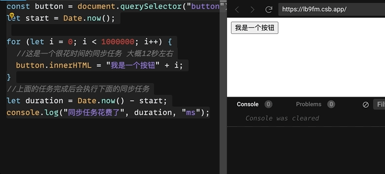
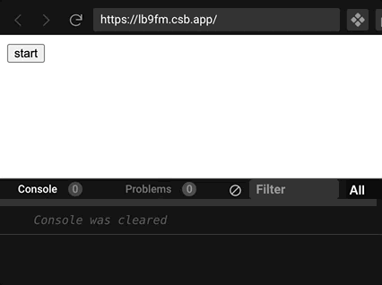
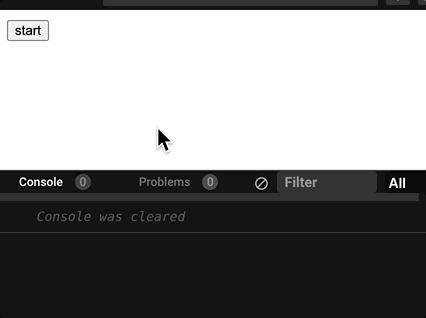

# 事件循环

**事件循环** 的概念非常简单。它是一个在 JavaScript 引擎等待任务，执行任务和进入休眠状态等待更多任务这几个状态之间转换的无限循环。

它的功能是负责执行代码、收集和处理事件以及执行队列中的子任务。

处理的逻辑非常简单：

1. 当有任务时：设置任务
2. JavaScript 引擎从最先进入的任务开始处理

3. 休息，等到出现任务，然后从第 1 步开始继续执行

然而这里面还有更细化的问题需要搞清楚。

## 有哪些任务

一般来说，任务分为以下几块：

1. 调用`<script src="...">`中的代码
2. 用户事件
3. 定时器任务
4. promise 任务
5. http 请求任务
6. ...

根据上面任务的调用方式，我们还可以分为同步任务和异步任务。

我们知道 Javascript 是单线程运行的语言，无论如何主线程都只能做一件事。但其所在的环境会提供 Javascript 多线程的能力。

这种异步调度的能力由浏览器或者 node 环境授予的，由 V8 引擎负责调度管理。它的好处是能够使得 JavaScript 代码异步执行，从而不阻塞 I/O。（我们暂时可以把异步调用理解为后台运行某段代码，然后等到合适的时机输出。）

**我们需要搞清楚 event loop 中同步任务和异步任务是如何被管理调度的**

## 任务放在哪

多个任务组成一个任务队列，即“宏任务队列”


任务队列遵循先进先出的原则，比如上面的图，JavaScript 引擎会先运行 script 代码，再运行用户事件、再执行定时器任务。

这里有两个细节：

- 当引擎执行宏任务时，render 不会执行，也就是所谓的 GUI 线程（负责页面渲染的线程）与 Javascript 引擎互斥

- 只有当上一个任务结束，才会执行下一个任务，即 JS 引擎一次只能做一件事。

**既然任务是先进先出的，我们就需要搞清楚哪些任务是先进的，哪些任务是后进的**

## setTimeout 的运行机制

下面来搞清楚同步任务和异步任务是如何被管理调度的，在此之前，我们需要知道哪些代码是异步的

- setTimeout、setInterval
- 点击事件
- promise.then
- xmlHttpRequest.send

上面的几种代码都是异步的，我们先从 setTimeout 说起，它是怎样执行的呢？

```javascript
let start = Date.now();
setTimeout(() => {
  console.log('setTimeout 的异步任务1', Date.now() - start, 'ms');
}, 10000); //这里是10s 的定时器

for (let i = 0; i < 10000000000; i++) {
  //这是一个很花时间的同步任务 大概12-13秒左右
}
//上面的任务完成后会执行下面的同步任务
let duration = Date.now() - start;
console.log('同步任务花费了', duration, 'ms');
```

我在上面设置了 10s 的定时器，接着执行同步任务，在我电脑上看到这样的效果

```javascript
同步任务花费了
13009ms

setTimeout 的异步任务1
13110ms
```

可以看到，异步任务虽然设置的是 10 秒，但是却是实实在在在 13 秒之后才打印出来的，这说明

- 异步任务排在同步任务之后，只要同步任务还在做，异步任务就不能运行
- setTimeout 在调用后就已经开启计时，你可以理解为在后台倒数计时，此时跟 for 循环是并行处理的

第一个结论非常好理解，JavaScript 是单线程的，它的规则是先执行同步代码，然后才执行异步代码。

那么结合第二个结论，setTimeout 在哪里倒数计时呢？

答案是浏览器提供的**定时触发器线程**，这个线程将代码放到任务队列，等到同步任务结束后，再由 js 线程去调用定时器里的任务。

## 定时器里的任务是什么时候进入任务队列的

既然叫任务队列，它就符合先进先出的条件，如果有两个定时器，那么它是以什么来判断谁先进呢？这个问题可以延伸为 setTimeout 里的任务是什么时候进入任务队列的。

我们继续做实验来证明，此时代码变更为

```js
let start = Date.now();
setTimeout(() => {
  console.log('setTimeout 的异步任务1', Date.now() - start, 'ms');
}, 10);

setTimeout(() => {
  console.log('setTimeout 的异步任务2', Date.now() - start, 'ms');
}, 0);

setTimeout(() => {
  console.log('setTimeout 的异步任务3', Date.now() - start, 'ms');
}, 0);

for (let i = 0; i < 1000000000; i++) {
  //这是一个不太花时间的同步任务 大概1秒左右
}
//上面的任务完成后会执行下面的同步任务
let duration = Date.now() - start;
console.log('同步任务花费了', duration, 'ms');
```

此时的结果为

```js
同步任务花费了
959 ms

setTimeout 的异步任务2
961 ms

setTimeout 的异步任务3
961 ms

setTimeout 的异步任务1
1139 ms
```

很明显，setTimeout 推送到任务队列的时机跟定时器设置的时间有关，我们可以得出以下结论

- setTimeout 是以**定时器计时完成**为准来将任务推送给任务队列的，而不是代码顺序
- 如果两个定时器之间设置的时间无限接近（或者相同），则跟代码顺序有关

## 事件代码和定时器谁快

下面我们有必要加入事件代码，我们需要了解的目标是事件代码和定时器谁更快，修改代码为以下内容

```javascript
const button = document.querySelector('button');
let start = Date.now();
button.addEventListener('click', () => {
  console.log('button被点击了', Date.now() - start, 'ms'); //这个函数是一个异步任务
});

setTimeout(() => {
  console.log('setTimeout 的异步任务1', Date.now() - start, 'ms');
}, 0);

for (let i = 0; i < 10000000000; i++) {
  //这是一个很花时间的同步任务 大概12秒左右
}
//上面的任务完成后会执行下面的同步任务
let duration = Date.now() - start;
console.log('同步任务花费了', duration, 'ms');
```

当运行上面这段代码时，我在等待循环结束的 12 秒里，顺手点了一下`button`

此时由于主线程依然在执行 for 循环的同步代码，所以 button 按钮有种被阻塞的感觉，你会发现，平时点击 button 的那种按压感不见了，**这是因为 js 线程正在执行任务，不会触发 GUI 线程去渲染页面**，所以会有种页面卡死的错觉，但是此时点击事件实际上已经触发了。

我们来看一下结果

```javascript
同步任务花费了
13013 ms
button被点击了
13017 ms
setTimeout 的异步任务1
13019 ms
```

**为什么 button 事件会先执行而不是 setTimeout 先执行呢？**

熟知先进先出队列结构的你难免有这样的疑问，从代码来看，不管怎样，点击事件肯定比定时为 0 的定时器更晚被推到任务队列呀，所以应该定时器先执行。

这里是因为事件是处理用户交互逻辑的，所以优先级必然比定时器更高，会先被推到任务队列中。

事件由**事件处理线程**处理，等到事件发生后推送到任务队列中。直到 js 线程把同步代码执行完了，再处理任务队列的事件任务，最后处理定时器。

## promise、事件、定时器谁快

还是同样的代码，我们加上 promise 逻辑

```javascript
....//上面的代码一致，所以这里省略

Promise.resolve().then(() => {
  console.log("Promise 的异步任务", Date.now() - start, "ms");
});

for (let i = 0; i < 10000000000; i++) {
  //这是一个很花时间的同步任务 大概12秒左右
}
//上面的任务完成后会执行下面的同步任务
let duration = Date.now() - start;
console.log("同步任务花费了", duration, "ms");
```

同样，我在执行 for 循环代码期间，点击 button 按钮，然后静静等待 12s 查看结果

```javascript
同步任务花费了
12985 ms
Promise 的异步任务
12986 ms
button被点击了
12988 ms
setTimeout 的异步任务1
12990 ms
```

可以发现`primise.then`更快，其次是点击事件，最后是定时触发器。

## 小结

- 浏览器除了 JS 线程外，还有事件处理线程和定时触发器线程，正是这些线程的辅助，让 JS 拥有异步处理任务的能力
- 异步处理任务就是等到合适的时机（比如定时器到期、用户点击）将任务推送给队列，由 JS 引擎按照顺序去取队列中的任务来执行。
- 不同的线程推送任务的优先级不同，事件专门处理用户的交互，推送到任务队列中的优先级比定时触发器更高

## 宏任务和微任务

为什么 promise 最快呢？

这是因为任务队列还分为宏任务 macro-task 和微任务 micro-task，**每个宏任务之后，引擎会立即执行微任务队列中的所有任务，然后再执行其他的宏任务，或渲染，或进行其他任何操作。**


- 往往第一个宏任务是 `script`,它是最先进入任务队列的，此时，script 里面的代码在执行过程中，会分异步代码和同步代码，异步代码被挂起，优先执行完同步代码
- 执行完同步代码后，此时所有 `promise`等组成的微任务优先排入任务队列中，组成微任务队列，挨个处理微任务
- 处理完微任务后，JavaScript 引擎暂时挂起，GUI 线程开始工作，执行页面 render 一次
- 接着处理下一个宏任务，优先级更高的用户事件（如果触发了）会排入任务队列中，此时用户点击事件（异步代码）里如果还有微任务代码，则在点击事件里的同步代码执行结束后，再次进入微任务队列执行，最后 render
- 最后处理定时器任务，逻辑跟上面基本一致
- ...

**常见的宏任务如下**

1. setTimeout
2. setInterval
3. setImmdiate
4. I/O

**常见的微任务如下**

1. Promise.then
2. process.nextTick
3. Object.observe
4. MutationObserver
5. queueMicrotask

## 验证试验

你可能对我上面所说的逻辑有点怀疑，我在这里列举你怀疑的点

- JS 引擎在执行任务时，GUI 会挂起？
- 宏任务结束，微任务完成，页面会 rendr 一次。然后进入下一个宏任务、微任务、render 的循环？

### 验证第一个

首先是第一个问题的验证，很好办，如下代码

```javascript
const button = document.querySelector('button');
let start = Date.now();

for (let i = 0; i < 1000000; i++) {
  button.innerHTML = '我是一个按钮' + i;
}
//上面的任务完成后会执行下面的同步任务
let duration = Date.now() - start;
console.log('同步任务花费了', duration, 'ms');
```



会看到三秒后页面才触发页面 render，说明我们是正确的，执行同步代码时，render 无效。（否则应该是边执行边 render）

### 验证第二个

接下来我们验证第二个问题：这里我们要加上微任务，宏任务，要在恰当的时机触发点击事件，代码是这样的

```javascript
const button = document.querySelector('button');
let start = Date.now();

for (let i = 0; i < 1000000; i++) {
  //这是一个很花时间的同步任务 大概3秒左右
  button.innerHTML = '我是一个按钮' + i;
}
Promise.resolve().then(() => {
  console.log('微任务触发了', Date.now() - start + 'ms');
  button.innerHTML = Date.now() - start + 'ms';
});
button.addEventListener('click', () => {
  console.log('点击事件触发了', Date.now() - start, 'ms');
});
//上面的任务完成后会执行下面的同步任务
let duration = Date.now() - start;
console.log('同步任务花费了', duration, 'ms');
```

我在等待结果的 3s 内，点击了一下 button，然后看结果：


根据结果，我们可以发现

1. 页面确实在微任务后 render 了
2. 在 render 后，引擎才执行点击事件

上述的试验证明我们的结论是正确的

- JS 引擎首先执行 script 中的同步代码，挂起异步代码
- 同步代码执行完后，其他线程将任务推到任务队列，此时微任务优先进入，宏任务后进入
- 微任务运行结束后，会 render 一次，紧接着处理任务队列中的下一个宏任务
- 宏任务处理结束-微任务-render
- 如此循环...

### 验证结论

能否让 for 循环时，页面也跟着 render 呢？

答案就在我们结论里，每次宏任务、微任务运行结束，才会执行 render。那我直接在 for 循环中开启宏任务，不就可以让页面不断 render 了吗？

为了验证我们的结论，这里再修改一下代码

```js
const button = document.querySelector('button');

button.addEventListener('click', () => {
  for (let i = 0; i < 100000; i++) {
    //这是一个很花时间的同步任务 大概3秒左右
    setTimeout(() => {
      button.innerHTML = '我是一个按钮' + i;
    }, 0);
  }
});
```



可以看到，我们相当于开了 100000 个定时器任务，每次定时器任务完成后，都会 render 一下页面，再开始下一个定时器任务。

上面的代码依然是**需要等到 for 循环结束**后，才挨个**开启定时器任务**的，这点我们需要知道。

最后，我们再使用`queueMicrotask`这个 API 修改一下代码，

```javascript
const button = document.querySelector('button');

button.addEventListener('click', () => {
  for (let i = 0; i < 100000; i++) {
    //这是一个很花时间的同步任务 大概3秒左右
    queueMicrotask(() => {
      button.innerHTML = '我是一个按钮' + i;
    });
  }
});
```

这个 API 是一个微任务，现在我们需要再次阐述我们的结论：

1. for 循环结束后会开启微任务
2. 微任务结束前不会 render 页面
3. queueMicrotask 属于 micro-task 队列
4. 所以 queueMicrotask 全部结束前不会 render

通过结果验证一下



## 总结

1. 事件循环是 JavaScript 引擎等待任务、执行任务、休眠的无限循环，它通过宏任务队列来接收任务，先进的先完成且一次只做一件事。
2. 宏任务队列中的第一个任务是 script，它最早被执行
3. 当执行完宏任务后，微任务队列开始执行，然后页面渲染一次，再进行下一个宏任务
4. 宏任务中，事件比定时器先进入宏任务队列（优先级更高）
5. 微任务一般是 Promise.then，queueMicrotask 等
6. JavaScript 是单线程的，但是浏览器和 Node 环境都给其配备了多个线程以辅助其异步的能力
7. 其他线程很多，举例：GUI 线程（管理页面渲染，回流重绘的）、事件处理线程、定时触发器线程等。
8. 其他线程无法像 JavaScript 主线程一样操作 DOM
9. JavaScript 所在的宿主环境所配备的任务管理顺序的并发模型是基于事件循环的。
10. 本篇文章讲的是浏览器中的 event loop
